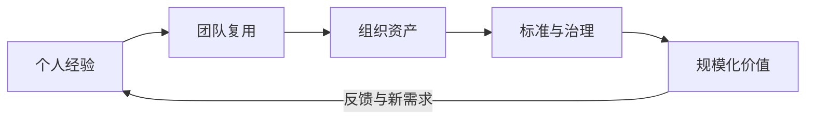
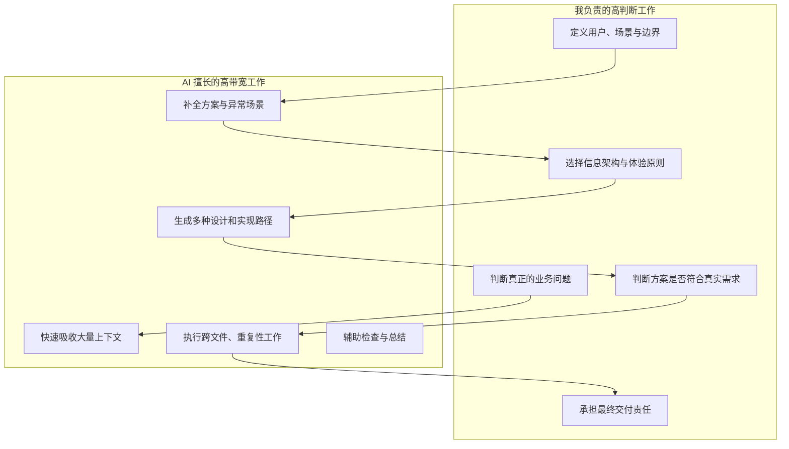
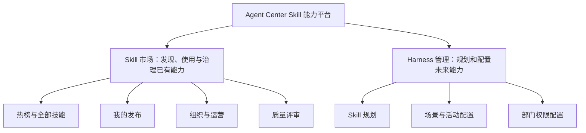
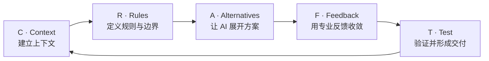

# 从业务构想到可用产品：我如何借助 Codex 设计并落地 Agent Center Skill 市场

> 文档定位：AI 协同产品设计与前端交付案例  
> 分享对象：产品、设计、研发及研发管理人员  
> 分享视角：第一人称项目复盘  
> 文档版本：V1.0  
> 编写日期：2026-08-03  
> 说明：本文基于当前 Agent Center Skill 市场项目整理，重点讨论设计思路与人机协作方法，不展开具体代码实现。

---

## 一、案例摘要

Agent Center Skill 市场是我借助 Codex 完成的一次完整 AI 辅助产品实践。

它最终呈现出来的是一套前端产品，但我认为这个案例真正有价值的地方，并不是“AI 帮我写了多少代码”，而是我逐步形成了一种更高效的工作方式：

> **我负责定义正确的问题、建立完整上下文、做关键设计判断并控制最终质量；AI 负责快速理解、扩展方案、形成原型、完成实现和辅助验证。**

在这个项目中，我没有把 Codex 当成一个简单的代码生成器，而是把它组织成一个能够参与需求分析、产品设计、体验设计、方案推演、工程实现和质量检查的协作伙伴。

项目最终覆盖了 Skill 发现、发布、详情、版本、组织治理、运营分析、质量评审、能力规划和配置管理等多个场景，形成了从个人经验沉淀到组织能力复用的完整闭环。

从结果看，AI 深度参与了约 80% 的分析、设计展开和实现活动；但项目方向、用户价值、业务规则、体验取舍和最终验收始终由我负责。

这个案例让我更加确信：

> **AI 能显著放大一个人的产出，但真正决定结果上限的，仍然是使用者的问题定义能力、系统思考能力、设计判断力和持续收敛能力。**

---

## 二、项目不是“做几个页面”，而是设计一套能力流转机制

### 2.1 项目背景

在实际研发过程中，很多有价值的工作经验、操作方法和专业知识散落在个人电脑、聊天记录和项目文档中。它们可能能够解决重复问题，却没有被沉淀为可发现、可使用、可持续演进的标准能力。

Agent Center Skill 市场希望解决的核心问题，是如何让个人和团队把日常经验沉淀为 Skill，并逐步完成发布、验证、复用、评审和组织级治理。

因此，这个项目从一开始就不是普通的资源列表，而是一套能力生命周期产品。


### 2.2 为什么要建设 SKILL 广场

#### AI 时代需要的，不只是模型入口，而是可复用的能力载体

随着 AI 逐步进入研发、测试、设计、运维和办公流程，团队真正需要解决的问题，已经不再只是“有没有一个可以对话的模型”，而是：

- 如何把一次有效的 AI 使用经验保存下来。
- 如何让其他人不必从零摸索，也能获得相对稳定的结果。
- 如何把个人掌握的提示方式、操作步骤、工具组合和领域知识沉淀为组织能力。
- 如何判断一个 AI 能力是否可靠、适合什么场景、由谁维护。
- 如何让优秀能力被更多人发现，并在真实使用中持续改进。

Skill 正好是承载这些内容的合适形式。它不是一段零散提示词，也不只是一个压缩包，而是把知识、流程、约束、工具和使用说明组合起来的可执行能力单元。

因此，建设 SKILL 广场的本质，是为组织建立一套 **AI 能力沉淀、分发、验证和演进的基础设施**。

#### 我们需要解决的不是“没有 Skill”，而是能力无法流动

在没有统一平台时，团队内部通常已经存在大量有价值的能力，只是这些能力处于分散和不可管理的状态。

| 现实问题                                 | 直接后果                                 |
| ---------------------------------------- | ---------------------------------------- |
| 经验散落在个人电脑、聊天记录和项目文档中 | 其他人不知道能力存在，也无法直接复用     |
| 同类问题由不同人员重复探索               | 重复投入时间，产出质量不稳定             |
| 缺少统一描述和分类                       | 即使找到了，也很难快速判断是否适用       |
| 缺少版本和维护关系                       | 能力过期后没有责任人，也无法追踪变化     |
| 缺少真实使用反馈                         | 无法知道哪些 Skill 真正创造了价值        |
| 缺少质量评审和组织治理                   | 个人经验难以升级为可信的组织资产         |
| 缺少需求规划                             | 已有供给与业务真正需要的能力之间存在断层 |

所以，我们要建设的不是一个“用于上传文件的地方”，而是一套让能力在个人、团队和组织之间流动的机制。



#### 对个人：让经验变成可见、可积累的成果

对普通开发者和专业人员而言，SKILL 广场的意义是降低能力沉淀和复用门槛：

- 不需要每次从空白对话开始，可以直接使用经过整理的能力。
- 可以把自己解决问题的方法沉淀为长期资产，而不是一次性劳动。
- 发布后的 Skill 能获得下载、调用、评价和评审反馈。
- 个人贡献能够被看见，并形成可以持续维护的专业成果。
- 通过参考高质量 Skill，降低学习新工具和新场景的成本。

它把“我会使用 AI”进一步转化为“我能够生产可被他人复用的 AI 能力”。

#### 对团队：减少重复建设，促进最佳实践复制

对团队而言，SKILL 广场可以把少数人的高效方法扩散给更多成员：

- 相似任务优先复用已有能力，减少重复探索和重复开发。
- 将优秀实践从口口相传变成标准化、可查找的资产。
- 新成员可以通过已有 Skill 更快理解团队方法和工作标准。
- 同一能力可以在真实使用中不断补充场景、修复问题和更新版本。
- 团队可以围绕 Skill 形成共同语言，减少协作过程中的理解偏差。

这意味着效率提升不再只发生在某一个高能力个体身上，而是可以被团队复制。

#### 对组织：把个人效率转化为组织生产力

对组织而言，真正有价值的不是 Skill 数量，而是能否建立可治理的能力资产体系。

SKILL 广场提供了从个人级到组织级的演进路径：

```text
个人沉淀
  → 小范围试用
  → 真实反馈
  → 版本完善
  → AI 与专家评审
  → 组织级认证
  → 更大范围分发
```

通过这一过程，组织可以：

- 识别哪些能力值得重点推广。
- 明确 Skill 的维护者、版本和适用范围。
- 建立质量、安全和发布标准。
- 通过运营数据观察真实使用效果。
- 发现重复建设、能力空白和高价值场景。
- 将优秀个人经验转化为稳定的组织生产力。

#### 对平台：建立 AI 能力生态的统一入口

随着 Skill 数量和能力类型增加，如果缺少统一入口，用户会再次面对信息分散的问题。

SKILL 广场承担的是能力生态入口的角色：

- 统一展示不同来源、不同层级的 Skill。
- 通过分类、标签、组织和部门形成能力导航。
- 连接发布、使用、评审、运营和规划环节。
- 为未来扩展 Command、Agent、Extension 等能力提供统一框架。
- 让能力供给与业务场景需求形成可观察、可调整的关系。

它不仅是内容展示层，也是连接能力生产者、使用者、治理者和规划者的平台。

#### 为什么不能只做一个文件仓库

一个普通文件仓库只能回答“文件存在哪里”，但 SKILL 广场需要回答更多问题：

| 文件仓库关注的问题 | SKILL 广场关注的问题             |
| ------------------ | -------------------------------- |
| 文件如何保存       | 能力如何被理解和使用             |
| 文件叫什么         | 它解决什么问题、适合什么场景     |
| 谁上传了文件       | 谁负责维护、当前是否可信         |
| 如何下载           | 如何试用、评价和持续反馈         |
| 是否有新文件       | 版本发生了什么变化               |
| 文件是否存在       | 能力是否经过验证、能否组织级复用 |
| 当前有什么         | 未来还缺少什么、应该建设什么     |

因此，市场、详情、版本、评审、运营和规划不是彼此独立的功能，而是共同构成 Skill 从产生到规模化复用的生命周期。

#### 这套系统要形成的是一个价值飞轮


这个飞轮成立后，系统价值不会只来自平台建设者，而会随着贡献者、使用者和治理者的持续参与不断增长。

#### 判断系统成功的标准

SKILL 广场的成功不能只看上传数量。我认为更重要的判断标准是：

- 用户是否能更快找到并完成真实任务。
- 已有 Skill 是否产生持续调用和跨团队复用。
- 是否减少了同类能力的重复建设。
- 发布者是否愿意持续维护和更新版本。
- 高质量 Skill 是否能够被识别并扩大使用范围。
- 组织是否能看见能力分布、质量水平和建设缺口。
- 个人经验是否真正转化为了可持续的组织资产。

用一句话概括我们为什么要做这套系统：

> **SKILL 广场要解决的，不是把更多文件放到一个页面上，而是让优秀的 AI 使用经验能够被沉淀、被发现、被信任、被复用，并最终成为组织可以持续演进的生产力。**

### 2.3 真正的设计难点

如果只看页面，这个项目似乎只是市场、详情、表格和弹窗的组合。但从设计角度看，它需要同时处理几组更复杂的问题：

- 如何让普通用户快速理解 Skill 的价值，而不是面对一个技术资产仓库。
- 如何降低发布门槛，又保证 Skill 信息具有基本规范。
- 如何区分个人级使用和组织级治理，避免权限与流程混乱。
- 如何在内容数量增加后，仍然让用户快速找到需要的能力。
- 如何把 AI 自动评审与专家判断结合起来，而不是让 AI 分数替代责任判断。
- 如何把“已经有什么 Skill”延伸到“未来还需要建设什么 Skill”。
- 如何在后端能力仍在演进时，让前端产品先形成可体验、可验证的闭环。

这些问题不能通过一句“帮我做一个 Skill 市场”得到高质量答案。我的主要工作，是把模糊目标逐步转化为 AI 能理解、能展开、能验证的设计问题。

### 2.4 我为项目建立的设计目标

我将项目目标归纳为四个层次：

| 设计层次 | 需要回答的问题                                           |
| -------- | -------------------------------------------------------- |
| 用户价值 | 用户为什么愿意进入市场，能否快速发现和使用有价值的 Skill |
| 内容生产 | 用户能否低成本完成发布，同时保持资产信息基本规范         |
| 组织治理 | 个人能力如何进入组织级体系，谁有权查看、审核和维护       |
| 持续演进 | 如何通过版本、评审、运营和规划，让 Skill 持续变好        |

这四个目标构成了后续所有页面和交互设计的判断基准。

---

## 三、我如何定位自己与 AI 的关系

### 3.1 我不是把工作交给 AI，而是在设计一套协作系统

在项目早期，我很快意识到：如果只把 Codex 当成“收到一句需求就输出一段代码”的工具，它的产出会很快，但很难形成一致、完整、可持续的产品。

所以我重新定义了双方的关系。

| 我的角色           | AI 的角色                |
| ------------------ | ------------------------ |
| 业务目标的定义者   | 需求的结构化分析者       |
| 产品范围的控制者   | 方案的快速展开者         |
| 关键规则的决策者   | 边界和遗漏的检查者       |
| 体验标准的制定者   | 原型与实现的高效生产者   |
| 设计一致性的把关者 | 跨模块修改的执行者       |
| 最终质量责任人     | 构建、检查和文档的辅助者 |

我不要求 AI 替我决定产品应该是什么，而是要求它帮助我更快地探索“可以怎么做”，然后由我判断“最终应该怎么做”。

### 3.2 人与 AI 的最佳分工



### 3.3 我保留了哪些不可外包给 AI 的工作

无论 AI 的完成度多高，以下工作始终由我把关：

1. 用户是否真的需要这个功能。
2. 复杂度是否值得，是否存在更简单的设计。
3. 角色和权限是否符合实际组织关系。
4. 页面信息是否有清晰的主次层级。
5. 交互是否符合用户直觉，而不只是逻辑上可以运行。
6. AI 生成内容是否与现有产品保持一致。
7. 哪些能力应该本期完成，哪些应该隐藏、占位或延后。
8. 最终结果是否达到可演示、可联调和可继续维护的标准。

这也是我认为 AI 时代设计者和开发者最重要的价值：**不是完成每一个动作，而是持续做正确的判断。**

---

## 四、我借助 AI 完成项目的实际方法

### 4.1 第一步：先让 AI 理解系统，而不是立刻产出

我在提出新需求时，会尽量把相关背景一起交给 AI，包括：

- 当前项目解决什么问题。
- 目标用户和角色是什么。
- 现有页面之间如何关联。
- 哪些功能已经存在，不能被破坏。
- 需求文档、参考页面和接口信息在哪里。
- 哪些结果是必须满足的。

我还会要求 AI 先阅读项目结构和相关模块，再给出修改建议。

这个动作看起来会增加前期时间，但实际上大幅减少了后续返工。AI 一旦建立了完整上下文，就能够从系统角度处理需求，而不是在局部文件中做孤立修改。

### 4.2 第二步：把模糊需求转化为设计问题

面对“做一个筛选”“增加一个评审页面”“优化一下详情”这样的需求，我不会直接让 AI 开始实现，而是先拆成设计问题：

- 用户进入这个页面时，最重要的任务是什么？
- 哪些信息必须首屏出现，哪些应该渐进展示？
- 不同角色看到的内容是否相同？
- 正常、空数据、加载、失败、无权限分别如何表达？
- 当前操作会改变什么状态，用户是否能理解结果？
- 它与前后页面之间是什么关系？
- 是否可以复用已有模式，减少新的认知成本？

AI 很擅长回答被清晰定义的问题。我的优势在于先把问题定义到足够准确。

### 4.3 第三步：让 AI 提供展开能力，我负责选择方向

在重要功能上，我会让 AI 从多个角度分析：

- 用户任务路径。
- 信息层级。
- 页面结构。
- 组件复用。
- 权限差异。
- 异常与边界。
- 后续扩展可能性。

AI 可以快速给出多种可能方案，但我不会直接接受内容最多的方案。我会结合项目阶段、用户习惯和实现成本，选择最适合当前产品的方向。

这一步体现的不是“会不会写提示词”，而是能否在大量可能性中做出有效取舍。

### 4.4 第四步：通过连续反馈把结果收敛到可用

AI 的第一次产出通常只能解决主要问题。真正让产品质量提升的，是后续多轮有方向的反馈。

我的反馈不会只说“看起来不太好”，而是尽量指出具体的体验问题：

- 信息层级不清楚，用户第一眼不知道重点。
- 操作入口与当前任务距离太远。
- 表格信息过密，主操作不突出。
- 筛选行为与用户预期不一致。
- 不同入口进入详情后的权限应该不同。
- 弹窗虽然完整，但用户需要一次理解太多内容。
- 页面局部风格与整个市场不一致。
- 设计只覆盖成功状态，没有覆盖失败和无权限状态。

AI 根据这些反馈快速修改，我再继续判断。通过这样的循环，方案从“能工作”逐渐变成“符合产品逻辑且容易使用”。

### 4.5 第五步：让 AI 帮我保持系统一致性

随着项目功能增多，我会要求 AI 优先寻找已有模式，例如：

- 相同的状态标签是否使用统一视觉语言。
- 相似操作是否复用同一类弹窗和反馈。
- 市场详情与版本详情能否共享结构。
- 不同页面的部门选择是否遵循相同交互。
- 加载、空数据、失败和无权限状态是否一致。
- 新增模块是否符合现有的信息架构。

这使 AI 不只是生产新内容，也参与维护整个产品的一致性。

### 4.6 第六步：要求 AI 参与验证，而不是停在“生成完成”

我会要求 AI 在完成修改后继续检查：

- 是否影响了其他入口。
- 是否遗漏角色差异和异常状态。
- 是否破坏已有功能。
- 是否通过基础工程检查。
- 当前结果与最初验收目标是否一致。

最后仍由我进行页面体验和业务判断。AI 的检查提高了效率，但不替代我的最终验收。

---

## 设计专题一：我与 AI 如何一步步完成 UX 设计

### UX 设计不是让 AI 直接画页面

在这个项目中，我没有从“页面应该长什么样”开始，而是先和 AI 一起回答三个问题：谁会使用这个产品、他进入产品时要完成什么任务、什么样的流程能让任务更容易完成。只有这些问题基本清楚后，我才让 AI 展开信息架构、任务流程和交互细节。

整个 UX 协作过程可以概括为：


### 第一步：让 AI 帮我建立用户与任务模型

我首先向 AI 提供项目背景、用户角色和已有需求，但不会马上要求它输出页面。我会让它站在普通用户、Skill 发布者、组织管理员、评审专家和规划负责人的角度，分析进入系统的触发场景、最重要的任务、完成任务时的阻力，以及产品应该优先提供的帮助。

典型的第一轮输入是：

```text
先不要设计页面，也不要写代码。

请根据当前项目背景，分别从普通用户、Skill 发布者、
组织管理员、评审专家和规划负责人五类角色出发，分析：
1. 他们进入系统的触发场景；
2. 最重要的任务；
3. 完成任务时可能遇到的阻力；
4. 产品应该优先提供的帮助。

如果需求中存在角色冲突或信息缺失，请单独指出。
```

AI 会快速给出角色任务和潜在问题，我再结合实际业务进行修正。例如，AI 可能把管理员理解为“拥有所有操作的高级用户”，而我会进一步明确：组织管理员只负责授权范围，超级管理员才承担平台级治理。

这一轮的产物不是页面，而是后续所有设计的判断基础。

### 第二步：把功能清单转化为用户旅程

原始需求通常是热榜、上传、详情、版本、组织、评审、规划等功能列表。功能列表说明系统“有什么”，但不能说明用户“怎么用”。我会让 AI 按用户目标重新组织这些功能：

| 用户阶段 | 用户心中的问题                | UX 目标                      |
| -------- | ----------------------------- | ---------------------------- |
| 发现     | 有没有适合我当前工作的 Skill  | 快速看到价值并缩小范围       |
| 判断     | 这个 Skill 是否可信、是否适用 | 用摘要、质量和详情帮助决策   |
| 使用     | 我如何获得或试用它            | 让关键操作清晰、反馈及时     |
| 贡献     | 我如何把自己的经验发布出来    | 减少填写成本并提供规范引导   |
| 维护     | 已发布 Skill 如何更新和管理   | 清晰表达版本、状态和可用操作 |
| 治理     | 如何把好能力沉淀为组织资产    | 明确审核、评审和责任边界     |
| 规划     | 未来还需要建设哪些能力        | 把场景、负责人和进度组织起来 |

经过这一步，页面不再是一组平行功能，而是围绕用户旅程形成前后关系。

### 第三步：让 AI 提供信息架构方案，我负责选择

确定用户旅程后，我会让 AI 提供两到三种信息架构，而不是直接接受唯一答案。例如，我会要求它比较以运营看板、Skill 发现市场或个人工作台为首页的差异，以及市场治理与能力规划应该放在同一导航还是拆成两个工作空间。

AI 会分析不同方案对不同角色的利弊。最终我选择以 Skill 发现为主要入口，并把“已有能力的发现与治理”和“未来能力的规划与配置”拆成市场与 Harness 两个工作空间。

我的判断依据是：

- 大多数用户首先需要感知 Skill 的价值。
- 市场场景与规划场景的任务性质不同。
- 管理能力应按角色渐进出现，而不是占据所有用户的第一视线。
- 未来扩展更多能力类型时，需要稳定的信息架构容器。

AI 提供了方案展开速度，而我负责根据真实用户价值做取舍。

### 第四步：围绕关键任务设计主流程

信息架构确定后，我会选择最关键的任务，让 AI 逐步展开流程。以发布 Skill 为例，我不会只说“做一个上传弹窗”，而是和 AI 一起拆成：

```text
了解发布规范
  → 选择 Skill 压缩包
  → 系统解析可识别信息
  → 展示解析结果与问题
  → 用户补充业务信息
  → 检查同名和版本关系
  → 用户确认发布
  → 展示结果并刷新个人发布
```

在这轮讨论中，我会持续追问：哪一步最容易让用户放弃、哪些字段可以自动完成、哪些信息必须由人确认、解析失败后如何继续、同名 Skill 应理解为错误还是版本更新、发布成功后的自然下一步是什么。

AI 能迅速补全正常路径和异常路径，我负责决定产品最终采用哪种行为。

### 第五步：用状态矩阵补全真实体验

AI 首次设计的流程往往集中在成功路径。我会要求它继续输出状态矩阵，确保产品面对真实数据时仍然完整。

| 状态类型   | 需要设计的内容                       |
| ---------- | ------------------------------------ |
| 初始状态   | 用户第一次进入时看到什么             |
| 加载状态   | 如何表达系统正在工作，而不是页面卡住 |
| 空数据状态 | 为什么为空，用户下一步可以做什么     |
| 局部失败   | 哪部分失败，其他内容是否仍可使用     |
| 整体失败   | 如何重试，是否保留用户输入           |
| 无权限     | 为什么不可访问，如何获得权限         |
| 提交中     | 如何避免重复操作                     |
| 操作成功   | 如何确认结果，下一步去哪里           |
| 高风险操作 | 如何提示影响范围和可恢复性           |

这一步显著提升了页面的真实可用性，也避免 AI 只生成“理想数据下看起来完整”的设计。

### 第六步：先确定内容层级，再讨论视觉表现

在进入 UI 设计前，我会和 AI 先确定低保真层面的内容顺序：页面主要任务是什么、首屏必须出现什么、主操作放在哪里、哪些信息可以折叠或进入详情、用户完成当前任务后自然进入哪里。

例如 Skill 详情中，我先确定用户应优先看到名称、用途、作者、版本、质量和关键操作，再逐步深入到文件结构、内容和版本对比，而不是把所有技术信息一次展示出来。

### 第七步：把可交互结果当成 UX 验证材料

AI 可以很快把流程变成可交互页面，这让我能够提前体验真实操作，而不是只在流程图上判断。我会按任务进行走查：

- 第一次进入的用户能否理解页面用途？
- 能否在较短时间内找到主要操作？
- 操作后是否知道系统发生了什么？
- 从列表进入详情再返回时，是否保持上下文？
- 不同角色是否只看到与自己相关的内容？
- 复杂表格是否仍能快速扫描？
- 是否存在逻辑正确但使用起来绕的步骤？

发现问题后，我会把现象、原因和设计原则一起反馈给 AI，而不是让它随机“再优化一版”。

### 一次典型 UX 协作的七轮对话

以下内容是对实际协作方式的结构化复盘，不是某一次对话的逐字记录。

| 轮次 | 我的输入                           | AI 的输出                    | 我的判断与下一步               |
| ---: | ---------------------------------- | ---------------------------- | ------------------------------ |
|    1 | 说明业务背景和角色，要求先分析任务 | 用户目标、痛点和信息缺口     | 修正角色边界，确认核心用户     |
|    2 | 要求把功能清单组织成用户旅程       | 发现、使用、发布、治理等阶段 | 确定产品生命周期主线           |
|    3 | 要求提供多种信息架构               | 导航、工作台和角色入口方案   | 选择市场 + Harness 双工作空间  |
|    4 | 选择一个关键任务，要求设计流程     | 主路径、分支和关键决策点     | 删除不必要步骤，确定人工确认点 |
|    5 | 要求补全空、错、无权限和高风险状态 | 页面状态矩阵                 | 统一状态语言和反馈规则         |
|    6 | 要求输出低保真内容层级             | 页面区块、主次信息和操作位置 | 调整首屏重点和渐进展示关系     |
|    7 | 根据可交互结果反馈体验问题         | 针对性流程和交互修改         | 验收并沉淀为后续页面规则       |

### 我在 UX 协作中的核心价值

AI 帮助我提高了分析和方案展开速度，但 UX 方向并不是 AI 自动得出的。我的主要价值体现在：识别真正的用户任务、判断角色业务边界、选择适合当前阶段的信息架构、删除理论完整但实际多余的步骤、发现“逻辑正确但体验不自然”的问题，以及把一次页面反馈上升为可复用的设计原则。

---

## 设计专题二：我与 AI 如何一步步完成 UI 设计

### UI 设计从产品气质开始，而不是从颜色开始

确定 UX 结构后，我才进入 UI 设计。我首先和 AI 对齐的不是具体色值，而是产品应该给人的整体感受。

我为项目定义的视觉关键词是：

> **专业、轻量、清晰、可信，具有适度的 AI 产品感，但不能像展示型科技大屏。**

这个定位决定了后续视觉选择：使用明亮中性的整体背景降低长时间使用的负担，用蓝色到紫色的轻量渐变表达智能产品特征，使用卡片、分区和留白建立信息层级；复杂页面优先保证阅读和扫描效率，装饰只服务于识别和氛围。

### 第一步：让 AI 给出视觉方向，而不是直接生成最终稿

我会先要求 AI 基于产品定位提供几种视觉方向，并说明每种方向的适用场景和风险：

1. 传统企业管理后台：可信、稳重，但缺少市场感和产品吸引力。
2. AI 科技驾驶舱：识别度强，但信息密度高、容易视觉疲劳。
3. 开发者社区市场：亲和、有内容氛围，但可能弱化组织治理感。
4. 轻量企业能力市场：兼顾专业工作台和内容发现体验。

我最终选择第四种方向，并吸收少量 AI 科技感和社区市场感，而不是完整采用某一种模板。

这一步的关键是先建立共同的审美目标，避免 AI 每次按不同风格生成局部页面。

### 第二步：把视觉目标转化为可执行规则

只说“专业、现代”仍然太抽象。我会继续要求 AI 把视觉关键词转化为设计规则。

| 视觉维度 | 设计规则                                             |
| -------- | ---------------------------------------------------- |
| 色彩     | 大面积保持明亮中性，品牌色用于主操作、选中和重点信息 |
| 层级     | 通过字号、字重、留白和容器关系建立，不依赖过多颜色   |
| 卡片     | 轻边框、适度圆角和克制阴影，突出内容而不是容器       |
| 状态     | 成功、进行中、警告、失败和禁用使用稳定的语义色       |
| 间距     | 同类页面保持一致节奏，高密度工作台适当压缩但不拥挤   |
| 图标     | 用于加速识别，不能代替关键文字                       |
| 动效     | 只表达状态变化、层级切换和操作反馈，避免无意义动画   |
| 响应式   | 优先保护主任务、关键信息和操作可达性                 |

有了这些规则，AI 后续生成不同页面时就有了稳定的视觉约束。

### 第三步：先设计视觉骨架，再完善局部组件

我会让 AI 先处理页面的大层级：

- 顶部导航如何与内容区分。
- 页面标题、说明和关键指标如何组织。
- 筛选区与结果区是什么关系。
- 列表、卡片和表格使用什么容器。
- 主操作和次操作如何区分。

骨架确定后，再逐步设计卡片、筛选器、状态标签、按钮、弹窗和空状态。这样可以避免局部组件看起来很精致，但组合成页面后缺乏统一层级。

### 第四步：让 AI 快速生成第一版高保真页面

当 UX 和视觉规则清楚后，我会让 AI 生成第一版可运行 UI。典型输入会包含：

```text
请基于已经确认的 UX 结构生成第一版 UI。

视觉定位：专业、轻量、清晰、可信，有适度 AI 产品感。
页面主任务：帮助用户快速发现高价值 Skill。
层级要求：标题和关键数据优先，筛选其次，结果内容是主体。
风格约束：浅色背景、克制渐变、轻边框卡片、不过度使用阴影。
交互要求：主操作突出，次操作弱化，状态变化必须有反馈。

先保证整体结构和视觉层级，不要在第一版加入过多装饰细节。
```

AI 的第一版帮助我快速看到整体效果，但我不会把它当成最终设计。

### 第五步：我的 UI 反馈从“感觉”转化为设计语言

页面生成后，我会结合真实画面给 AI 反馈。高质量反馈不是“再高级一点”，而是解释哪里破坏了信息层级或使用效率。

| 模糊反馈   | 我实际采用的反馈方式                                       |
| ---------- | ---------------------------------------------------------- |
| 页面不好看 | 首屏装饰面积过大，挤压了用户真正要浏览的 Skill 内容        |
| 按钮不协调 | 次操作使用了与主操作相同的视觉权重，用户无法判断优先级     |
| 表格太乱   | 列之间缺少分组，状态与主数据竞争注意力，操作列滚动后不可见 |
| 卡片太普通 | 没有突出名称、用途和质量信号，用户需要逐字阅读才能比较     |
| 页面太挤   | 筛选、结果统计和内容之间缺少层级留白，不是简单增加所有间距 |
| 颜色太多   | 标签都使用高饱和色，导致真正重要的状态无法突出             |

AI 根据这些反馈进行定向修改，通常比重新生成整个页面更稳定。

### 第六步：用真实页面逐轮收敛 UI

我的 UI 迭代通常分为四轮：

1. **结构正确**：检查页面分区、主任务、主要信息和操作位置。
2. **层级清晰**：调整标题、说明、指标、筛选、内容和操作的视觉权重。
3. **组件一致**：统一按钮、卡片、标签、表格、弹窗、空状态和反馈方式。
4. **细节与适配**：处理长文本、滚动、固定操作、不同宽度、hover/focus、禁用和异常状态。

这种方式避免在结构尚未稳定时过早打磨细节，也让 AI 每一轮都有明确目标。

### 第七步：针对不同页面选择不同的信息密度

我没有要求所有页面看起来完全一样，而是在统一视觉语言下，根据任务调整信息密度。

- **市场和热榜**强调发现感，使用更舒展的卡片、指标和轻量渐变，让用户愿意浏览。
- **Skill 详情**强调阅读层级，减少无关装饰，让元信息、文件内容和版本关系清晰。
- **评审中心**强调判断依据，通过任务列表、评分维度、雷达图和表单建立专业工作台感。
- **Skill 规划**强调高密度扫描和批量操作，表格更紧凑，但保持状态和操作清晰。
- **配置管理**强调结构关系和操作安全，让部门、场景、活动和权限层级容易理解。

AI 帮我快速实现不同页面密度，我负责确保它们仍然属于同一个产品。

### 第八步：让 AI 做跨页面 UI 一致性检查

单个页面完成后，我会要求 AI 从整个产品角度检查：

- 相同层级的标题是否一致。
- 主按钮是否使用统一规则。
- 状态标签是否存在同义不同色。
- 相似弹窗的标题、内容和操作位置是否统一。
- 同一信息是否使用相同语言。
- 高密度页面是否仍然遵循整体色彩和间距体系。
- 响应式情况下是否保留最重要的内容和操作。

这一步把 AI 从局部页面生成器变成了 UI 一致性检查助手。

### 一次典型 UI 协作的八轮过程

以下同样是对实际工作方式的结构化复盘。

| 轮次 | 我与 AI 的交互                               | 形成的结果                     |
| ---: | -------------------------------------------- | ------------------------------ |
|    1 | 说明产品定位，让 AI 提供多种视觉方向         | 确定轻量企业能力市场方向       |
|    2 | 将视觉关键词转化为色彩、层级、容器和状态规则 | 建立 UI 基础约束               |
|    3 | 先讨论页面视觉骨架                           | 确定导航、标题、筛选和内容关系 |
|    4 | 要求生成第一版可运行高保真 UI                | 快速获得整体视觉反馈           |
|    5 | 从信息层级和任务效率提出反馈                 | 修正主次关系和视觉噪声         |
|    6 | 分别打磨卡片、表格、弹窗和状态               | 形成可复用组件语言             |
|    7 | 检查长文本、滚动、适配和交互细节             | 提升真实场景可用性             |
|    8 | 要求跨页面一致性检查                         | 收敛为统一产品体验             |

### 一个典型的 UI 修改反馈

```text
当前页面功能完整，但视觉层级还没有服务用户任务，请不要整体重做。

主要问题：
1. 页面标题区域高度过大，首屏可见内容太少；
2. 主按钮和次按钮权重接近；
3. 卡片中的标签颜色过多，名称和描述不够突出；
4. 列表滚动后关键操作不可见；
5. 空状态只说明“暂无数据”，没有给用户下一步建议。

请保留现有信息架构和交互逻辑，按照“压缩装饰、突出主任务、
统一状态、增强操作可达性”的原则做定向调整，
并说明每项修改解决了什么问题。
```

这类反馈让 AI 理解我不是单纯改变审美，而是在用 UI 提高任务完成效率。

### 我在 UI 协作中的核心价值

AI 可以快速生成视觉效果，但我负责建立和维护审美方向：

- 定义产品应该呈现什么气质。
- 判断视觉是否服务于信息层级。
- 区分结构问题、层级问题和装饰问题。
- 把模糊感受转化为可执行的设计反馈。
- 在市场感、企业感和高密度工作台之间取得平衡。
- 控制不同页面的差异，同时保持整体一致。
- 决定什么时候继续打磨，什么时候已经达到交付标准。

---

## 五、从设计角度看，我完成了什么

### 5.1 产品主线：把 Skill 设计成有生命周期的资产

我没有把 Skill 只设计成一个可下载文件，而是把它看作一种持续演进的能力资产。

围绕这个定位，产品形成了六个连续阶段：

| 阶段 | 用户关注点                    | 对应设计                           |
| ---- | ----------------------------- | ---------------------------------- |
| 发现 | 这里是否有我需要的能力        | 热榜、搜索、分类、标签和部门筛选   |
| 理解 | 这个 Skill 能做什么，是否可信 | 卡片摘要、详情、文件结构、质量信息 |
| 获取 | 我如何使用它                  | 试用、下载和操作反馈               |
| 发布 | 我如何贡献自己的能力          | 上传、自动解析、规范提示和确认     |
| 演进 | 已发布内容如何持续维护        | 我的发布、版本管理、版本对比和状态 |
| 治理 | 如何形成组织级高质量资产      | 组织同步、专家评审、运营分析和规划 |

这个生命周期是整个产品设计的主线。所有功能都应该能够说明自己服务于哪个阶段。

### 5.2 信息架构：市场与 Harness 两个工作空间

我将产品的核心任务分成两个工作空间：



市场解决“已经存在的能力如何被发现、使用和治理”；Harness 解决“未来需要建设什么能力、由谁负责、如何统一分类和规划”。

这种划分让复杂功能拥有清晰的认知边界，也为后续扩展 Command、Agent 和 Extension 等能力预留了空间。

### 5.3 角色设计：不是简单隐藏按钮，而是改变工作视角

项目包含普通用户、组织管理员、超级管理员和评审专家等不同身份。

我没有把权限设计成单纯的按钮显隐，而是从每类角色的工作目标出发：

- 普通用户关注发现、使用和维护自己的 Skill。
- 组织管理员关注本组织的内容质量与同步审核。
- 超级管理员关注跨组织配置和平台治理。
- 专家关注待评任务、评分依据、结论和历史记录。

因此，不同角色看到的是不同的工作空间，而不仅是同一页面上多几个按钮。

### 5.4 发现体验：从“资源列表”变成“能力导航”

Skill 数量较少时，简单列表足够；数量增加后，用户真正需要的是快速缩小范围。

我设计了多维度的发现方式：

- 热榜帮助用户低成本了解当前高价值能力。
- 搜索满足目标明确的用户。
- 业务维度、组织和部门帮助用户按工作场景定位。
- 标签提供更灵活的横向关联。
- 排序帮助用户从时间、使用量和质量角度判断。

设计重点不是“筛选项越多越好”，而是让每一种筛选都对应用户真实的判断方式，并保持不同筛选之间的逻辑可理解。

### 5.5 发布体验：在低门槛与规范之间取得平衡

如果发布过程要求用户手工填写大量字段，会显著降低贡献意愿；如果完全不做约束，市场内容又会快速失去质量。

我的设计选择是：

- 让系统从 Skill 包中自动解析可确定的信息。
- 对标准格式提供明确示例和引导。
- 让用户只补充系统无法可靠判断的业务信息。
- 在正式提交前展示解析结果和风险提示。
- 对同名、版本和异常情况提供明确反馈。

AI 帮助我快速补全各种状态和提示方式，我负责判断哪些信息应该自动完成，哪些必须由用户确认。

### 5.6 详情与版本：同时服务“了解”和“管理”

Skill 详情承担两类不同任务：

1. 普通使用者判断这个 Skill 是否适合自己。
2. 发布者理解它的文件、版本和维护状态。

因此，详情设计采用渐进展开：先展示名称、描述、作者、版本和关键指标，再提供文件内容、版本列表、版本对比和管理操作。

不同入口进入详情时，操作权限也不同。市场浏览强调查看和获取；我的发布强调维护和版本管理。这种上下文差异通过统一详情结构表达，既保持一致，又避免把不相关操作暴露给用户。

### 5.7 质量评审：让 AI 分析与专家责任互补

评审中心是整个项目中最能体现人机协同思想的业务模块。

AI 评审擅长快速、稳定地按照多个维度分析 Skill；专家则拥有业务经验、组织责任和最终判断能力。

我将两者设计为互补关系：

```text
AI 提供结构化分析、维度得分和风险线索
                ↓
专家结合真实场景进行评分、解释和修正
                ↓
形成可追溯的结论、勋章和历史记录
```

产品没有让 AI 分数直接成为最终结论，而是把它作为专家决策的输入。这一设计与我使用 Codex 完成项目的方式本身也是一致的：AI 提供高带宽分析，人保留最终责任。

### 5.8 规划与配置：从内容市场延伸到能力建设

市场解决的是当前资产复用，规划模块关注未来能力建设。

我把规划设计成围绕部门、场景、活动、负责人、进度和计划时间展开的工作台，并通过场景配置、活动配置和权限配置，为不同部门建立统一但可管理的规划基础。

这使产品从一个“展示已有 Skill 的市场”，扩展为一个“持续建设组织能力的平台”。

---

## 六、贯穿项目的体验设计原则

### 6.1 任务优先，而不是功能堆叠

每个页面都围绕一个主要任务组织：发现、发布、管理、评审或规划。次要功能不与主任务争夺注意力。

### 6.2 渐进展示，降低一次性认知成本

先展示用户完成当前判断所需的信息，再通过详情、版本、更多筛选和弹窗逐步展开复杂内容。

### 6.3 让状态始终可见

上传、同步、评审、规划和版本操作都涉及状态变化。产品通过标签、提示、加载状态和操作反馈，让用户知道当前处于什么阶段、下一步可以做什么。

### 6.4 把权限转化为可理解的体验

无权限时不只隐藏功能，也要解释当前为什么不可操作、可以联系谁或需要什么授权。权限应该减少困惑，而不是制造“按钮突然消失”的不确定感。

### 6.5 高风险操作必须帮助用户避免错误

删除、下架、覆盖、批量修改和归档等操作需要二次确认、明确影响范围，并在文案中说明是否可恢复。

### 6.6 相同概念使用相同语言

状态、角色、层级、组织、部门和版本等概念在不同页面保持一致表达，减少用户重新理解的成本。

### 6.7 视觉服务于信息层级

项目整体采用轻量、清晰的企业工作台风格：

- 使用卡片和分区建立信息边界。
- 通过留白、字号和颜色建立主次关系。
- 使用渐变和轻量背景增强产品识别度，但不影响信息阅读。
- 复杂表格强调扫描效率和关键操作可见性。
- 评审、规划等高密度页面优先保证结构清晰，而不是追求装饰效果。

---

## 七、AI 在项目中具体帮助了我什么

### 7.1 它提高了我的方案展开速度

当我给出目标和约束后，AI 能快速补全页面状态、角色差异、异常分支和交互细节，让我把更多时间放在方向判断和体验取舍上。

### 7.2 它扩大了我能够同时处理的范围

传统方式下，一个人同时推进市场、详情、版本、评审、运营和规划会面临很高的上下文切换成本。AI 可以快速读取不同模块，使我能够保持整体视角，并行推进多个设计主题。

### 7.3 它成为了随时可用的方案讨论对象

我可以让 AI 从用户、产品、交互、工程和异常场景等不同视角质疑方案。即使最终不采用它的建议，这个过程也帮助我更早发现遗漏。

### 7.4 它降低了设计验证的成本

设计想法可以快速变成可交互结果。我不需要在所有细节完全确定后才看到效果，而是可以更早体验、更早发现问题、更早调整方向。

### 7.5 它帮助我把隐性经验变成显性规则

为了让 AI 正确工作，我需要把原本依赖经验判断的内容说清楚，例如角色边界、状态流转、筛选关系和验收标准。这反过来提升了项目文档和设计规则的完整度。

### 7.6 它提升了重复性工作的完成质量

相似页面状态、表格行为、交互反馈和文档整理适合由 AI 批量完成。只要我提供了统一标准，AI 能够快速保持一致。

---

## 八、真正拉开差距的不是使用 AI，而是如何使用 AI

很多人使用 AI 时，关注的是提示词技巧或单次生成效果。这个项目中，我认为自己真正形成优势的地方主要有以下几点。

### 8.1 我能先定义正确的问题

我不会把未经整理的模糊需求直接交给 AI，而是先判断用户、场景、目标和矛盾，再把问题转化为可以讨论和验证的设计任务。

AI 可以快速回答问题，但问题质量决定了答案上限。

### 8.2 我能组织高质量上下文

我会主动提供需求文档、现有页面、相关模块、历史约束和验收目标，并要求 AI 先理解整体再修改局部。

这使 AI 不再像一个临时外包人员，而更接近长期参与项目的协作者。

### 8.3 我能给 AI 建立明确边界

我会告诉 AI：哪些现有行为必须保留，哪些规则不能改变，哪些功能本期不做，哪些结果必须验证。

边界越清楚，AI 的自由度越有价值；没有边界的自由往往只会产生偏差。

### 8.4 我有系统设计意识

我不会只判断某一个页面是否完成，还会关注它与角色、流程、状态、其他入口和未来扩展的关系。

因此，我给 AI 的任务通常不是“增加一个按钮”，而是“在整个业务闭环中正确地增加一种能力”。

### 8.5 我能提供高质量反馈

我不会停留在“好看一点”“再优化一下”这类模糊反馈，而会从信息层级、任务路径、认知成本、状态表达和一致性等角度指出问题。

这让 AI 能够快速迭代，也让每轮修改都在向明确目标靠近。

### 8.6 我知道何时发散、何时收敛

方案早期，我会利用 AI 快速探索可能性；方向确定后，我会减少变化，要求它遵循已有规则、复用现有模式并完成验证。

AI 很容易不断生成更多内容。我的价值是控制产品在合适的时间停止发散，进入可交付状态。

### 8.7 我始终保留最终判断

我不会因为某个方案由 AI 快速生成就降低验收标准。AI 的输出需要经过我的业务判断、体验判断和风险判断。

这种“高效率但不放弃责任”的使用方式，是项目能够持续推进的关键。

### 8.8 普通 AI 使用方式与我的方式

| 常见使用方式             | 我在本项目中的方式                   |
| ------------------------ | ------------------------------------ |
| 提一句需求，等待完整答案 | 先构建上下文，再分阶段推进           |
| 关注单次生成是否惊艳     | 关注多轮迭代后是否可交付             |
| 把 AI 当代码补全工具     | 把 AI 作为分析、设计、实现和验证伙伴 |
| 只描述想要什么           | 同时说明为什么、给谁用、不能破坏什么 |
| 生成后直接接受           | 按业务、体验和系统一致性持续校正     |
| 追求 AI 替代多少工作     | 追求人与 AI 的整体产出质量           |
| 遇到问题重新生成         | 让 AI 定位原因并在现有设计上收敛     |

---

## 九、我总结的 CRAFT 人机协作方法

为了让这套方式能够被其他项目复用，我把它总结为 CRAFT 五步法。



### C — Context：建立上下文

向 AI 说明项目背景、目标用户、已有能力、相关材料和当前状态。重要任务先让 AI 阅读和复述理解，确认双方对问题的认识一致。

### R — Rules：定义规则与边界

明确业务规则、角色权限、状态变化、设计原则、禁止事项和验收标准。不要只描述理想结果，也要说明不能发生什么。

### A — Alternatives：让 AI 展开方案

要求 AI 从不同视角提供方案和遗漏检查。此阶段允许充分发散，但由人选择最终方向。

### F — Feedback：用专业反馈收敛

根据真实体验给出具体反馈，说明问题发生在哪里、为什么影响用户、希望遵循什么原则。避免只给审美结论。

### T — Test：验证并形成交付

检查关键任务、角色差异、异常状态、一致性和工程结果。只有通过人的最终验收，AI 输出才转化为项目成果。

### 适合复用的设计型提示模板

```text
先不要直接实现，请先理解当前产品。

【背景】这个功能解决什么业务问题。
【用户】谁在什么场景下使用。
【目标】用户完成任务后获得什么结果。
【现状】当前已经有哪些页面和交互。
【规则】角色、状态、权限和关键限制。
【设计要求】信息层级、主任务、异常状态和一致性要求。
【范围】本次必须做什么，明确不做什么。
【验收】用哪些可观察结果判断完成。

请先从用户任务、信息架构、交互流程和风险四个角度分析，
给出建议方案并指出需要我决策的事项。
```

这个模板的关键不在措辞，而在于先把思考结构提供给 AI。

---

## 十、项目带来的价值

### 10.1 对产品结果的价值

- 形成从 Skill 发现到组织治理的完整产品闭环。
- 把市场、评审和规划从分散功能组织成统一能力平台。
- 在后端能力演进过程中，仍然能够快速形成可体验结果。
- 通过持续反馈建立了较一致的页面结构和交互语言。
- 将 AI 自动分析与专家责任判断融入同一业务设计。

### 10.2 对个人工作方式的价值

- 我从主要关注“如何实现”，转向更多关注“应该设计成什么”。
- 我能够同时处理更广的业务范围，同时保持整体视角。
- 设计想法可以更快进入可体验状态，缩短判断周期。
- 我需要把隐含判断表达清楚，反过来提升了自己的结构化思考能力。
- 我逐渐形成了可以反复复用的人机协作方法，而不是依赖偶然的好提示词。

### 10.3 对团队的启示

AI 不仅能够提高编码速度，也会改变产品与研发的协作方式：

- 更早形成可交互结果，减少只靠文档沟通的偏差。
- 产品、设计和研发可以围绕同一份上下文与验收标准协作。
- 个人可以承担更完整的垂直任务，但需要更强的判断和质量意识。
- 团队需要建设共享上下文、设计规则和验证机制，才能稳定复用 AI 能力。

### 10.4 关于 AI 参与比例

如果需要在分享中给出一个简洁口径，我建议表述为：

> **AI 深度参与了约 80% 的分析展开、方案生成、前端实现和文档整理；我主导了 100% 的业务目标、设计决策、反馈收敛和最终验收。**

这个表达比“80% 的代码由 AI 写成”更准确。因为 AI 的真正价值不仅体现在代码量，还体现在方案探索、遗漏检查、跨模块理解和迭代速度上。

---

## 十一、我对 AI 辅助设计的反思

### 11.1 AI 会放大清晰，也会放大混乱

当目标、规则和验收清楚时，AI 能显著加速项目；当需求本身混乱时，AI 只会更快地产生更多不一致内容。

### 11.2 第一次生成不是结果，只是讨论材料

高质量成果通常来自多轮“生成—体验—判断—修正”。把首稿当成终稿，是 AI 项目最常见的质量风险。

### 11.3 AI 擅长完整，但容易过度设计

AI 往往会主动补充更多字段、状态和能力。使用者必须判断哪些真正服务当前目标，哪些只是理论上的完整。

### 11.4 快速产出之后必须安排设计收口

功能快速增加后，需要阶段性检查信息架构、术语、组件、视觉和流程是否仍然统一。AI 可以参与收口，但必须由人明确提出收口目标。

### 11.5 设计审美仍然来自持续判断

AI 可以生成样式和布局，但它不知道团队真正认可的产品气质。视觉质量需要人在一次次比较和反馈中建立标准。

### 11.6 AI 不承担责任

权限、安全、业务状态和上线风险不能因为“AI 认为可以”就被接受。最终责任始终属于项目成员。

---

## 十二、分享时建议展示的内容

### 12.1 推荐讲述顺序

|   时间 | 内容             | 核心信息                           |
| -----: | ---------------- | ---------------------------------- |
| 3 分钟 | 为什么做这个项目 | 不是资源列表，而是能力生命周期平台 |
| 5 分钟 | 我如何使用 AI    | 从代码助手升级为设计与交付伙伴     |
| 5 分钟 | 产品设计主线     | 发现、发布、演进、评审、治理、规划 |
| 8 分钟 | 页面成果演示     | 用真实任务路径展示设计结果         |
| 5 分钟 | 我的 CRAFT 方法  | 上下文、规则、方案、反馈、验证     |
| 3 分钟 | 个人优势与反思   | AI 放大的其实是人的判断能力        |
| 1 分钟 | 总结             | 人定方向，AI 扩大实现带宽          |

### 12.2 推荐演示路径

1. 从热榜进入，说明产品如何帮助用户发现高价值 Skill。
2. 使用全部技能筛选，说明业务维度、组织和部门如何构成能力导航。
3. 打开 Skill 详情，说明如何从摘要逐步深入到文件与版本。
4. 展示上传流程，说明如何平衡低门槛和内容规范。
5. 展示我的发布，说明个人资产如何持续演进。
6. 展示评审中心，说明 AI 分析与专家判断如何协同。
7. 展示 Skill 规划和配置，说明产品如何从资产复用延伸到能力建设。

### 12.3 演示时可以重点表达的句子

> 我没有让 AI 替我决定产品，而是让它帮助我更快地看到更多可能性。

> 我投入最多的不是敲代码，而是定义上下文、建立规则和持续做设计判断。

> AI 让一个人能够处理更完整的产品链路，但前提是这个人能够驾驭复杂度。

> 这个项目的竞争力不是生成速度，而是我把大量生成结果持续收敛成了一个统一产品。

> AI 参与了大部分工作过程，但业务责任和最终判断始终在我这里。

---

## 十三、结论

Agent Center Skill 市场是一次前端项目实践，也是一场工作方式的升级。

通过这个项目，我不再把 AI 只看作提高编码速度的工具，而是把它纳入完整的产品设计和交付流程：让它理解上下文、参与分析、展开方案、形成可体验结果、执行修改并辅助验证。

AI 帮助我显著扩大了个人产出范围，但项目能够形成完整产品，依赖的仍然是我对业务目标、用户任务、信息架构、体验原则和质量标准的持续判断。

我认为自己在这个项目中体现出的核心能力可以概括为四点：

1. **把模糊业务问题转化为清晰设计问题。**
2. **把分散材料组织成 AI 可以持续理解的上下文。**
3. **在大量生成可能性中做出取舍，并通过反馈持续收敛。**
4. **始终保留最终责任，把 AI 产出转化为真正可用的产品。**

因此，这个案例最重要的结论不是“AI 可以替代多少开发工作”，而是：

> **当一个人具备业务理解、系统思考、设计判断和质量意识时，AI 可以把这些能力放大数倍；真正稀缺的能力，是知道要做什么、为什么这样做，以及如何把结果持续带到正确方向。**

---

## 附录：设计型案例与原开发型案例的区别

| 维度     | 本文重点                                 | 原开发型文档重点             |
| -------- | ---------------------------------------- | ---------------------------- |
| 叙事视角 | 我如何借助 AI 完成产品设计与交付         | 项目由哪些技术模块组成       |
| 核心价值 | 问题定义、上下文组织、设计判断和收敛能力 | 目录、服务、接口和工程实现   |
| AI 定位  | 分析、设计、实现和验证的协作者           | 提高代码实现效率的助手       |
| 项目呈现 | 产品闭环、信息架构、体验原则和关键决策   | 功能模块、开发流程和质量检查 |
| 适合听众 | 产品、设计、研发与管理者                 | 前端研发和技术评审人员       |
| 分享目的 | 展示个人驾驭 AI 完成复杂项目的能力       | 说明项目如何实现和维护       |
