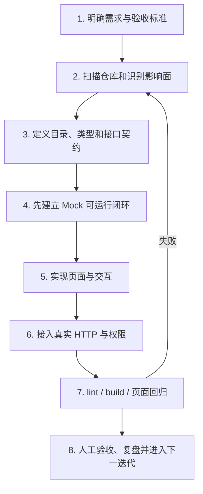
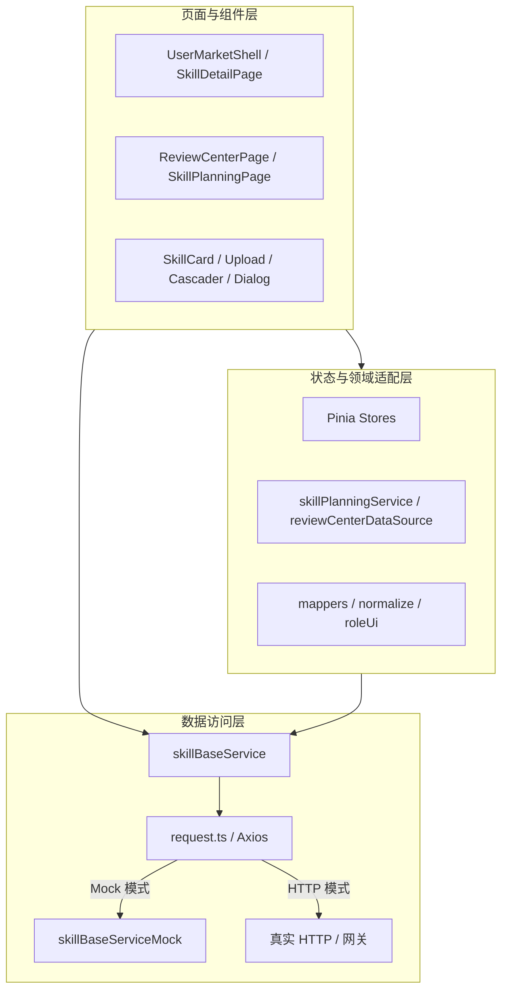
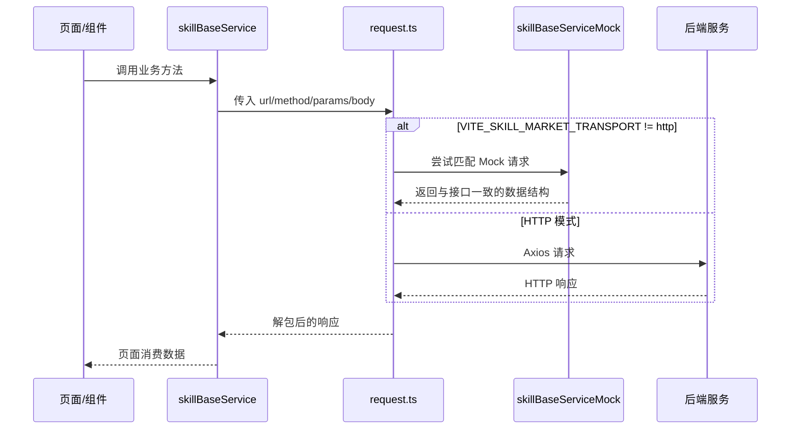
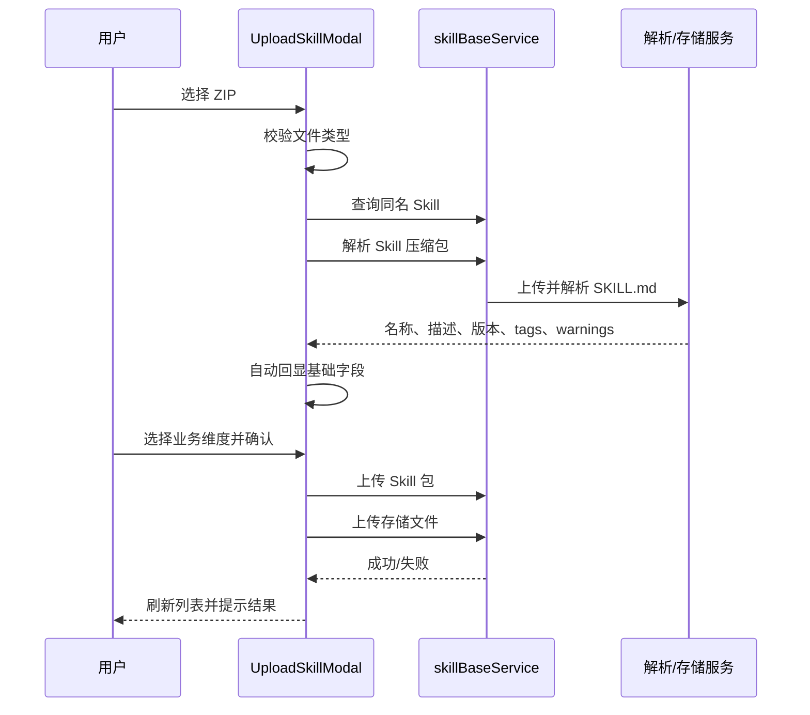

# Codex AI 辅助前端开发案例：Agent Center Skill 市场

> 文档性质：公司内部案例分享材料  
> 项目类型：Vue 3 企业级前端应用  
> 文档版本：V1.0  
> 基线日期：2026-07-22  
> 代码基线：当前工作区（包含尚未提交的在研变更）  
> 建议分享人：项目开发者  
> 保密建议：内部公开，演示截图需脱敏

---

## 0. 执行摘要

本案例是一套以 **Agent Center Skill 市场**为核心的企业内部前端应用。系统用于承接 Skill 的发现、发布、下载、版本管理、组织同步、质量评审、运营分析，以及 Harness 侧的 Skill 规划与配置管理。项目不是单页原型，而是已经形成了页面层、领域服务层、接口适配层、Mock 数据层和权限模型的中大型 Vue 应用。

项目采用“**人负责目标、规则与验收，Codex 负责分析、生成、修改与验证**”的协作方式。开发者持续向 Codex 提供需求文档、页面原型、接口约束、现有代码和反馈；Codex 在真实代码库内完成结构分析、方案拆解、组件与服务实现、问题定位、静态检查和构建验证；最终业务判断、权限口径、接口确认和发布决策仍由人负责。

截至当前代码基线，项目具备以下可验证规模：

| 指标            |                 当前结果 | 说明                                             |
| --------------- | -----------------------: | ------------------------------------------------ |
| 开发周期        | 2026-04-24 至 2026-07-21 | 按 Git 提交日期统计                              |
| Git 提交数      |                      284 | 包含功能、样式、联调与合并提交                   |
| 前端源文件      |                       71 | 统计 `.ts`、`.vue`、`.scss`、`.css`              |
| Vue 单文件组件  |                       22 | 页面和业务组件                                   |
| TypeScript 文件 |                       46 | 服务、类型、状态、工具与路由                     |
| 前端源码行数    |                   49,043 | 当前工作区统计值，不含 `node_modules` 和构建产物 |
| 构建模块数      |                      240 | Vite 生产构建实际转换结果                        |
| ESLint          |                     通过 | `npm run lint`，退出码 0                         |
| 生产构建        |                     通过 | `npm run build`，退出码 0                        |

本案例的核心价值不在于“AI 写了多少行代码”，而在于验证了一套可以复制的工作方式：

1. 用需求、类型和接口契约约束 AI，而不是只给一句自然语言让 AI 自由发挥。
2. 让 AI 在真实仓库中理解上下文并连续迭代，而不是生成孤立代码片段。
3. 将 Mock 与 HTTP 解耦，使前端可以在后端未完全就绪时先形成可演示、可验证的完整流程。
4. 用 lint、build、页面验收和联调反馈构成闭环，确保“生成代码”最终成为“可交付代码”。

---

## 1. 项目简介

### 1.1 项目背景

公司级 Agent Center Skill 市场承担组织级 Skill 的统一管理、发布验收、安全治理和分发。产业侧同时需要一个更轻量、更贴近日常研发作业的前置平台，让个人和团队能够快速沉淀、试用和验证 Skill，再将成熟能力同步到组织级市场。

当前项目前端承载的核心业务闭环是：

```text
日常经验沉淀为 Skill
  → 上传并自动解析
  → 个人级发布
  → 市场发现、试用和下载
  → 版本持续演进
  → 同步至 Agent Center 组织
  → 管理员审核与质量评审
  → 运营分析与规模化复用
```

项目同时延伸到 Harness 能力规划场景，支持按部门维护 Skill 规划、场景体系、活动体系和配置权限。

### 1.2 业务问题

项目试图解决的不是单一“Skill 列表展示”问题，而是以下一组连续问题：

- 个人经验分散，缺少统一沉淀、检索和复用入口。
- Skill 包结构和元数据不统一，人工发布成本高。
- 个人级能力升级为组织级能力时，缺少清晰的审核和状态流转。
- 市场内容增多后，缺少部门、业务维度、标签、质量等多维筛选。
- Skill 的 AI 评分、专家评审、勋章和历史记录缺少集中工作台。
- 各部门的 Skill 建设计划缺少统一台账、批量维护和进度管理。
- 后端接口和权限模型仍在演进，前端需要能够独立开发和演示。

### 1.3 建设目标

项目目标可归纳为四层：

| 层次     | 目标                                             |
| -------- | ------------------------------------------------ |
| 用户价值 | 能发现、理解、上传、试用、下载和维护 Skill       |
| 组织治理 | 能完成组织同步、角色控制、审核和质量评审         |
| 运营管理 | 能查看数量、调用、下载、部门分布等运营指标       |
| 工程能力 | 能在 Mock 和真实 HTTP 间切换，支持持续联调和扩展 |

### 1.4 用户与角色

当前项目围绕三类市场角色设计：

| 角色                     | 主要能力                                       | 前端控制重点          |
| ------------------------ | ---------------------------------------------- | --------------------- |
| 普通用户 `USER`          | 浏览、筛选、上传、下载、查看详情、维护个人发布 | 不展示组织治理入口    |
| 组织管理员 `ORG_ADMIN`   | 管理授权组织、处理本组织数据、查看运营与评审   | 只能操作授权组织/部门 |
| 超级管理员 `SUPER_ADMIN` | 全量组织治理、组织创建、跨组织管理             | 展示平台级配置能力    |

此外，评审中心还通过独立的“是否为专家”接口控制入口。市场角色和专家身份是两条不同的授权维度。

### 1.5 当前实现范围

为了准确反映当前代码，而不是仅复述需求文档，功能状态分为以下三类。

#### 已实现并接入主流程

- Skill 热榜、全部技能、搜索与多维筛选。
- Skill 卡片、详情、文件结构和文件内容预览。
- Skill 上传、压缩包解析、字段回显、重名检查和存储上传。
- 我的发布、状态筛选、版本管理、版本下载、版本下架和整项删除。
- 运营管理与本地 Excel/JSON 数据处理能力。
- 组织管理及基于角色的入口控制。
- 专家评审中心，包括 AI 评审详情、专家评分、勋章推荐和历史记录。
- Skill 规划，包括查询、分页、行内新增/编辑、批量修改、导入导出和删除。
- Harness 配置管理，包括场景、活动和部门权限配置。
- 父应用通过 `postMessage` 注入用户、部门和目标页签。

#### 已有实现，但仍处于联调或数据补齐阶段

- 评审中心在 HTTP 模式下已接入评审列表和详情等接口，但部分排名、算力、勋章运营数据仍使用 Mock 或空数据结构等待后端契约确定。
- 仓库保留一套完整的 `SkillMarketClient` Mock/HTTP 抽象，但当前主页面实际以 `skillBaseService` 和领域服务为主要调用入口，尚未完成统一迁移。
- 部分 Harness 配置和任务数据在 Mock 阶段使用 `localStorage` 持久化，生产环境仍需落到后端。

#### 页面中暂时隐藏或占位

- `CoreHarness` 市场页签在模板中通过 `v-if="false"` 隐藏。
- 市场“审核中心”页签当前通过 `false && showAdminModules` 隐藏。
- Harness 的 Command 规划、Agent 规划和 Extension 发布为占位页面；当前重点实现 Skill 规划和配置管理。

这种状态标注非常重要：AI 辅助案例应展示真实进度，不应把“已有代码骨架”描述为“已完成上线能力”。

---

## 2. 人与 AI 的协作模式

### 2.1 协作原则

本项目采用的不是“AI 代替开发者”，而是“开发者建立约束，AI 提高实现带宽”的模式。


### 2.2 人与 Codex 的职责边界

| 工作内容 | 人的职责                           | Codex 的职责                      |
| -------- | ---------------------------------- | --------------------------------- |
| 项目目标 | 确定为什么做、服务谁、优先级是什么 | 将目标转化为可实现任务            |
| 业务规则 | 确认角色、状态、权限、字段含义     | 在代码中系统性落地规则            |
| 技术方案 | 决定技术边界和关键取舍             | 分析现有结构、给出方案并实现      |
| 页面实现 | 提供原型、交互意图和验收标准       | 生成组件、样式、状态和交互逻辑    |
| 接口联调 | 确认后端真实契约和环境             | 编写请求、类型、映射、Mock 和容错 |
| 问题修复 | 描述现象、判断业务是否正确         | 定位根因、修改代码、运行验证      |
| 质量保障 | 最终验收、安全评审和上线决策       | 执行静态检查、构建、回归建议      |
| 责任归属 | 对交付结果负责                     | 提供辅助，不替代责任人            |

### 2.3 AI 生成占比的专业口径

当前仓库没有保存可审计的 Codex patch 遥测，Git 作者也不等于代码实际生成者，因此不能从提交记录精确计算“AI 生成代码百分比”。在公司分享中，建议采用以下口径：

> **建议对外表述：AI 深度参与度约 80%，其中大部分页面初稿、样式、服务适配和重复性逻辑由 AI 生成或改写；业务目标、权限规则、接口确认、视觉判断和最终验收由开发者 100% 负责。**

可以进一步拆分为：

| 工作类型             |       建议描述 | 说明                                           |
| -------------------- | -------------: | ---------------------------------------------- |
| 需求与业务决策       |    人主导 100% | AI 可辅助整理，但不能替业务负责人决策          |
| 代码初稿与机械性改写 | AI 约 70%～80% | 组件、类型、请求、Mock、样式和重复逻辑占比较高 |
| 调试与修复建议       | AI 约 60%～80% | AI 定位与修改，人提供现象并做最终判断          |
| 文档与结构化总结     | AI 约 80%～90% | 人审核事实、敏感信息和表达口径                 |
| 验收与发布责任       |    人主导 100% | 包括业务正确性、安全性和生产风险               |

这里的“80%”表示 **AI 参与开发活动的深度**，不等同于“80% 的代码可以无人审核”。如果公司需要可审计数据，后续应在任务系统中记录每个需求的 AI 初稿、人工修改量、一次通过率和返工次数。

### 2.4 本项目实际形成的协作节奏

1. **输入完整上下文**：开发者提供当前文件、页面原型、需求文档、接口字段和已有问题。
2. **先读后改**：Codex 先检查目录、依赖、调用链和相邻模块，避免生成与项目风格不一致的孤立代码。
3. **按垂直切片实现**：一个需求同时处理页面、状态、服务、类型、Mock 和样式，而不是只改模板。
4. **小步反馈**：开发者根据真实页面反馈间距、固定列、文案、筛选行为、权限边界等细节。
5. **持续校正**：AI 根据反馈定位到具体组件和 CSS 规则，完成局部修正。
6. **工程验证**：至少执行 lint 和生产构建，阻止明显语法、类型和打包问题进入交付。

### 2.5 高质量提示词结构

本项目适合复用以下提示词模板：

```text
【上下文】
当前页面/文件是什么，相关需求文档和接口在哪里。

【目标】
用户最终应该看到什么、能完成什么操作。

【业务规则】
角色、状态、字段、权限、筛选关系、异常分支。

【技术约束】
必须复用哪些组件/服务；是否兼容 Mock 与 HTTP；不能破坏哪些现有行为。

【验收标准】
列出可观察结果，并要求运行 lint、build 或指定测试。
```

例如，不只说“做一个部门筛选”，而应说明：部门树来自哪个接口、支持 L1～L6、多个层级按 AND 过滤、组织管理员只能选择授权部门、选择后必须点击“完成”才触发查询、清空时恢复默认授权范围。

---

## 3. 总体开发流程

### 3.1 从需求到交付的八步流程



### 3.2 为什么先定义结构和契约

AI 生成代码速度很快，但如果没有目录职责和数据契约，速度会转化为重复实现和维护成本。本项目先建立了以下约束：

- 页面只负责展示和交互编排。
- 复用交互抽到 `components/skill`。
- API DTO 统一放在 `apiTypes.ts`。
- 业务模型放在 `types` 或领域共享文件。
- URL 和请求调用集中到服务层。
- Mock 与 HTTP 尽量保持相同响应结构。
- DTO 与 UI 模型通过 mapper/normalize 函数转换。

这些约束让 Codex 能在后续任务中快速定位“改哪里、影响谁、如何验证”。

### 3.3 垂直切片，而不是按文件分工

以“上传 Skill”为例，一个可交付切片包含：

1. 上传弹窗与拖拽/选择文件交互。
2. ZIP 类型与大小校验。
3. `SKILL.md` 解析接口。
4. 名称、描述、版本、标签自动回显。
5. 业务维度人工选择。
6. 同名 Skill 检查和版本提示。
7. 文件存储上传。
8. 成功、warning、失败等用户反馈。
9. Mock 响应和 HTTP 请求形状。
10. lint、build 和页面验收。

这种切片方式特别适合 AI：上下文集中、验收结果明确，也便于开发者判断是否完成。

---

## 4. 项目目录层级与职责

### 4.1 当前目录结构

```text
projectTest/
├─ public/                         # 静态资源，如 favicon、帮助图标
├─ docs/                           # 需求、设计、联调说明和案例文档
├─ src/
│  ├─ api/                         # 用户等外部接口入口
│  ├─ components/skill/            # Skill 领域可复用组件
│  │  ├─ SkillCard.vue
│  │  ├─ UploadSkillModal.vue
│  │  ├─ SkillDetailDialog.vue
│  │  ├─ SkillVersionManageDialog.vue
│  │  ├─ MarketDeptCascader.vue
│  │  ├─ BusinessDimensionCascader.vue
│  │  ├─ DepartmentTaxonomyPanel.vue
│  │  └─ ...
│  ├─ mock/                        # 运营看板静态 JSON
│  ├─ router/                      # Vue Router 路由定义
│  ├─ services/skillMarket/        # 接口、Mock、领域服务、映射和权限辅助
│  │  ├─ apiTypes.ts               # API DTO 与统一响应类型
│  │  ├─ endpoints.ts              # REST 路径常量
│  │  ├─ request.ts                # Axios 请求通道和 Mock 拦截入口
│  │  ├─ skillBaseService.ts       # 当前主流程使用的业务 API 门面
│  │  ├─ skillBaseServiceMock.ts   # 与门面对应的 Mock 路由
│  │  ├─ skillPlanningService.ts   # Skill 规划领域适配
│  │  ├─ reviewCenterDataSource.ts # 评审中心 Mock/HTTP 数据源
│  │  ├─ roleUi.ts                 # 角色与 UI 权限判断
│  │  ├─ mappers.ts                # DTO 与 UI 模型转换
│  │  └─ mock/                     # 内置 Skill、部门树、业务维度等数据
│  ├─ stores/                      # Pinia：用户与父应用注入上下文
│  ├─ style/                       # 页面级样式
│  ├─ types/                       # Skill、用户等业务类型
│  ├─ utils/                       # Excel、详情展示等通用工具
│  ├─ views/                       # 路由页面和业务工作台
│  ├─ App.vue                      # 用户初始化、父应用消息接入、路由同步
│  └─ main.ts                      # Vue、Pinia、Router 启动入口
├─ package.json                    # 依赖和脚本
├─ vite.config.ts                  # Vite、别名、base、代理
├─ tsconfig.app.json               # TypeScript 约束
└─ eslint.config.js                # ESLint + Vue + TypeScript + Prettier
```

`src/数据处理先不用管` 中的 Python 脚本属于历史/离线数据处理辅助，不参与当前 Vite 前端构建，案例主体不将其计入前端架构。

### 4.2 分层关系



### 4.3 当前架构的真实情况

仓库中还存在 `SkillMarketClient`、`skillMarketMockClient` 和 `skillMarketHttpClient`，它们定义了一套更完整的统一客户端抽象。但当前业务页面没有实例化 `createSkillMarketClient()`，主流程直接使用 `skillBaseService`。因此：

- **当前事实**：`skillBaseService` 是主要 API 门面。
- **既有资产**：`SkillMarketClient` 是可复用的目标架构资产。
- **后续建议**：选定一套访问入口，逐步迁移，避免两套 Mock/HTTP 实现长期漂移。

这是 AI 辅助开发中常见的演进现象：AI 可以快速补齐新结构，但团队仍需要及时做架构收口。

---

## 5. 初始化与项目配置

### 5.1 技术栈

| 类别     | 技术              | 项目用途                                         |
| -------- | ----------------- | ------------------------------------------------ |
| 前端框架 | Vue 3.5           | Composition API、响应式状态、组件化              |
| 开发语言 | TypeScript 5      | DTO、业务模型和组件契约                          |
| 构建工具 | Vite 4            | 本地开发、环境变量和生产构建                     |
| 路由     | Vue Router 4      | 市场、Harness、详情页路由                        |
| 状态管理 | Pinia 3           | 用户信息、父应用注入的用户/部门上下文            |
| HTTP     | Axios + Fetch     | 当前门面主要使用 Axios，统一客户端资产使用 Fetch |
| 样式     | CSS + Sass        | 页面视觉、响应式和复杂工作台布局                 |
| Markdown | md-editor-v3      | Skill 文件内容/Markdown 展示能力                 |
| Excel    | xlsx              | 规划与运营数据导入导出                           |
| 压缩包   | pizzip            | ZIP 类文件处理辅助                               |
| 规范     | ESLint + Prettier | 语法、代码风格和格式约束                         |

### 5.2 常用命令

```bash
npm install
npm run dev
npm run lint
npm run build
npm run buildGamma
npm run buildProd
npm run preview
```

### 5.3 启动过程

`src/main.ts` 的启动顺序很清晰：

```text
createApp(App)
  → createPinia()
  → app.use(pinia)
  → app.use(router)
  → mount('#app')
```

`App.vue` 在挂载后初始化用户信息，并每 5 分钟检查一次登录态；同时监听父应用的 `Skill_Square_Init` 消息，将 `userId`、部门树、目标 tab 和可选 `skillId` 同步到 Pinia 与路由。

### 5.4 路由设计

| 路径                            | 页面                        | 用途                   |
| ------------------------------- | --------------------------- | ---------------------- |
| `/`                             | 重定向                      | 跳转到 `/skill-market` |
| `/skill-market`                 | `SkillMarketPage.vue`       | 市场主工作台           |
| `/harness-management`           | `HarnessManagementPage.vue` | Harness 规划与配置     |
| `/skill-market/detail/:skillId` | `SkillDetailPage.vue`       | 独立 Skill 详情页      |
| `/skill-detail/:skillId`        | 路由别名                    | 兼容既有入口           |

路由还兼容旧的 `planning`、`skillPlanning` 等 tab 参数，并将它们重定向到 Harness 管理页面，降低嵌入式平台升级时的兼容成本。

### 5.5 环境变量与传输切换

公开示例中定义了以下核心配置：

| 变量                                     | 用途                           |
| ---------------------------------------- | ------------------------------ |
| `VITE_SKILL_MARKET_TRANSPORT`            | `mock` 或 `http`，控制数据来源 |
| `VITE_SKILL_MARKET_API_BASE`             | 真实后端根路径，空值表示同源   |
| `VITE_SKILL_MARKET_MOCK_ROLE`            | Mock 用户角色                  |
| `VITE_SKILL_MARKET_MOCK_MANAGED_ORG_IDS` | Mock 组织管理员的授权组织      |
| `VITE_BASE`                              | Vite 部署 base 路径            |

源码还使用扶摇代理、Agent 调测和目标应用地址等环境变量。公司分享材料只应展示变量名称和作用，不应展示真实环境地址、Cookie、Token 或内部凭据。

### 5.6 Vite 与工程规范

- `@` 映射到 `src`，减少深层相对路径。
- 开发服务器将 `/fuyaoDomain` 代理到扶摇目标服务。
- TypeScript 开启未使用变量、未使用参数和 switch fallthrough 等检查。
- ESLint 覆盖 JS、TS 和 Vue 文件，并通过 `eslint-config-prettier` 解决格式冲突。
- `.env.development`、`.env.production` 支持不同构建模式。

---

## 6. 核心运行机制

### 6.1 Mock 与 HTTP 双通道



这种设计带来三个直接收益：

1. 后端尚未完成时，前端仍可完成页面和交互验证。
2. Mock 和 HTTP 使用相同业务方法，切换环境时页面改动较小。
3. 权限、状态、异常和边界数据可以在本地重复模拟。

### 6.2 用户身份与上下文优先级

市场页面计算当前操作者工号时使用以下优先级：

```text
父应用注入的 skillMarketStore.userId
  > 当前角色接口返回的 employeeNo
  > userStore.userInfo.w3Id
```

这解决了嵌入式页面中“角色接口已经返回，但父应用或 Profile 状态尚未同步”的瞬时不一致问题。上传、删除、审核、规划等接口都依赖稳定的操作者 ID。

### 6.3 权限控制方式

权限控制包含三层：

1. **入口层**：根据角色或专家身份决定是否展示菜单。
2. **数据层**：组织管理员只获得授权组织/部门范围。
3. **操作层**：新增组织、部门权限配置、删除、审核等按钮再次判断。

前端权限只改善体验，最终安全边界仍必须由后端接口校验。

### 6.4 状态存储策略

| 状态               | 当前存储位置            | 示例                                   |
| ------------------ | ----------------------- | -------------------------------------- |
| 用户与父应用上下文 | Pinia                   | 用户 ID、部门列表、登录用户信息        |
| 页面临时状态       | Vue `ref/reactive`      | 筛选、分页、弹窗、loading、toast       |
| 路由状态           | Vue Router query/params | tab、skillId                           |
| Mock 配置与任务    | `localStorage`          | 场景、活动、规划权限、主数据关联、任务 |
| 服务端数据         | HTTP/Mock 服务          | Skill、组织、评审、运营、规划          |

### 6.5 数据防御与兼容

项目中大量使用 normalize/coerce/mapping 函数处理后端字段差异，例如：

- `ApiEnvelope<T>` 新旧响应壳兼容。
- 列表可能返回 `list`、`records`、`items` 或 `rows`。
- 用户信息可能使用 `employeeNo`、`uid`、`account` 等字段。
- 部门树可从父应用注入，也可从接口或 Mock 获取。
- Skill UI 模型兼容历史字段与新接口字段。

这种防御性设计提高了联调阶段的可用性，但长期仍应推动后端契约收敛，避免兼容逻辑无限增长。

---

## 7. 功能模块开发过程

### 7.1 模块全景

| 模块                    | 用户结果                                          | 核心文件                                       | 当前状态                         |
| ----------------------- | ------------------------------------------------- | ---------------------------------------------- | -------------------------------- |
| 热榜                    | 查看热门 Skill 和市场指标                         | `UserMarketShell.vue`、`SkillCard.vue`         | 已实现                           |
| 全部技能                | 搜索、组织/部门/业务维度/标签筛选、排序、滚动加载 | `UserMarketShell.vue`、两个 Cascader           | 已实现                           |
| 发布 Skill              | ZIP 上传、解析、回显、校验、存储                  | `UploadSkillModal.vue`                         | 已实现                           |
| 我的发布                | 状态筛选、同步、更新、删除、版本操作              | `UserMarketShell.vue`                          | 已实现                           |
| Skill 详情              | 文件树、内容预览、下载、调测、版本列表/对比       | `SkillDetailPage.vue`、`SkillDetailDialog.vue` | 已实现                           |
| 组织管理                | 组织查询、新建、编辑、管理员维护                  | `UserMarketShell.vue`、`roleUi.ts`             | 已实现，受角色控制               |
| 运营管理                | KPI、分布、排行、Excel/JSON 数据处理              | `UserMarketShell.vue`、`opsExcelImport.ts`     | 已实现                           |
| 评审中心                | AI 评分、专家评分、勋章、历史版本                 | `ReviewCenterPage.vue`                         | 主流程已实现，部分 HTTP 数据待补 |
| Skill 规划              | 查询、筛选、增删改、批量、导入导出                | `SkillPlanningPage.vue`、领域服务              | 已实现                           |
| 配置管理                | 场景、活动、部门配置权限                          | `HarnessConfigurationPage.vue`、配置组件       | 已实现，部分 Mock 本地存储       |
| Command/Agent/Extension | Harness 其它规划能力                              | `HarnessManagementPage.vue`                    | 当前占位                         |

### 7.2 市场列表：从“卡片展示”到“可运营检索”

#### 需求拆解

市场列表不是简单的 `v-for`，还需要：

- 关键词搜索。
- 个人级/组织级等范围筛选。
- 组织单选。
- 部门 L1～L6 级联筛选。
- 业务维度一级/二级筛选。
- 标签多选并集。
- 下载量、评分、发布时间排序。
- 分页或接近底部自动预取。
- 加载中、空数据、全部加载完成等状态。

#### AI 实现方式

Codex 将需求拆成三类函数：

1. `matchesXxx`：每个筛选维度独立判断。
2. `sortOverviewSkills`：统一排序。
3. `loadOverviewRemotePage` 和滚动阈值判断：处理远端分页与连续加载。

这样比把全部逻辑写进一个 computed 更容易调试，也便于 Mock 和 HTTP 使用同一套交互。

#### 验收重点

- 同维度标签按 OR，不同维度按 AND。
- 部门路径逐级精确匹配。
- 修改筛选后重置页码和滚动位置。
- 重复触底不会并发加载同一页。
- 空结果和加载完成都有明确提示。

### 7.3 Skill 上传：把压缩包变成结构化资产



实现中的关键细节：

- 系统自动解析名称、描述、版本和 tags。
- 业务维度不盲从 `SKILL.md`，由用户显式选择。
- warning 和 error 分开呈现，避免“解析成功但数据不完整”被当成可直接发布。
- 同名 Skill 会提示当前版本，帮助用户判断是新建还是更新。
- 操作者 ID 由页面统一传入，避免弹窗内部状态不同步。

### 7.4 Skill 详情与版本：处理复杂上下文差异

同一个详情组件支持三种使用方式：

- 市场卡片弹窗详情。
- 独立路由详情页。
- 历史版本只读预览。

详情能力包括：

- 展示标题、作者、版本、标签和统计信息。
- 左侧文件树和右侧文件内容。
- 图片文件预览失败时回退为文本/错误提示。
- SKILL.md 内容展示。
- 版本列表和版本对比。
- 下载、在线试用、版本管理、删除等上下文操作。

从“全部技能”进入时不应展示删除；从“我的发布”进入时可以展示删除和版本操作。项目通过 `showDelete`、`previewOnly`、`displayMode`、`showOperationsColumn` 等组件契约表达上下文，而不是复制多个详情页面。

### 7.5 Skill 规划：复杂表格的渐进实现

Skill 规划是当前项目中交互密度最高的模块之一，包含：

- 部门、产品、时间、关键词等查询条件。
- 场景、活动、级别、状态等表头多选筛选。
- 计划完成时间排序。
- 分页和页大小切换。
- 行内新增、行内编辑和弹窗编辑。
- 人员远程模糊搜索与选择确认。
- 产品远程搜索。
- 批量编辑、批量删除。
- Excel 模板下载、导入和导出。
- 部门授权范围过滤。
- 规划主数据管理子页面。

开发过程采用“共享类型 → Mock 服务 → HTTP 适配 → 页面交互”的顺序：

```text
skillPlanningShared.ts
  → 定义数据模型、字段映射、归一化和 Excel 表头
skillPlanningMockService.ts
  → 提供可运行的本地 CRUD/导入导出
skillPlanningService.ts
  → 根据 transport 选择 Mock 或 HTTP，并统一响应
SkillPlanningPage.vue
  → 实现查询、表格、批量操作和用户反馈
```

这使复杂页面可以在接口未完全稳定时先完成交互验收。

### 7.6 评审中心：AI 评分与专家判断协同

评审中心本身也体现了“AI + 人”的业务设计：系统提供 AI 评审维度和雷达图，专家负责给出有业务责任的最终评分、理由、整体意见和勋章推荐。

核心能力包括：

- 按状态、月份、业务维度、部门和排序方式筛选任务。
- 左侧评审任务列表滚动加载。
- 展示 Skill 下载量、调用量和 AI 综合评分。
- AI 评审维度、检查项、得分和雷达图。
- 专家维度评分与理由。
- 按权重自动计算专家总分，禁止手工篡改总分。
- 勋章多选及共用推荐理由。
- 提交前完整校验。
- 查看历史版本中 AI 与专家的评审记录。

代表性校验规则：

- 所有专家评审维度必须有分数和理由。
- 整体评审意见必填。
- 选择勋章后必须填写推荐理由；不选勋章则理由可空。
- 已提交记录按状态展示，避免重复误操作。

### 7.7 组织、运营与权限

组织管理由当前用户角色驱动：

- 普通用户不展示入口。
- 组织管理员只能操作授权组织。
- 超级管理员可创建组织并管理全量配置。

运营管理支持扶摇和公司系统两种口径。当前公司系统看板读取仓库内打包 JSON；Excel 导入用于页面预览并生成新的 JSON。扶摇侧通过接口获取看板数据。该设计适应了两个系统数据可用性不同的现实情况。

### 7.8 Harness 配置：保存后联动规划页

Harness 配置管理包含：

- 场景管理：按部门维护一级/二级场景及排序。
- 活动管理：按部门维护活动/子活动体系。
- 部门权限配置：为人员分配可管理部门。

`harnessConfigurationSyncService.ts` 通过响应式 revision 通知配置变化。规划页面读取新的 revision 后刷新选项，实现“配置保存后自动同步到规划页面”的前端联动。

---

## 8. AI 辅助开发中的关键设计决策

### 8.1 先做契约，再做页面

项目为接口定义 `ApiEnvelope<T>` 和大量 DTO，使 AI 在生成页面代码时有明确字段边界。即使部分旧接口仍使用 `any`，核心方向仍是类型优先。

### 8.2 Mock 不是假页面，而是契约替身

Mock 层不仅返回静态数组，还模拟了：

- 角色与授权组织。
- 列表筛选和分页。
- 上传与版本演进。
- 下载次数累加。
- 审核状态流转。
- 草稿审批。
- 规划 CRUD 和导入导出。

因此 Mock 可以支持完整业务演示，而不是仅用于“页面有数据”。

### 8.3 权限上下文先于页面渲染

Harness 页面在角色上下文未准备好时显示加载状态；无授权部门时显示明确的无权限状态，而不是先渲染全部数据再隐藏。这减少了越权数据闪现和用户困惑。

### 8.4 复杂组件通过模式参数复用

详情、版本管理和部门级联等组件使用 props/emit 表达场景差异，避免复制粘贴。AI 在接到“这个入口要显示删除、另一个入口不要显示”这类反馈时，可以修改组件契约而不是制造新组件。

### 8.5 对异步交互做显式状态建模

项目为加载、提交、删除、导入、远程搜索、分页和 toast 等分别维护状态。虽然代码量增加，但可以防止重复提交、请求覆盖和无反馈等待。

### 8.6 兼容嵌入式平台

项目通过 `postMessage` 接收父应用上下文，并兼容历史 tab 名称和详情路由别名。这体现了企业前端常见的“新页面必须嵌入旧平台并保持兼容”约束。

---

## 9. 质量保障与验证结果

### 9.1 当前验证结果

本案例文档编写时，在当前工作区执行了以下检查：

| 检查            | 结果        | 说明                     |
| --------------- | ----------- | ------------------------ |
| `npm run lint`  | 通过        | ESLint 退出码 0          |
| `npm run build` | 通过        | Vite 完成 240 个模块转换 |
| HTML 构建产物   | 0.47 kB     | gzip 0.32 kB             |
| CSS 构建产物    | 715.69 kB   | gzip 108.60 kB           |
| 主 JS 构建产物  | 1,079.27 kB | gzip 359.00 kB           |

### 9.2 构建警告

构建虽然通过，但存在两个值得在案例分享中主动说明的工程问题：

1. Dart Sass legacy JS API 已弃用，未来升级 Sass/Vite 时需要处理。
2. 主 JS chunk 超过 500 kB，Vite 建议使用动态导入或 `manualChunks` 拆包。

这说明“AI 写完并能构建”不是终点；性能、升级和长期维护仍需专项治理。

### 9.3 当前测试短板

`package.json` 目前没有单元测试或端到端测试脚本。现阶段质量主要依赖：

- TypeScript 与 ESLint 静态检查。
- 生产构建。
- Mock 场景验证。
- 开发者页面验收。
- 后端联调。

后续建议补充 Vitest + Vue Test Utils，以及覆盖上传、筛选、权限、版本、规划和评审主路径的 Playwright E2E。

### 9.4 推荐的 AI 代码验收清单

每次接受 AI 修改前至少检查：

- [ ] 是否只修改了需求范围内的文件。
- [ ] 是否复用了现有类型、服务和组件。
- [ ] 是否同时覆盖成功、空数据、失败和无权限状态。
- [ ] 是否破坏 Mock/HTTP 任一模式。
- [ ] 是否将内部地址、Token 或个人信息写入代码。
- [ ] 是否存在未校验的 `postMessage`、HTML 注入或文件上传风险。
- [ ] 是否通过 lint 和 build。
- [ ] 是否由业务负责人完成最终页面验收。

---

## 10. 生成结果展示

### 10.1 页面成果

#### 热榜

用户进入市场即可看到 Skill 数量、创作者、调用量和下载量等指标，以及高价值 Skill 卡片。页面强调“发现”和“复用”，适合作为分享演示的开场。

#### 全部技能

用户可以通过关键词、组织、部门、业务维度、标签和排序组合定位 Skill。卡片展示版本、作者、质量标记、下载/调用指标，并支持详情、试用和下载。

#### 上传 Skill

上传弹窗会指导用户准备标准 `SKILL.md`，选择 ZIP 后自动解析基础信息，并明确区分系统解析字段和人工选择的业务维度。

#### Skill 详情与版本

详情支持文件树、文件内容、SKILL.md、版本列表和版本对比。独立详情路由适合从父平台直接跳转，也支持从“我的发布”进入后管理版本或删除。

#### 我的发布

发布者可以查看个人级、组织审核中、组织已驳回、组织级和自进化草稿等状态，并执行同步、下载、版本管理和删除等操作。

#### 运营管理

运营页面提供 KPI、部门分布、Skill 明细和数据导入能力，支持扶摇与公司系统两种数据口径。

#### 评审中心

专家可以从任务列表进入 AI 评审和专家评审两个详情页签，完成维度评分、理由填写、勋章推荐、总分计算和历史记录查看。

#### Skill 规划与配置

Harness 工作台支持 Skill 规划表格、批量操作、Excel 导入导出，以及场景、活动和部门权限配置，形成“配置体系 → 规划执行”的联动。

### 10.2 分享演示脚本（建议 10～12 分钟）

|   时间 | 演示内容        | 讲解重点                          |
| -----: | --------------- | --------------------------------- |
| 1 分钟 | 热榜            | 项目定位、业务价值、成品视觉      |
| 2 分钟 | 全部技能筛选    | 复杂筛选关系、滚动加载、组件复用  |
| 2 分钟 | 上传 Skill      | 从 ZIP/SKILL.md 到结构化发布      |
| 2 分钟 | 详情与版本      | 文件预览、版本管理、上下文权限    |
| 2 分钟 | 评审中心        | AI 评分与专家责任的结合           |
| 2 分钟 | Skill 规划/配置 | 复杂表格、Mock/HTTP、部门权限联动 |
| 1 分钟 | lint/build 结果 | AI 生成必须进入工程验证闭环       |

### 10.3 推荐截图清单

为避免泄露内部账号、部门和地址，建议由分享人在脱敏环境按以下清单截图：

| 编号 | 地址/操作                    | 推荐画面                       |
| ---- | ---------------------------- | ------------------------------ |
| 01   | `/skill-market?tab=hot`      | 热榜标题、四项指标和首屏卡片   |
| 02   | `/skill-market?tab=overview` | 左侧/顶部多维筛选和卡片网格    |
| 03   | 点击“发布 Skill”             | 上传区、解析字段和业务维度选择 |
| 04   | 点击 Skill 卡片              | 文件树与文件内容详情           |
| 05   | 详情中进入版本               | 版本列表或版本对比             |
| 06   | `/skill-market?tab=releases` | 我的发布状态筛选与操作列       |
| 07   | `/skill-market?tab=ops`      | KPI、分布和排行                |
| 08   | 专家账号进入 `review`        | AI 雷达图与专家评分表单        |
| 09   | `/harness-management`        | Skill 规划表格和批量操作       |
| 10   | Harness“配置管理”            | 场景/活动/部门权限三个页签     |

截图时应隐藏浏览器内网地址、用户头像、工号、组织名称和真实 Skill 内容。建议使用统一 16:9 画布，并给关键区域增加编号标注。

---

## 11. 项目成效

### 11.1 可量化结果

- 在约三个月提交跨度内形成 49,043 行前端源码和 71 个源文件。
- 覆盖市场、发布、版本、运营、评审、规划、配置等多个业务域。
- 形成 22 个 Vue 组件/页面和 46 个 TypeScript 模块。
- 当前代码通过 ESLint 和生产构建。
- 通过 Mock 数据使多个复杂流程能够在后端未完全就绪时先行演示。

这些数据只能说明交付规模，不能单独说明质量或效率。更严谨的效率评估应继续记录需求交付周期、人工修改量、缺陷密度和线上稳定性。

### 11.2 研发效率价值

1. **缩短从需求到首个可交互版本的时间**：AI 可以同时生成模板、状态、样式和 Mock。
2. **降低重复劳动**：类型定义、请求方法、表格字段、状态样式和归一化函数适合 AI 批量处理。
3. **提高跨文件修改能力**：一个需求可以同步修改页面、组件、服务、类型和文档。
4. **加速问题定位**：对固定列、overflow、级联筛选、路由上下文等问题，AI 可以从调用链和 CSS 层级追踪根因。
5. **促进知识显性化**：为了让 AI 正确工作，团队被迫把隐含规则写成需求、类型、注释和验收标准。

### 11.3 业务价值

- 将零散 Skill 变成可检索、可下载、可评审的组织资产。
- 连接个人级创新与组织级治理。
- 通过版本、评审和运营数据建立质量反馈闭环。
- 通过 Skill 规划和部门配置把“已有资产”延伸到“未来建设计划”。

---

## 12. 典型问题与解决方式

### 12.1 需求看似简单，影响面实际很大

例如“详情页增加删除按钮”会同时影响：

- 从哪个入口进入。
- 当前用户是否为发布者。
- 删除单个版本还是整个 Skill。
- 市场详情是否应展示操作。
- 版本管理弹窗是否显示操作列。
- 删除成功后返回哪里、刷新哪张列表。

解决方式是先画出入口和状态矩阵，再修改公共组件契约。

### 12.2 接口字段和返回结构不断变化

项目中出现过 `list/records/items`、`pageNo/pageNum`、多种用户和部门字段。AI 的初版通常会严格按一个样例实现，联调后容易暴露兼容问题。

解决方式：

- 把响应兼容放在服务/mapper 层。
- 页面只消费稳定 UI 模型。
- 对关键字段设置明确 fallback。
- 最终推动后端统一契约，避免前端长期兜底。

### 12.3 复杂 CSS 的局部修复容易产生回归

表格固定操作列曾受到祖先元素 `overflow` 和 CSS 特异度影响。只修改 `position: sticky` 并不能解决问题。

解决方式：让 AI 同时检查滚动容器、祖先 overflow、z-index、背景和列宽，并在真实滚动场景验收。

### 12.4 部门筛选不仅是一个下拉框

部门筛选同时涉及父应用注入、接口树、Mock fallback、L1～L6 映射、管理员授权范围和“点击完成后再查询”的交互约束。

解决方式：将树转换、权限裁剪、选择状态和查询提交拆成独立层次。

### 12.5 AI 容易继续扩展，而不是主动收口

当前仓库同时存在两套服务客户端，就是快速迭代后需要架构治理的例子。AI 可以完成新增结构，但不会天然知道团队希望废弃哪套旧结构。

解决方式：每个阶段设置一次“架构收口任务”，明确唯一入口、迁移顺序和删除条件。

---

## 13. 风险、边界与后续改进

### 13.1 P0：上线前必须确认

| 风险                   | 当前表现                                                | 建议                                             |
| ---------------------- | ------------------------------------------------------- | ------------------------------------------------ |
| `postMessage` 来源校验 | `App.vue` 当前按消息类型处理，未显式校验 `event.origin` | 配置可信父域白名单并校验来源                     |
| 前端权限不是安全边界   | 页面通过角色隐藏入口                                    | 后端必须对每个组织、部门和操作再次鉴权           |
| 上传文件安全           | 前端主要校验 ZIP 和字段                                 | 后端执行大小、类型、解压路径、病毒和内容安全检查 |
| HTTP 契约未完全收敛    | 部分页面仍大量使用 `any` 和 fallback                    | 联调完成后冻结 DTO 和错误码                      |
| 本地 Mock 数据         | 配置/任务部分写入 `localStorage`                        | 生产模式必须使用服务端持久化                     |

### 13.2 P1：工程质量改进

1. 将 `UserMarketShell.vue`、`SkillPlanningPage.vue`、`ReviewCenterPage.vue` 进一步拆分为 composable、子组件和领域 Store。
2. 统一 `skillBaseService` 与 `SkillMarketClient` 两套访问方式。
3. 为关键 mapper、筛选、权限和状态流转补充单元测试。
4. 为上传、详情、版本、评审和规划补充 E2E。
5. 使用路由级动态导入和手工分包降低主 JS 体积。
6. 整理 8,000 行以上的页面 SCSS，建立设计 token 和组件级样式边界。
7. 逐步消除 `any`，尤其是 API 响应、表格行和表单对象。

### 13.3 P2：体验与运营改进

- 建立统一 Skeleton、Empty、Error 和权限状态组件。
- 完善帮助中心和上传规范说明。
- 增加操作埋点、接口耗时和异常上报。
- 将公司运营 JSON 更新流程自动化。
- 完善 Command、Agent、Extension 三个 Harness 占位模块。

### 13.4 AI 使用边界

以下内容不应只依赖 AI 判断：

- 权限与数据可见范围。
- 内部接口、账号、组织信息和敏感数据处理。
- 上传包安全、脚本执行和外部跳转。
- 生产环境配置。
- 业务状态是否允许回退或删除。
- 最终上线和故障处置决策。

---

## 14. 可复制的方法论

### 14.1 适合 AI 深度参与的任务

- 已有原型和明确验收标准的页面实现。
- DTO、表格列、表单和请求方法的批量生成。
- Mock/HTTP 适配与数据归一化。
- 重复交互组件抽取。
- CSS 问题定位和局部调整。
- lint/build 错误修复。
- 设计文档、联调说明和测试清单整理。

### 14.2 不适合直接交给 AI 决定的任务

- 需求优先级和范围取舍。
- 权限、合规和数据安全规则。
- 多系统责任边界。
- 生产事故中的高风险操作。
- 没有验收标准的“做得高级一点”。

### 14.3 团队复制清单

在新项目中复制本案例，建议先准备：

- [ ] 一份简明项目背景和业务目标。
- [ ] 用户角色与权限矩阵。
- [ ] 页面原型或参考图。
- [ ] 接口列表、DTO 和错误码。
- [ ] 目录职责和命名规范。
- [ ] Mock/HTTP 切换策略。
- [ ] 每个需求的可观察验收标准。
- [ ] lint、build、test 命令。
- [ ] 敏感信息与禁止操作清单。
- [ ] 人工 Review 与上线责任人。

### 14.4 推荐度量方式

后续如果要客观评估 AI 效率，建议每个需求记录：

| 指标               | 定义                                |
| ------------------ | ----------------------------------- |
| 首个可运行版本耗时 | 从任务开始到页面可运行              |
| AI 首稿采纳率      | AI 生成后未经大改保留的代码比例     |
| 人工修改率         | 人工修改行数 / 最终变更行数         |
| 一次验收通过率     | 首次提交即满足验收的需求占比        |
| 回归缺陷数         | AI 修改引起的已有功能问题           |
| 构建通过率         | AI 完成后第一次 lint/build 是否通过 |
| 平均对话轮次       | 一个需求从输入到验收的交互次数      |

这些指标比笼统的“AI 写了 80%”更能帮助团队改进流程。

---

## 15. 分享结论

本项目证明，Codex 可以在真实企业前端项目中承担大量高强度实现工作：理解已有仓库、跨文件修改、生成复杂交互、适配接口、维护 Mock、修复问题并执行工程验证。它带来的最大改变不是“少写几行代码”，而是让一名开发者能够同时处理更多上下文和更完整的垂直切片。

但项目也清楚地展示了 AI 辅助开发的边界：

- 没有清晰需求，AI 只会更快地产生偏差。
- 没有契约和目录约束，AI 会放大重复与漂移。
- 没有自动检查，能运行不等于可交付。
- 没有人工验收，权限、业务和安全责任无人承担。
- 没有阶段性重构，快速生成会累积大组件和双重架构。

因此，这个案例最值得推广的结论是：

> **AI 辅助开发的最佳实践，不是把任务整包交给 AI，而是由人建立正确约束，让 AI 在可验证的工程闭环中持续交付。**

---

## 附录 A：核心文件索引

| 主题             | 文件                                                             |
| ---------------- | ---------------------------------------------------------------- |
| 应用启动         | `src/main.ts`、`src/App.vue`                                     |
| 路由             | `src/router/index.ts`                                            |
| 市场主页面       | `src/views/skill/UserMarketShell.vue`                            |
| Skill 详情路由页 | `src/views/skill/SkillDetailPage.vue`                            |
| Skill 卡片       | `src/components/skill/SkillCard.vue`                             |
| 上传             | `src/components/skill/UploadSkillModal.vue`                      |
| 详情与版本对比   | `src/components/skill/SkillDetailDialog.vue`                     |
| 版本管理         | `src/components/skill/SkillVersionManageDialog.vue`              |
| 评审中心         | `src/views/skill/ReviewCenterPage.vue`                           |
| Skill 规划       | `src/views/skill/SkillPlanningPage.vue`                          |
| Harness 壳层     | `src/views/HarnessManagementPage.vue`                            |
| Harness 配置     | `src/views/skill/HarnessConfigurationPage.vue`                   |
| API 门面         | `src/services/skillMarket/skillBaseService.ts`                   |
| 请求与 Mock 拦截 | `src/services/skillMarket/request.ts`、`skillBaseServiceMock.ts` |
| API DTO          | `src/services/skillMarket/apiTypes.ts`                           |
| 角色 UI 规则     | `src/services/skillMarket/roleUi.ts`                             |
| 规划领域服务     | `src/services/skillMarket/skillPlanningService.ts`               |
| 评审数据源       | `src/services/skillMarket/reviewCenterDataSource.ts`             |
| Excel 工具       | `src/utils/opsExcelImport.ts`                                    |
| 需求设计         | `docs/AgentCenter_Skill市场需求开发设计文档_结构保留补充版.md`   |
| 联调说明         | `docs/前端对接后端服务说明.md`                                   |

## 附录 B：建议的 30 分钟分享结构

|    时长 | 内容                          |
| ------: | ----------------------------- |
|  3 分钟 | 项目背景与业务问题            |
|  4 分钟 | 人与 Codex 的职责和协作闭环   |
|  5 分钟 | 目录、技术栈和 Mock/HTTP 架构 |
| 10 分钟 | 页面现场演示                  |
|  3 分钟 | lint/build、规模数据和成效    |
|  3 分钟 | 踩坑、风险和架构债务          |
|  2 分钟 | 可复制的方法与结论            |

## 附录 C：术语

| 术语         | 说明                                                             |
| ------------ | ---------------------------------------------------------------- |
| Skill        | 封装特定知识、流程或工具能力的可复用资产                         |
| 个人级 Skill | 用户上传后可在当前平台快速使用和验证的 Skill                     |
| 组织级 Skill | 经组织同步与审核后纳入统一治理的 Skill                           |
| Harness      | 对 Command、Skill、Agent、Extension 等能力进行规划和配置的工作台 |
| Mock         | 在真实后端未就绪时模拟接口行为的数据实现                         |
| DTO          | 前后端接口传输使用的数据结构                                     |
| AI 评审      | 系统按维度自动给出的质量分析和分数                               |
| 专家评审     | 由有权限的专家给出评分、理由、结论和勋章推荐                     |
