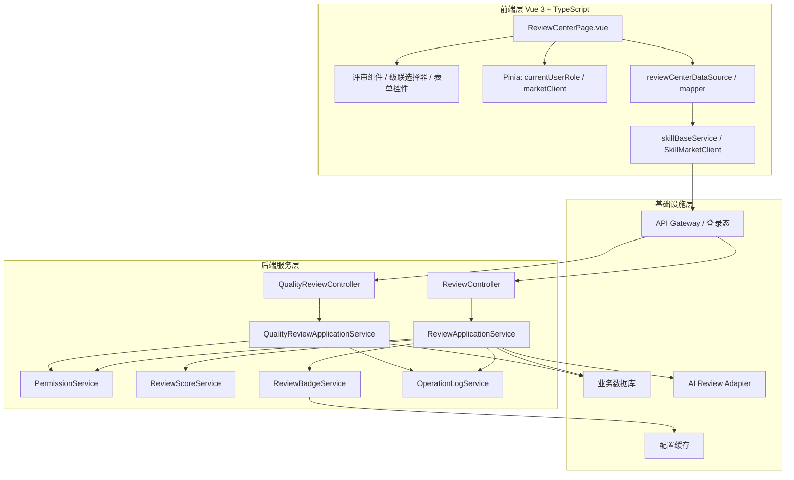
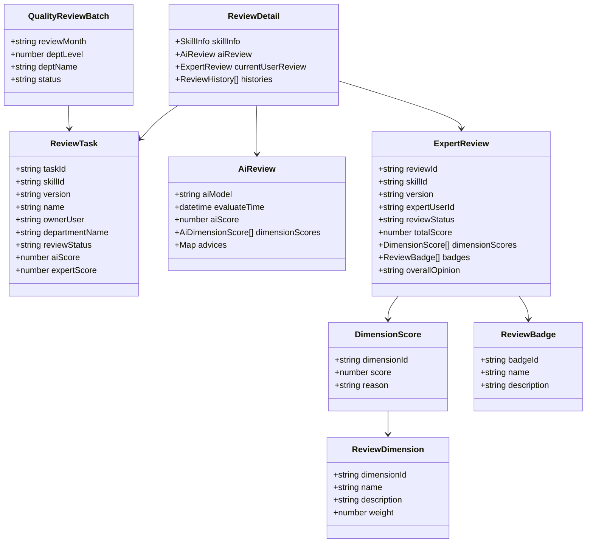
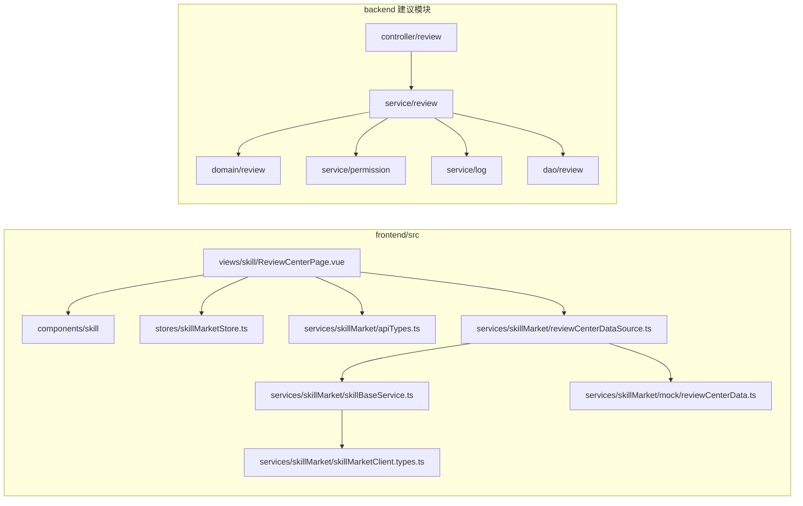
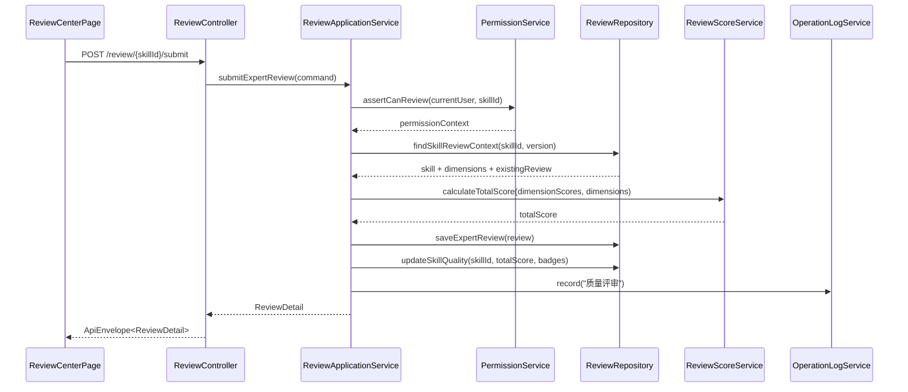
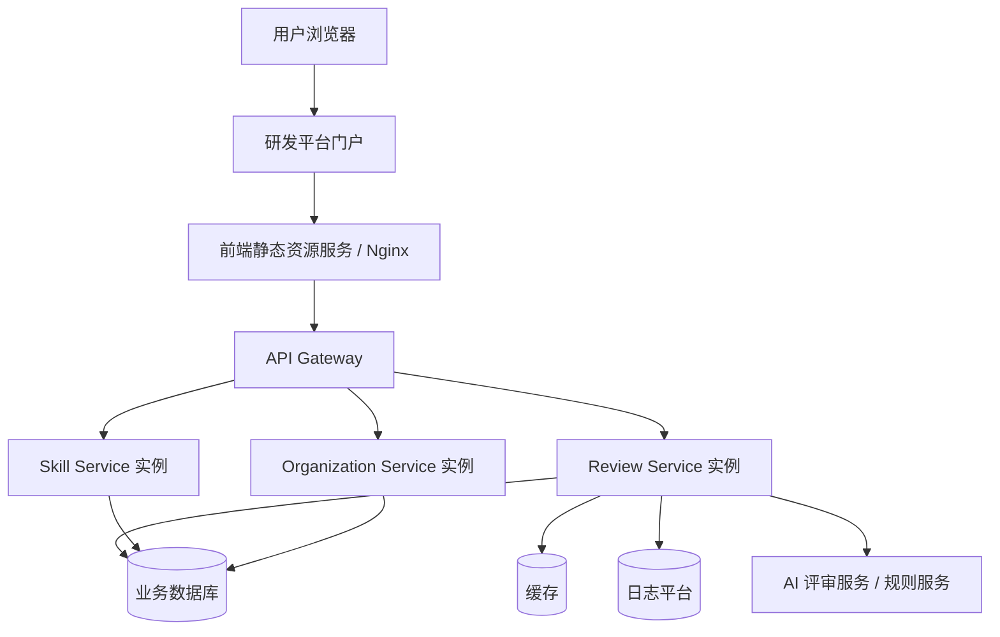
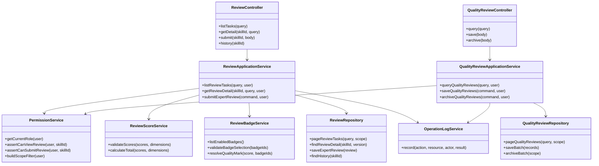
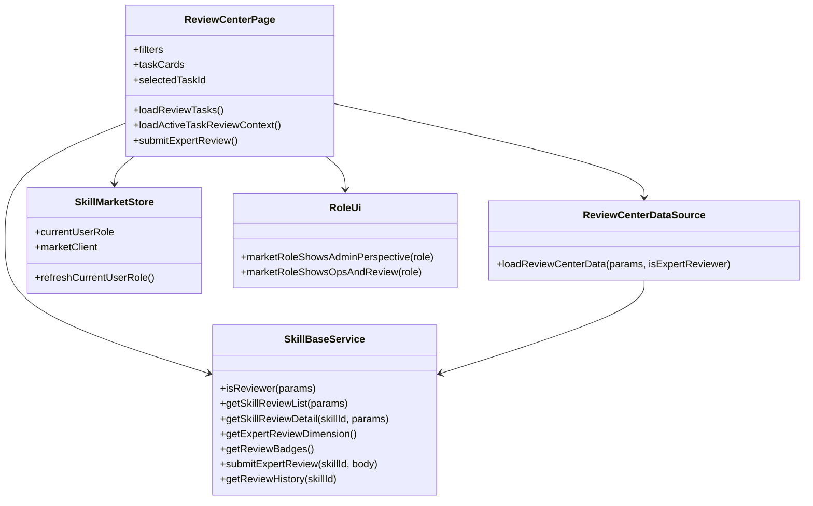
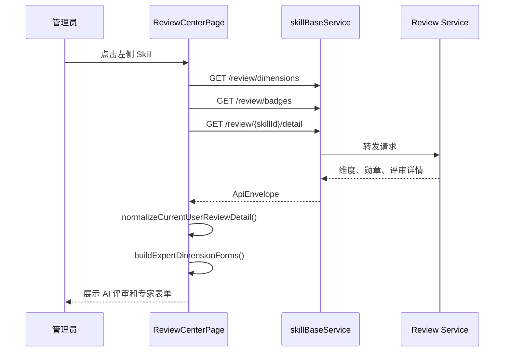
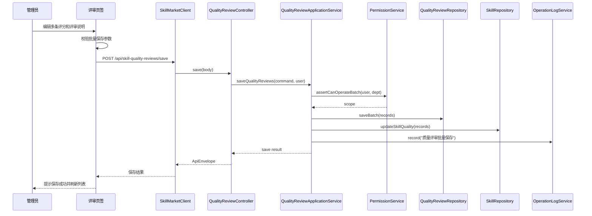
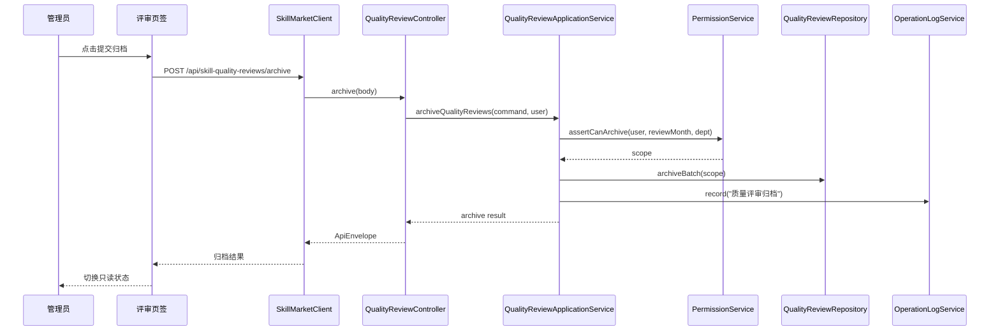

# Skill 评审页签实现设计

> 本文作为《SkillReviewTab_SoftwareDesign.md》的“实现设计”补充章节，可作为正式文档中的独立目录并入“系统设计”和“DFX 分析”之间。

---

# 1. 实现设计总览

Skill 评审页签采用“前端工作台 + 后端评审服务 + 权限服务 + 数据持久化”的分层实现方式。前端负责页面交互、表单校验、状态展示和 Mock / HTTP 数据适配；后端负责权限判定、评审规则、总分计算、数据一致性、归档控制和操作日志。

实现设计需要满足以下目标：

1. 支持当前项目 Vue 3 + TypeScript + Vite + Pinia 技术栈。
2. 复用现有 Skill 市场服务层、Mock / HTTP 双通道和角色权限模型。
3. 通过类图和时序图明确前后端核心对象、模块职责和交互流程。
4. 按 4+1 视图描述逻辑、开发、过程、物理和场景设计。
5. 满足 SOLID 设计原则，确保后续新增评审维度、勋章、AI 模型和复核流程时具备扩展性。

---

# 2. 技术架构

## 2.1 分层架构



## 2.2 架构设计要点

1. 前端页面不直接访问数据库、Mock 文件或裸 HTTP 路径。
2. 服务端以 Application Service 编排流程，Domain Service 承载评分、勋章、权限等业务规则。
3. AI 评审通过 Adapter 隔离外部模型或规则服务，避免页面和核心业务依赖具体模型实现。
4. 评审维度、勋章配置可缓存，但保存和提交类接口必须访问数据库并执行权限校验。
5. Mock / HTTP 模式共享 UI 模型，避免本地演示与真实联调割裂。

## 2.3 技术选型映射

| 层级     | 技术/模块                               | 说明                                          |
| -------- | --------------------------------------- | --------------------------------------------- |
| 前端页面 | Vue 3 Composition API                   | 承载复杂工作台交互和响应式状态                |
| 前端类型 | TypeScript                              | 约束 DTO、表单和服务响应                      |
| 全局状态 | Pinia                                   | 管理当前用户角色、市场客户端等共享状态        |
| 请求封装 | `skillBaseService`、`SkillMarketClient` | 统一 Mock / HTTP 调用                         |
| 数据适配 | `reviewCenterDataSource`                | 统一 UI 模型，屏蔽后端字段差异                |
| 后端接口 | REST API                                | 与当前 Skill 市场接口风格一致                 |
| 权限     | Permission Service                      | 统一计算 `SUPER_ADMIN` / `ORG_ADMIN` / `USER` |
| 持久化   | 业务数据库                              | 保存专家评审、AI 评审、质量评审批次和日志     |

---

# 3. 概念定义

| 概念         | 英文/代码建议        | 定义                                      | 关键属性                                    |
| ------------ | -------------------- | ----------------------------------------- | ------------------------------------------- |
| 评审任务     | `ReviewTask`         | 评审页签左侧列表中的一个待处理 Skill 任务 | Skill、版本、部门、状态、AI 分、专家分      |
| 评审详情     | `ReviewDetail`       | 单个 Skill 的评审聚合信息                 | Skill 信息、AI 评审、当前专家评审、历史记录 |
| AI 评审      | `AiReview`           | 系统自动生成的评分和建议                  | 模型版本、总分、维度分、建议                |
| 专家评审     | `ExpertReview`       | 专家或管理员提交的人工评审结果            | 评审人、维度分、总分、勋章、意见            |
| 评审维度     | `ReviewDimension`    | 专家评审的评分维度                        | 维度 ID、名称、说明、权重                   |
| 维度评分     | `DimensionScore`     | 某个维度下的专家打分                      | 维度 ID、分数、理由                         |
| 质量勋章     | `ReviewBadge`        | 对 Skill 质量的标签化表达                 | 勋章 ID、名称、说明                         |
| 质量评审批次 | `QualityReviewBatch` | 按月份和部门形成的批量评审范围            | 月份、部门层级、部门名称、状态              |
| 操作日志     | `OperationLog`       | 评审相关操作的审计记录                    | 操作人、资源、动作、结果、时间              |

概念关系：

1. 一个 `ReviewTask` 对应一个 Skill 的一个当前评审版本。
2. 一个 `ReviewDetail` 聚合一个 Skill 版本的 AI 评审、当前专家评审和历史记录。
3. 一个 `ExpertReview` 包含多个 `DimensionScore`。
4. 一个 `ExpertReview` 可以选择多个 `ReviewBadge`。
5. 一个 `QualityReviewBatch` 包含多条 Skill 质量评审记录。

---

# 4. 4+1 视图设计

## 4.1 逻辑视图

逻辑视图描述核心领域对象和服务职责。



## 4.2 开发视图

开发视图描述代码模块组织和依赖方向。



开发约束：

1. 页面层不得直接依赖 Mock 数据文件。
2. 页面层不得直接拼接可变后端 baseURL。
3. 后端 Controller 不承载业务规则，只做参数接收和响应转换。
4. 评分计算、权限判断、勋章规则分别由独立服务负责。

## 4.3 过程视图

过程视图描述运行时核心流程。



## 4.4 物理视图

物理视图描述部署和运行节点。



部署建议：

1. 前端作为静态资源部署，后端接口通过网关统一转发。
2. Review Service 可与现有 Skill Service 合设，也可独立部署。
3. AI 评审服务通过 Adapter 接入，避免直接暴露给前端。
4. 评审配置可缓存，评审结果必须落业务库。

## 4.5 场景视图

场景视图对应 4+1 中的 “+1”，以关键用例串联前四类视图。

| 场景             | 参与者      | 关键路径                                                   |
| ---------------- | ----------- | ---------------------------------------------------------- |
| 进入评审页签     | 管理员      | 角色校验 -> 专家身份校验 -> 加载评审列表                   |
| 查看 AI 评审     | 管理员      | 选择 Skill -> 加载详情 -> 展示 AI 维度和建议               |
| 提交专家评审     | 专家/管理员 | 表单校验 -> 权限校验 -> 总分计算 -> 保存评审 -> 更新 Skill |
| 批量保存质量评审 | 管理员      | 查询批次 -> 编辑多条记录 -> 批量保存 -> 回写质量字段       |
| 提交归档         | 管理员      | 校验批次 -> 更新归档状态 -> 页面只读                       |

---

# 5. 核心类图设计

## 5.1 后端核心类图



## 5.2 前端核心模块图



---

# 6. 核心时序图设计

## 6.1 评审详情加载时序



## 6.2 批量质量评审保存时序



## 6.3 月度归档时序



---

# 7. SOLID 设计原则落地

| 原则         | 落地设计                                                                                                                            |
| ------------ | ----------------------------------------------------------------------------------------------------------------------------------- |
| SRP 单一职责 | `ReviewApplicationService` 负责编排，`ReviewScoreService` 负责评分，`PermissionService` 负责权限，`ReviewBadgeService` 负责勋章规则 |
| OCP 开闭原则 | 新增评审维度、勋章、AI 模型时通过配置或 Adapter 扩展，不修改页面核心流程                                                            |
| LSP 里氏替换 | Mock Client 与 HTTP Client 都实现同一 `SkillMarketClient` 契约，页面可无感替换                                                      |
| ISP 接口隔离 | 评审接口、质量评审批次接口、组织权限接口分离，页面按需依赖                                                                          |
| DIP 依赖倒置 | 页面依赖服务抽象和 DTO，不依赖具体 HTTP 实现；业务服务依赖 Repository / Adapter 抽象，不依赖具体外部模型实现                        |

## 7.1 SRP 单一职责

```text
ReviewController: 参数接收和响应包装
ReviewApplicationService: 提交评审流程编排
PermissionService: 判断当前用户能否评审
ReviewScoreService: 校验分数并计算总分
ReviewBadgeService: 校验勋章并解析质量标识
ReviewRepository: 评审数据读写
OperationLogService: 操作日志写入
```

## 7.2 OCP 开闭原则

新增一个“安全合规”评审维度时：

1. 后端在维度配置中新增记录。
2. `GET /review/dimensions` 返回新维度。
3. 前端动态渲染新维度输入项。
4. `ReviewScoreService` 按配置权重计算总分。

整个过程不需要修改 `ReviewCenterPage.vue` 的核心提交流程。

## 7.3 LSP 里氏替换

当前项目支持 Mock / HTTP 双通道：

```text
SkillMarketClient
  -> skillMarketMockClient
  -> skillMarketHttpClient
```

只要二者遵守同一接口契约，页面无需感知具体实现。

## 7.4 ISP 接口隔离

接口按能力拆分：

| 接口族                         | 职责                                   |
| ------------------------------ | -------------------------------------- |
| `/review/*`                    | 评审清单、评审详情、专家提交、历史记录 |
| `/api/skill-quality-reviews/*` | 月度质量评审批次保存和归档             |
| `/api/users/current/role`      | 当前用户角色                           |
| `/api/organizations/*`         | 组织配置                               |

页面按需依赖接口，不把所有市场能力揉进一个超大服务。

## 7.5 DIP 依赖倒置

AI 评审接入通过接口抽象：

```text
ReviewApplicationService
  -> AiReviewProvider 接口
    -> RuleBasedAiReviewProvider
    -> ModelBasedAiReviewProvider
    -> MockAiReviewProvider
```

业务服务只依赖 `AiReviewProvider`，后续替换规则引擎或模型服务不影响评审主流程。

---

# 8. 与正式设计文档的并入位置

建议将本文内容并入《SkillReviewTab_SoftwareDesign.md》的以下位置：

```text
# 3. 系统设计
# 4. 实现设计
  ## 4.1 技术架构
  ## 4.2 概念定义
  ## 4.3 4+1 视图设计
  ## 4.4 核心类图设计
  ## 4.5 核心时序图设计
  ## 4.6 SOLID 设计原则落地
# 5. DFX 分析
# 6. 开发实现
# 7. 测试分析
```
