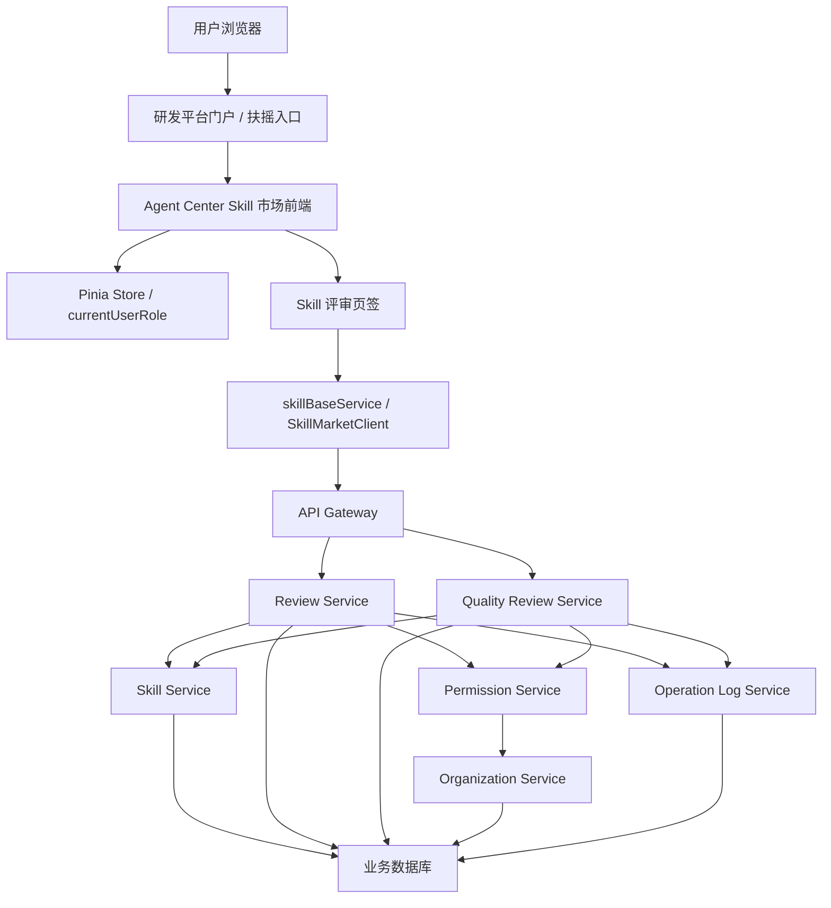
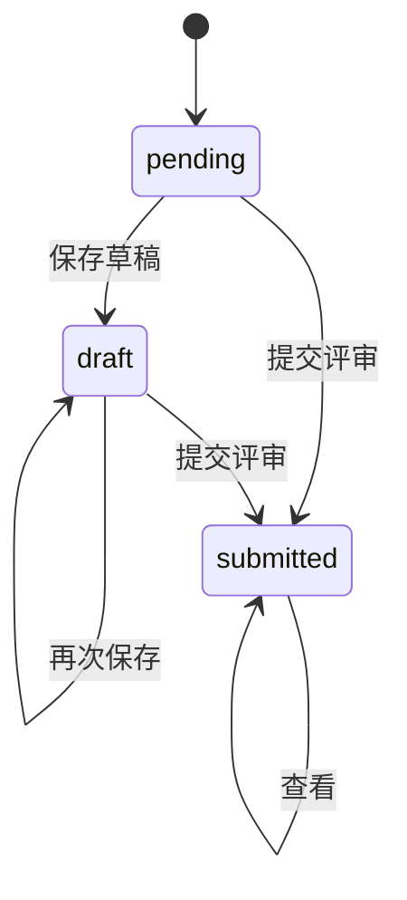
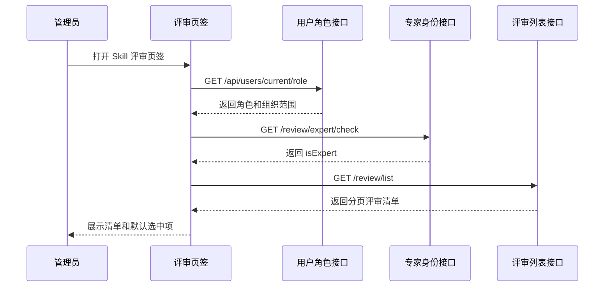
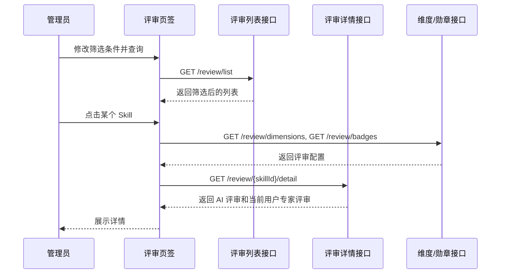
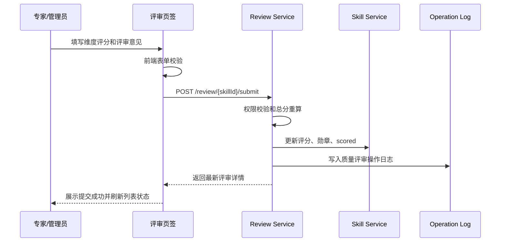
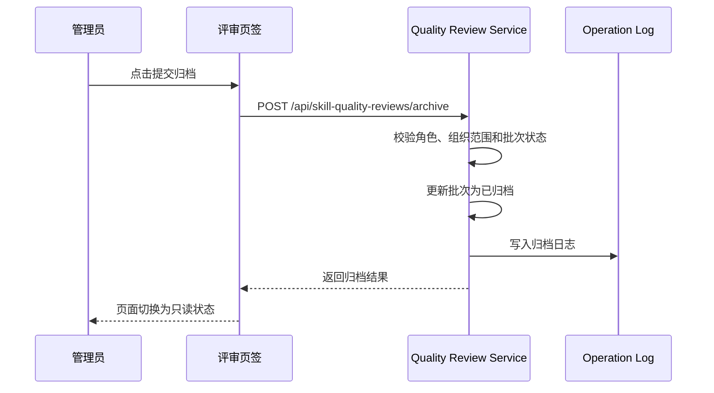

# Skill 评审页签软件设计文档

## 文档信息

| 项目 | 内容 |
| --- | --- |
| 文档名称 | Skill 评审页签软件设计文档 |
| 所属系统 | Agent Center Skill 市场 |
| 所属模块 | 管理员视角 / Skill 评审页签 |
| 当前版本 | V1.0 |
| 编写日期 | 2026-06-23 |
| 适用范围 | Skill 市场前端、评审服务、质量评审服务、权限服务、测试验收 |
| 目标读者 | 产品经理、前端开发、后端开发、测试、运维、项目评审人员 |

---

# 1. 需求背景

## 1.1 市场现状

Agent Center Skill 市场用于沉淀、管理和分发公司内部可复用 Skill。当前市场能力主要覆盖 Skill 上传、解析、市场浏览、我的发布、同步至组织、审核中心、组织管理和运营统计等基础流程。

随着市场规模扩大，Skill 来源逐渐呈现以下特点：

1. Skill 数量持续增长，既包含个人级沉淀，也包含同步后的组织级 Skill。
2. Skill 类型差异明显，覆盖作业类、业务类、工具类等多个场景。
3. 反馈指标来源分散，包括下载量、点赞量、点踩量、评分、运营统计等。
4. 管理员需要在组织或部门维度识别优秀 Skill、推荐复用 Skill 和待优化 Skill。
5. 市场运营需要从“可上传、可浏览”升级为“可评价、可治理、可追踪”。

目前市场总览只能展示基础指标和质量勋章结果，但缺少集中化评审工作台承载评分、专家意见、AI 评审结果、勋章标记和月度归档流程。

## 1.2 痛点分析

| 痛点 | 说明 | 影响 |
| --- | --- | --- |
| 质量判断依赖人工经验 | 管理员只能从下载量、点赞量、描述等零散信息判断 Skill 质量 | 优秀 Skill 难以及时发现，低质量 Skill 难以及时治理 |
| 评审入口分散 | 若在 Skill 详情或市场卡片中零散操作，缺少批量处理能力 | 月度部门评审效率低，难以形成稳定运营机制 |
| 缺少统一评分标准 | 不同管理员对 Skill 评分尺度不一致 | 跨部门、跨月份数据不可比 |
| AI 评审和专家判断未闭环 | 自动评审可提供参考，但没有与专家确认结果形成统一记录 | AI 结果难以沉淀为可信运营数据 |
| 勋章管理缺少过程依据 | 勋章展示结果容易脱离评分理由和历史记录 | 用户无法理解为什么某 Skill 被推荐或待优化 |
| 组织权限边界复杂 | 超级管理员与组织管理员可见范围不同 | 若前后端职责不清，容易产生越权访问风险 |
| 归档机制缺失 | 月度部门评审完成后缺少固化状态 | 后续复盘、统计和审计困难 |

## 1.3 市场需求

从市场运营和组织治理角度，Skill 评审页签需要满足以下需求：

1. 管理员能够按月、按部门、按业务维度集中处理 Skill 评审。
2. 平台能够为管理员提供 AI 评审结果作为参考，降低人工评审成本。
3. 专家能够基于统一维度进行评分，并填写结构化评审理由。
4. 平台能够通过质量勋章建立可视化运营标签，例如优秀 Skill、推荐复用、待优化、高分 Skill。
5. 评审结果需要回写 Skill 基础信息，使市场总览、运营管理和 Skill 详情展示一致。
6. 每次评审、保存、提交、归档都需要可追踪，支撑质量治理和审计。
7. 普通用户不可进入评审页签，组织管理员只能查看和操作自身组织范围内的数据。

## 1.4 建设目标

| 目标类型 | 目标 |
| --- | --- |
| 业务目标 | 建立管理员集中评审入口，支撑月度部门质量治理 |
| 产品目标 | 提供清晰、高效、可追踪的 Skill 评审工作台 |
| 技术目标 | 接入现有 Vue 3 + TypeScript + SkillMarket 服务层，保持 Mock / HTTP 可切换 |
| 数据目标 | 形成 Skill 评分、勋章、评审说明、历史记录和归档状态 |
| 权限目标 | 严格区分 `SUPER_ADMIN`、`ORG_ADMIN`、`USER` 的可见范围和操作能力 |

## 1.5 建设范围

本设计覆盖：

1. Skill 评审页签入口和页面布局。
2. 评审清单查询、筛选、分页和详情展示。
3. AI 评审结果展示。
4. 专家评审维度评分、勋章选择、评审意见提交。
5. 月度质量评审批量保存、导出清单、提交归档。
6. 前端服务封装、类型定义、Mock 数据源与 HTTP 对接。
7. 后端接口、数据模型、权限校验、操作日志建议。
8. DFX 分析、开发实现计划和测试分析。

不包含：

1. Skill 上传解析功能改造。
2. 同步至 Agent Center 组织审核流程改造。
3. 多专家会签、申诉、复核等复杂评审流。
4. AI 评审算法模型本身的训练和优化。

---

# 2. 需求分析

## 2.1 用户角色分析

| 角色 | 说明 | 评审页签能力 |
| --- | --- | --- |
| 超级管理员 `SUPER_ADMIN` | 平台最高管理角色 | 查看全部组织和部门 Skill，执行评分、打标、保存、归档、导出 |
| 组织管理员 `ORG_ADMIN` | 管理一个或多个组织 | 查看和操作自身管理组织范围内的 Skill |
| 普通用户 `USER` | 市场普通使用者 | 不展示评审页签，不允许调用评审写接口 |
| 专家评审人 | 可与管理员重合，由评审服务判定 | 可填写维度评分并提交专家评审 |

角色判定沿用当前项目角色模型：

```text
SUPER_ADMIN > ORG_ADMIN > USER
```

前端只负责入口展示和交互控制，最终鉴权由服务端完成。

## 2.2 功能性需求

### 2.2.1 页面入口

| 编号 | 需求 | 优先级 |
| --- | --- | --- |
| FR-01 | 管理员视角中新增“Skill 评审”页签 | P0 |
| FR-02 | `SUPER_ADMIN` 和 `ORG_ADMIN` 可见评审页签 | P0 |
| FR-03 | `USER` 不展示评审页签，直访时提示无权限 | P0 |
| FR-04 | 页面加载时获取当前用户角色和专家身份 | P0 |

### 2.2.2 筛选与查询

| 编号 | 需求 | 优先级 |
| --- | --- | --- |
| FR-05 | 支持按月份查询评审批次 | P0 |
| FR-06 | 支持按部门层级和具体部门筛选 | P0 |
| FR-07 | 支持按业务维度筛选 | P1 |
| FR-08 | 支持按评审状态筛选，包括全部、待评审、已评审、未评分 | P0 |
| FR-09 | 支持按 Skill 名称或发布人搜索 | P0 |
| FR-10 | 支持按下载量或 AI 分排序 | P1 |
| FR-11 | 支持分页和下拉加载更多 | P0 |

### 2.2.3 评审清单

| 编号 | 需求 | 优先级 |
| --- | --- | --- |
| FR-12 | 展示 Skill 名称、版本、发布人、部门、标签 | P0 |
| FR-13 | 展示下载量、AI 分、专家分、评审状态 | P0 |
| FR-14 | 支持点击 Skill 加载右侧评审详情 | P0 |
| FR-15 | 支持列表空状态、加载状态、错误状态 | P0 |

### 2.2.4 AI 评审详情

| 编号 | 需求 | 优先级 |
| --- | --- | --- |
| FR-16 | 展示 AI 总分、模型版本、评估时间 | P0 |
| FR-17 | 展示 AI 维度得分和扣分说明 | P0 |
| FR-18 | 展示 `SKILL.md`、references、scripts 等模块化改进建议 | P1 |
| FR-19 | 支持查看历史版本 AI 评审记录 | P1 |

### 2.2.5 专家评审

| 编号 | 需求 | 优先级 |
| --- | --- | --- |
| FR-20 | 动态加载专家评审维度 | P0 |
| FR-21 | 支持维度评分和评分理由填写 | P0 |
| FR-22 | 按维度权重自动计算专家总分 | P0 |
| FR-23 | 支持选择质量勋章 | P0 |
| FR-24 | 支持填写勋章理由和整体评审意见 | P0 |
| FR-25 | 支持提交专家评审结果 | P0 |
| FR-26 | 提交后刷新列表状态和历史记录 | P0 |

### 2.2.6 月度质量评审

| 编号 | 需求 | 优先级 |
| --- | --- | --- |
| FR-27 | 支持月度部门质量评审清单查询 | P0 |
| FR-28 | 支持多条 Skill 批量保存评分、质量标识、评审说明 | P0 |
| FR-29 | 支持只看未评分 | P1 |
| FR-30 | 支持导出当前筛选清单 | P1 |
| FR-31 | 支持提交归档 | P0 |
| FR-32 | 已归档批次默认只读 | P0 |

### 2.2.7 操作日志

| 编号 | 需求 | 优先级 |
| --- | --- | --- |
| FR-33 | 专家评审提交写操作日志 | P0 |
| FR-34 | 批量保存写操作日志 | P0 |
| FR-35 | 提交归档写操作日志 | P0 |

## 2.3 非功能性需求

| 分类 | 需求 |
| --- | --- |
| 性能 | 评审列表查询 P95 小于 1 秒，详情查询 P95 小于 1 秒，提交评审 P95 小于 2 秒 |
| 安全 | 服务端按角色和组织范围鉴权，前端不可信 |
| 可用性 | 页面支持加载、空态、失败、重试和表单校验 |
| 可靠性 | 提交、保存、归档接口需要事务一致性和幂等控制 |
| 可维护性 | 类型、接口路径、Mock、HTTP 实现分层维护 |
| 可扩展性 | 评审维度、勋章、AI 评审模型可配置扩展 |
| 可观测性 | 记录评审查询、详情加载、提交、保存、归档耗时和结果 |
| 兼容性 | 兼容当前项目 Mock / HTTP 双通道和 Vite 构建方式 |
| 数据一致性 | 专家评分、质量勋章、市场卡片、运营统计展示口径一致 |

## 2.4 业务规则

1. 评审页签仅对管理员展示。
2. 组织管理员只能查看和操作其管理组织范围内的 Skill。
3. 专家评分维度由后端配置返回，前端不硬编码最终维度集合。
4. 前端可展示实时总分，但服务端提交时必须重新计算总分。
5. 选择质量勋章后必须填写勋章理由。
6. 提交专家评审后，当前 Skill 的专家评审状态变为已评审。
7. 批量保存质量评审后，需要同步更新 Skill 的评分、质量标识、勋章和是否已评分字段。
8. 归档后的评审批次默认不可编辑。

---

# 3. 系统设计

## 3.1 架构设计

### 3.1.1 总体架构



### 3.1.2 前端分层

| 层级 | 项目落位 | 职责 |
| --- | --- | --- |
| 页面层 | `src/views/skill/ReviewCenterPage.vue` | 页面布局、筛选、清单、详情、表单交互 |
| 组件层 | `src/components/skill/*` | 部门级联、业务维度级联、通用 Skill 展示组件 |
| 状态层 | `src/stores/skillMarketStore.ts` | 当前用户角色、市场客户端、公共数据 |
| 服务层 | `src/services/skillMarket/skillBaseService.ts` | 评审接口调用 |
| 数据源层 | `src/services/skillMarket/reviewCenterDataSource.ts` | Mock / HTTP 数据适配 |
| 类型层 | `src/services/skillMarket/apiTypes.ts` | DTO、请求体、响应体类型 |
| 权限辅助 | `src/services/skillMarket/roleUi.ts` | 前端入口和按钮展示判断 |

### 3.1.3 后端分层

| 层级 | 模块 | 职责 |
| --- | --- | --- |
| Controller | ReviewController、QualityReviewController | 参数接收、响应包装 |
| Service | ReviewService、QualityReviewService | 评审业务编排 |
| Domain | Skill、ExpertReview、QualityReview | 领域实体和业务规则 |
| DAO | SkillDao、ReviewDao、QualityReviewDao | 数据访问 |
| Permission | PermissionService | 当前用户角色和组织范围判断 |
| Integration | AI Review Adapter | AI 评审结果查询或触发 |
| Log | OperationLogService | 操作日志记录 |

## 3.2 技术选型

### 3.2.1 前端技术选型

| 技术 | 当前项目使用情况 | 选型原因 |
| --- | --- | --- |
| Vue 3 | 已使用 | Composition API 适合复杂工作台状态管理 |
| TypeScript | 已使用 | 提升 DTO、表单、接口调用可维护性 |
| Vite | 已使用 | 快速开发和构建 |
| Pinia | 已使用 | 管理当前用户角色和市场客户端等全局状态 |
| Axios / 请求封装 | 已使用 | 统一 HTTP 请求、错误处理和 Mock 适配 |
| SCSS / 原生 CSS | 已使用 | 适合当前页面风格和局部样式控制 |
| Mermaid 文档图 | 文档使用 | 便于表达架构和过程视图 |

### 3.2.2 后端技术建议

| 技术方向 | 建议 |
| --- | --- |
| 接口风格 | REST API |
| 响应格式 | 统一 `ApiEnvelope<T>` |
| 鉴权 | 网关登录态 + Permission Service 二次鉴权 |
| 数据库 | 沿用 Skill 市场业务库 |
| 事务 | 专家评审提交、质量评审保存、归档使用事务 |
| 幂等 | 使用 `reviewId`、`skillId`、`version`、`expertUserId` 控制重复提交 |
| 日志 | 写入 `skill_operation_log` 或独立操作日志表 |

## 3.3 应用范式设计

### 3.3.1 单页应用范式

评审页签作为 Skill 市场 SPA 内的一个管理页签，不单独创建应用。页面进入后通过前端状态和接口动态加载数据。

设计原则：

1. 路由层保持轻量，业务页签由市场主页面或管理员壳组件控制。
2. 页面状态本地化，跨页面共享状态放入 Pinia。
3. 所有后端访问通过服务层封装。
4. Mock 和 HTTP 通过同一数据模型对齐。

### 3.3.2 工作台范式

页面采用“筛选 + 清单 + 详情 + 操作”的工作台模式。

| 区域 | 作用 |
| --- | --- |
| 顶部筛选 | 控制评审批次、部门、业务维度、状态和搜索 |
| 左侧清单 | 快速浏览和切换待评审 Skill |
| 右侧详情 | 展示 AI 评审和专家评审表单 |
| 操作区 | 提交、保存、归档、导出 |

该范式适合高频处理多个 Skill，避免用户在多个详情页之间跳转。

### 3.3.3 服务适配范式

当前项目已存在 Mock / HTTP 双通道，评审页签继续沿用：

```text
ReviewCenterPage.vue
  -> reviewCenterDataSource.ts
    -> mock/reviewCenterData.ts
    -> skillBaseService.ts
  -> skillMarketClient.types.ts
    -> skillMarketMockClient.ts
    -> skillMarketHttpClient.ts
```

原则：

1. 页面只依赖稳定 UI 模型。
2. Mock 数据必须模拟真实分页、状态、异常和权限差异。
3. HTTP 返回字段与 `apiTypes.ts` 对齐。
4. 若后端字段变化，优先在 mapper 或 dataSource 层适配。

### 3.3.4 类型优先范式

新增或调整接口前，先补齐 TypeScript 类型：

1. 请求参数类型。
2. 响应 DTO 类型。
3. 页面 UI 模型类型。
4. 表单状态类型。
5. 枚举和状态类型。

这样可以减少页面中 `any` 扩散，并降低联调风险。

## 3.4 页面结构设计

### 3.4.1 页面布局

| 区域 | 内容 |
| --- | --- |
| 顶部筛选区 | 月份、部门、业务维度、状态、排序、关键词、查询按钮 |
| 统计摘要区 | 待评审数量、已评审数量、平均 AI 分、平均专家分 |
| 左侧任务列表 | Skill 卡片、状态、下载量、标签、评分 |
| 主详情区 | AI 评审页签、专家评审页签 |
| 侧边辅助区 | 榜单、勋章排行、历史版本入口 |
| 底部操作区 | 批量保存、导出清单、提交归档 |

### 3.4.2 筛选字段

| 筛选项 | 参数 | 说明 |
| --- | --- | --- |
| 月份 | `reviewMonth` | 评审月份，默认当前月份 |
| 部门层级 | `deptLevel` | 一级到六级部门 |
| 部门名称 | `deptName` | 具体部门名称 |
| 业务维度 | `categoryId` | Skill 所属业务维度 |
| 评审状态 | `reviewStatus` | `PENDING` / `REVIEWED` / `UNSCORED` |
| 排序 | `sortBy` | `downloads` / `aiScore` |
| 关键词 | `keyword` | Skill 名称或发布人 |
| 分页 | `pageNum`、`pageSize` | 页码和每页数量 |

### 3.4.3 详情页签

| 页签 | 内容 |
| --- | --- |
| AI 评审 | AI 总分、维度评分、扣分说明、改进建议、历史版本 |
| 专家评审 | 动态维度评分、评分理由、勋章、整体意见、提交 |

## 3.5 接口设计

### 3.5.1 统一响应格式

```ts
type ApiEnvelope<T> = {
  code: number;
  message: string;
  meta?: {
    number?: number;
    message: string;
    success: boolean;
  };
  data: T;
};
```

### 3.5.2 评审相关接口

| 接口 | 方法 | 说明 |
| --- | --- | --- |
| `/review/expert/check` | GET | 判断当前用户是否为专家评审人 |
| `/review/list` | GET | 查询评审 Skill 列表 |
| `/review/{skillId}/detail` | GET | 查询 Skill 评审详情 |
| `/review/dimensions` | GET | 查询专家评审维度 |
| `/review/badges` | GET | 查询评审勋章列表 |
| `/review/{skillId}/submit` | POST | 提交专家评审 |
| `/review/{skillId}/history` | GET | 查询历史版本评审记录 |

### 3.5.3 质量评审批次接口

| 接口 | 方法 | 说明 |
| --- | --- | --- |
| `/api/skill-quality-reviews` | GET | 查询月度部门质量评审清单 |
| `/api/skill-quality-reviews/save` | POST | 批量保存质量评审结果 |
| `/api/skill-quality-reviews/archive` | POST | 提交月度部门质量评审归档 |

### 3.5.4 提交专家评审请求体

```ts
type ExpertReviewSubmitBody = {
  reviewId: string;
  totalScore: number;
  dimensionScores: {
    dimensionId: string;
    score: number;
    reason: string;
  }[];
  badgeIds: string[];
  badgeReason?: string;
  overallOpinion?: string;
};
```

### 3.5.5 批量保存质量评审请求体

```ts
type QualityReviewSaveBody = {
  reviewMonth: string;
  deptLevel: number;
  deptName: string;
  items: {
    skillId: number;
    score: number;
    qualityMark: string;
    reviewComment: string;
  }[];
};
```

## 3.6 数据模型设计

### 3.6.1 专家评审主表

建议表名：`t_skill_expert_review`

| 字段 | 类型 | 说明 |
| --- | --- | --- |
| `id` | bigint | 主键 |
| `review_id` | varchar(64) | 评审记录 ID |
| `skill_id` | bigint | Skill ID |
| `version` | varchar(64) | Skill 版本 |
| `expert_user_id` | varchar(128) | 专家账号 |
| `total_score` | decimal(6,2) | 专家总分 |
| `badge_ids` | varchar(512) | 勋章 ID 集合 |
| `badge_reason` | text | 勋章理由 |
| `overall_opinion` | text | 整体意见 |
| `review_status` | varchar(32) | `draft` / `submitted` |
| `created_at` | datetime | 创建时间 |
| `updated_at` | datetime | 更新时间 |
| `submitted_at` | datetime | 提交时间 |

### 3.6.2 专家评审维度明细表

建议表名：`t_skill_expert_review_dimension`

| 字段 | 类型 | 说明 |
| --- | --- | --- |
| `id` | bigint | 主键 |
| `review_id` | varchar(64) | 评审记录 ID |
| `dimension_id` | varchar(64) | 维度 ID |
| `dimension_name` | varchar(128) | 维度名称快照 |
| `weight` | decimal(6,4) | 权重快照 |
| `score` | decimal(6,2) | 维度得分 |
| `reason` | text | 评分理由 |

### 3.6.3 AI 评审结果表

建议表名：`t_skill_ai_review`

| 字段 | 类型 | 说明 |
| --- | --- | --- |
| `id` | bigint | 主键 |
| `skill_id` | bigint | Skill ID |
| `version` | varchar(64) | Skill 版本 |
| `ai_model` | varchar(128) | AI 模型或规则版本 |
| `ai_score` | decimal(6,2) | AI 总分 |
| `dimension_scores` | text | 维度分和扣分说明 JSON |
| `advices` | text | 改进建议 JSON |
| `evaluate_time` | datetime | 评估时间 |
| `created_at` | datetime | 创建时间 |

### 3.6.4 月度质量评审表

建议沿用市场设计表：`t_skill_quality_review`

| 字段 | 类型 | 说明 |
| --- | --- | --- |
| `id` | bigint | 主键 |
| `review_month` | varchar(7) | 评审月份 |
| `review_dept_level` | int | 评审部门层级 |
| `review_dept_name` | varchar(128) | 评审部门名称 |
| `skill_id` | bigint | Skill ID |
| `score` | decimal(6,2) | 质量评分 |
| `quality_mark` | varchar(32) | 质量标识 |
| `review_comment` | text | 评审说明 |
| `review_status` | varchar(32) | 待评审 / 已评审 / 已归档 |
| `reviewer` | varchar(128) | 评审人 |
| `reviewed_at` | datetime | 评审时间 |

唯一约束：

```text
uk_quality_review_scope(review_month, review_dept_level, review_dept_name, skill_id)
```

## 3.7 状态设计

### 3.7.1 专家评审状态

| 状态 | 说明 | 是否可编辑 |
| --- | --- | --- |
| `pending` | 尚未评审 | 是 |
| `draft` | 已保存草稿 | 是 |
| `submitted` | 已提交 | 默认只读 |



### 3.7.2 质量评审批次状态

| 状态 | 说明 | 是否可编辑 |
| --- | --- | --- |
| 待评审 | 存在未评分或未确认项 | 是 |
| 已评审 | 已保存评审结果 | 是 |
| 已归档 | 月度部门评审完成 | 否 |

## 3.8 过程视图

### 3.8.1 页面初始化过程



### 3.8.2 查询和切换 Skill 过程



### 3.8.3 专家评审提交过程



### 3.8.4 月度归档过程



---

# 4. DFX 分析

## 4.1 可用性 Usability

| 设计点 | 说明 |
| --- | --- |
| 默认筛选 | 默认选择当前月份和待评审状态，减少首屏操作成本 |
| 工作台布局 | 清单与详情同屏展示，便于连续评审 |
| 清晰状态 | 待评审、草稿、已提交、已归档状态明确展示 |
| 表单即时校验 | 评分、理由、勋章理由在提交前校验 |
| 自动总分 | 根据维度权重自动计算总分，降低人工计算错误 |
| 历史记录 | 支持查看历史版本，便于专家了解演进情况 |

## 4.2 性能 Performance

| 场景 | 指标 |
| --- | --- |
| 评审列表查询 | P95 小于 1 秒 |
| 评审详情查询 | P95 小于 1 秒 |
| 维度和勋章配置查询 | P95 小于 500ms |
| 专家评审提交 | P95 小于 2 秒 |
| 500 条清单滚动 | 无明显卡顿 |

性能设计：

1. 清单分页加载，默认 `pageSize = 10`。
2. 详情按需加载，不在列表查询中返回大字段。
3. 筛选变化时重置请求 token，避免旧请求覆盖新数据。
4. 维度和勋章配置可短时间缓存。
5. 大文本建议仅详情区加载。

## 4.3 安全 Security

| 风险 | 方案 |
| --- | --- |
| 普通用户越权访问 | 前端隐藏入口，后端返回 403 |
| 组织管理员查看非授权数据 | 服务端按 `managedOrgIds` 过滤 |
| 前端篡改 `userId` | 服务端以登录态用户为准 |
| 分数篡改 | 服务端重算总分并校验范围 |
| XSS | 所有评审说明按文本渲染，不直接渲染 HTML |
| 重复提交 | 使用唯一约束和幂等键控制 |
| 已归档批次被修改 | 保存接口拒绝已归档批次 |

## 4.4 可靠性 Reliability

1. 专家评审提交必须使用事务，确保主表、维度表、Skill 评分字段、日志一致。
2. 批量保存时允许部分失败需要明确返回失败项，默认建议采用全成功或全失败事务。
3. 归档操作需要幂等，多次提交同一归档请求返回相同结果或明确提示已归档。
4. 页面在网络失败时保留用户已填写内容。
5. 接口返回异常时展示可理解错误文案。

## 4.5 可维护性 Maintainability

1. 接口类型集中维护在 `apiTypes.ts`。
2. REST 路径集中维护在 `endpoints.ts` 或 `skillBaseService.ts`。
3. 页面 UI 模型与后端 DTO 通过 mapper 解耦。
4. Mock 数据和 HTTP 数据结构保持一致。
5. 专家维度和勋章配置由后端返回，避免前端硬编码。

## 4.6 可扩展性 Extensibility

| 扩展方向 | 预留设计 |
| --- | --- |
| 新增评审维度 | 后端配置维度，前端动态渲染 |
| 新增勋章类型 | 后端返回勋章列表，前端动态展示 |
| 多专家评审 | 专家评审表按 expertUserId 支持多条记录 |
| 复核流程 | 在 `submitted` 后增加 `reviewed`、`confirmed` 等状态 |
| AI 模型升级 | AI 表记录 `ai_model`，支持版本对比 |
| 质量趋势 | 月度质量评审表可按月份聚合 |

## 4.7 可观测性 Observability

| 观测点 | 记录内容 |
| --- | --- |
| 评审列表查询 | userId、role、筛选条件、耗时、结果数量 |
| 详情查询 | userId、skillId、version、耗时 |
| 专家提交 | userId、skillId、version、totalScore、badgeIds、结果 |
| 批量保存 | userId、reviewMonth、deptName、itemCount、成功/失败 |
| 归档 | userId、reviewMonth、deptName、未评分数量、结果 |
| 权限拒绝 | userId、role、目标资源、拒绝原因 |

---

# 5. 开发实现

## 5.1 前端实现

### 5.1.1 文件落位

| 文件 | 实现内容 |
| --- | --- |
| `src/views/skill/ReviewCenterPage.vue` | Skill 评审页签主页面 |
| `src/services/skillMarket/apiTypes.ts` | 新增评审相关 DTO |
| `src/services/skillMarket/skillBaseService.ts` | 新增 `/review/*` 接口封装 |
| `src/services/skillMarket/reviewCenterDataSource.ts` | Mock / HTTP 数据源适配 |
| `src/services/skillMarket/mock/reviewCenterData.ts` | Mock 评审榜单、清单、历史记录 |
| `src/services/skillMarket/roleUi.ts` | 复用管理员入口判断 |
| `src/services/skillMarket/skillMarketClient.types.ts` | 质量评审批次接口抽象 |

### 5.1.2 页面状态

| 状态 | 说明 |
| --- | --- |
| `filters` | 当前筛选条件 |
| `taskCards` | 评审 Skill 清单 |
| `selectedTaskId` | 当前选中 Skill |
| `selectedSkillDetail` | 评审详情 |
| `activeReviewDetailTab` | AI 评审 / 专家评审 |
| `expertReviewDimensions` | 专家评审维度 |
| `badgeOptions` | 勋章选项 |
| `expertDimensionForms` | 专家评分表单 |
| `reviewHistoryRecords` | 历史记录 |
| `loading` / `submitting` | 加载和提交状态 |

### 5.1.3 前端核心逻辑

1. 页面挂载时检查角色和专家身份。
2. 初始化筛选条件，加载第一页评审清单。
3. 筛选条件变化时重置页码和列表滚动位置。
4. 点击 Skill 后并行加载维度、勋章和详情。
5. 专家评分表单按后端维度动态生成。
6. 提交前执行前端校验。
7. 提交成功后刷新当前 Skill 的评分和状态。
8. 归档成功后禁用当前批次编辑。

### 5.1.4 前端校验

| 字段 | 校验 |
| --- | --- |
| 维度评分 | 必填，0 到 100，最多两位小数 |
| 评分理由 | 提交时必填 |
| 勋章理由 | 选择勋章后必填 |
| 整体意见 | 提交时必填 |
| 归档参数 | 月份必填，部门按当前筛选传入 |

## 5.2 后端实现

### 5.2.1 Review Service

核心方法：

| 方法 | 说明 |
| --- | --- |
| `checkExpert` | 判断当前用户是否为专家 |
| `listReviewTasks` | 查询评审 Skill 清单 |
| `getReviewDetail` | 查询 Skill 评审详情 |
| `listDimensions` | 查询专家评审维度 |
| `listBadges` | 查询勋章列表 |
| `submitExpertReview` | 提交专家评审 |
| `listReviewHistory` | 查询历史版本评审记录 |

### 5.2.2 Quality Review Service

核心方法：

| 方法 | 说明 |
| --- | --- |
| `queryQualityReviews` | 查询月度质量评审清单 |
| `saveQualityReviews` | 批量保存质量评审 |
| `archiveQualityReviews` | 提交归档 |
| `exportQualityReviews` | 导出清单，可作为后续接口扩展 |

### 5.2.3 权限实现

处理流程：

```text
获取当前登录用户
  -> 查询超级管理员表
  -> 若命中 enabled 超级管理员，role = SUPER_ADMIN
  -> 否则查询启用组织 admins
  -> 若命中，role = ORG_ADMIN，返回 managedOrgIds
  -> 否则 role = USER
```

查询和写操作均需要基于角色追加权限过滤：

| 角色 | 过滤规则 |
| --- | --- |
| `SUPER_ADMIN` | 不追加组织过滤 |
| `ORG_ADMIN` | `skill.org_id in managedOrgIds` 或映射部门范围 |
| `USER` | 拒绝访问 |

### 5.2.4 评分和勋章回写

专家评审提交或质量评审保存后，需要同步更新 Skill 表：

| 字段 | 说明 |
| --- | --- |
| `rating` | 综合评分 |
| `quality_mark` | 主质量标识 |
| `quality_badges` | 勋章集合 |
| `scored` | 是否已评分 |
| `last_review_comment` | 最近评审说明 |
| `last_reviewed_at` | 最近评审时间 |

## 5.3 Mock / HTTP 实现

| 模式 | 数据来源 | 用途 |
| --- | --- | --- |
| Mock | `mock/reviewCenterData.ts`、`skillBaseServiceMock.ts` | 本地演示、无后端联调 |
| HTTP | `skillBaseService.ts`、`skillMarketHttpClient.ts` | 真实接口联调 |

要求：

1. Mock 返回结构与 HTTP DTO 一致。
2. Mock 支持分页、筛选、提交和状态变更。
3. HTTP 模式下保留兼容处理，避免后端少量字段差异导致页面崩溃。

## 5.4 开发步骤

| 阶段 | 内容 | 产出 |
| --- | --- | --- |
| Step 1 | 补充 DTO 和接口封装 | `apiTypes.ts`、`skillBaseService.ts` |
| Step 2 | 完成 Mock 数据和数据源适配 | `reviewCenterDataSource.ts`、Mock 数据 |
| Step 3 | 搭建页面布局和筛选清单 | `ReviewCenterPage.vue` |
| Step 4 | 实现 AI 评审详情 | AI 总览、维度、建议、历史记录 |
| Step 5 | 实现专家评审表单 | 维度评分、勋章、意见、提交 |
| Step 6 | 实现质量评审批量能力 | 保存、导出、归档 |
| Step 7 | 补齐权限、异常和测试 | 权限闭环、测试用例、联调记录 |

---

# 6. 测试分析

## 6.1 测试范围

| 测试类型 | 范围 |
| --- | --- |
| 功能测试 | 页面入口、筛选、清单、详情、专家提交、批量保存、归档 |
| 权限测试 | `SUPER_ADMIN`、`ORG_ADMIN`、`USER` 的入口和接口权限 |
| 接口测试 | `/review/*`、`/api/skill-quality-reviews/*` |
| 异常测试 | 网络失败、接口失败、空数据、已归档修改 |
| 性能测试 | 列表、详情、提交、滚动加载 |
| 安全测试 | 越权、XSS、重复提交、前端参数篡改 |
| 兼容测试 | Mock / HTTP 切换，浏览器兼容 |
| 回归测试 | 市场卡片、运营管理、Skill 详情的评分和勋章展示一致 |

## 6.2 功能测试用例

| 编号 | 测试项 | 操作 | 预期 |
| --- | --- | --- | --- |
| FT-01 | 管理员入口 | 使用 `SUPER_ADMIN` 登录 | 显示 Skill 评审页签 |
| FT-02 | 普通用户入口 | 使用 `USER` 登录 | 不显示 Skill 评审页签 |
| FT-03 | 月份筛选 | 选择 `2026-06` 查询 | 返回该月份评审清单 |
| FT-04 | 部门筛选 | 选择六级部门查询 | 返回该部门范围 Skill |
| FT-05 | 业务维度筛选 | 选择某业务维度 | 返回命中的 Skill |
| FT-06 | 状态筛选 | 选择待评审 | 仅返回待评审 Skill |
| FT-07 | 关键词搜索 | 输入 Skill 名称 | 返回匹配结果 |
| FT-08 | 切换 Skill | 点击左侧列表项 | 右侧加载对应详情 |
| FT-09 | AI 评审展示 | 打开 AI 评审页签 | 展示总分、维度分、建议 |
| FT-10 | 专家评审提交 | 填写完整表单并提交 | 提交成功，状态更新 |
| FT-11 | 勋章选择 | 选择勋章并填写理由 | 提交后展示勋章 |
| FT-12 | 批量保存 | 保存多条质量评审 | 返回成功并刷新 |
| FT-13 | 提交归档 | 对当前批次归档 | 批次变为只读 |
| FT-14 | 历史版本 | 打开历史记录 | 展示版本维度评审记录 |

## 6.3 权限测试用例

| 编号 | 场景 | 预期 |
| --- | --- | --- |
| PT-01 | `SUPER_ADMIN` 查询评审列表 | 可查询全部数据 |
| PT-02 | `ORG_ADMIN` 查询评审列表 | 仅返回管理组织范围数据 |
| PT-03 | `USER` 查询评审列表 | 返回 403 |
| PT-04 | `ORG_ADMIN` 提交非管理组织 Skill 评审 | 返回 403 |
| PT-05 | `USER` 调用保存质量评审 | 返回 403 |
| PT-06 | 前端篡改 `userId` 提交 | 后端仍以登录态用户鉴权 |
| PT-07 | 管理员被移除后刷新页面 | 不再展示评审页签 |

## 6.4 接口测试用例

| 编号 | 接口 | 测试点 |
| --- | --- | --- |
| IT-01 | `GET /review/list` | 分页、筛选、排序、空结果 |
| IT-02 | `GET /review/{skillId}/detail` | 正常详情、无权限、Skill 不存在 |
| IT-03 | `GET /review/dimensions` | 维度权重、禁用维度不返回 |
| IT-04 | `GET /review/badges` | 勋章列表正常返回 |
| IT-05 | `POST /review/{skillId}/submit` | 成功提交、缺失字段、分数越界、重复提交 |
| IT-06 | `GET /review/{skillId}/history` | 多版本记录 |
| IT-07 | `GET /api/skill-quality-reviews` | 月份、部门、状态筛选 |
| IT-08 | `POST /api/skill-quality-reviews/save` | 批量保存、事务回滚 |
| IT-09 | `POST /api/skill-quality-reviews/archive` | 归档、重复归档、已归档修改拒绝 |

## 6.5 异常测试用例

| 编号 | 异常 | 预期 |
| --- | --- | --- |
| ET-01 | 角色接口失败 | 页面提示权限加载失败，可重试 |
| ET-02 | 评审列表为空 | 展示空状态 |
| ET-03 | 详情接口超时 | 详情区提示加载失败，列表保留 |
| ET-04 | 维度接口返回空 | 专家评审区提示暂无维度 |
| ET-05 | 勋章接口失败 | 勋章区提示失败，不影响评分填写 |
| ET-06 | 提交时网络失败 | 保留表单输入 |
| ET-07 | 旧请求晚于新请求返回 | 不覆盖新筛选结果 |
| ET-08 | 已归档批次继续编辑 | 前端禁用，后端拒绝 |

## 6.6 性能测试

| 场景 | 测试方法 | 通过标准 |
| --- | --- | --- |
| 评审列表查询 | 构造 1 万条 Skill 数据分页查询 | P95 小于 1 秒 |
| 详情查询 | 并发查询 100 个 Skill 详情 | P95 小于 1 秒 |
| 专家提交 | 并发提交专家评审 | P95 小于 2 秒，数据一致 |
| 滚动加载 | 连续加载 500 条列表项 | 页面无明显卡顿 |
| 批量保存 | 一次保存 100 条质量评审 | P95 小于 3 秒 |

## 6.7 安全测试

| 测试项 | 说明 |
| --- | --- |
| 越权访问 | 普通用户和非管理组织管理员访问评审数据必须被拒绝 |
| XSS | 评审理由、整体意见、Skill 描述中注入脚本，前端必须按文本展示 |
| 参数篡改 | 篡改 `skillId`、`userId`、`deptName`，后端必须重新鉴权 |
| 重复提交 | 连续点击提交按钮或重放请求，后端幂等处理 |
| 分数越界 | 提交负数或超过 100 的分数，后端拒绝 |
| 已归档修改 | 已归档批次再次保存，后端拒绝 |

## 6.8 验收标准

1. 管理员可进入 Skill 评审页签，普通用户不可进入。
2. 支持按月份、部门、业务维度、状态、关键词组合查询。
3. 清单展示 Skill 基础信息、下载量、AI 分、专家分和评审状态。
4. 点击 Skill 后可查看 AI 评审明细和历史版本记录。
5. 专家评审维度由后端动态返回，前端可正确渲染。
6. 专家可填写维度评分、评分理由、勋章和整体意见并提交。
7. 提交成功后 Skill 评分、勋章、已评分状态更新。
8. 月度质量评审支持批量保存、导出清单和提交归档。
9. 已归档批次默认只读，后端拒绝再次修改。
10. 所有评审写操作具备服务端鉴权和操作日志。
11. Mock 模式和 HTTP 模式页面行为一致。
12. 评审结果在市场总览、Skill 详情和运营管理中展示口径一致。

---

# 7. 风险与应对

| 风险 | 影响 | 应对 |
| --- | --- | --- |
| AI 评审结果结构不稳定 | 页面频繁调整 | 通过 dataSource / mapper 适配 |
| 维度和权重后期变化 | 历史评分解释困难 | 保存维度名称和权重快照 |
| 组织与部门映射复杂 | 可能越权或漏数据 | 后端统一 Permission Service 过滤 |
| 勋章规则争议 | 影响运营一致性 | 勋章由配置返回，规则可调整 |
| 归档后是否允许修改存在争议 | 影响使用流程 | 默认只读，预留超级管理员解锁 |
| Mock 与 HTTP 不一致 | 联调成本增加 | 以 `apiTypes.ts` 和接口文档为准同步维护 |

---

# 8. 附录

## 8.1 建议前端类型

```ts
type ReviewTaskCard = {
  id: string;
  skillId: string;
  name: string;
  owner: string;
  ownerName: string;
  ownerUser: string;
  version?: string;
  team: string;
  departmentL6: string;
  tags: string;
  usage: string;
  downloads: string;
  expertScore: string;
  hasReviewed: boolean;
  overallScore: number | null;
  dimensionId: string;
  dimensionName: string;
  categoryId: string;
  categoryName: string;
};

type ExpertReviewDimensionDto = {
  dimensionId: string;
  name: string;
  description: string;
  weight: number;
};

type ReviewBadgeDto = {
  badgeId: string;
  name: string;
  description: string;
};

type SkillExpertReviewDetailDto = {
  reviewId: string;
  skillId: string;
  aiScore: number;
  reviewStatus: 'pending' | 'draft' | 'submitted';
  totalScore: number | null;
  dimensionScores: {
    dimensionId: string;
    score?: number;
    reason?: string;
  }[];
  badgeIds: string[];
  badgeReason?: string;
  overallOpinion?: string;
  updatedAt?: string;
};
```

## 8.2 当前项目相关文件

| 文件 | 说明 |
| --- | --- |
| `src/views/skill/ReviewCenterPage.vue` | 评审页签建议实现位置 |
| `src/services/skillMarket/skillBaseService.ts` | 评审接口封装位置 |
| `src/services/skillMarket/reviewCenterDataSource.ts` | 评审数据源适配位置 |
| `src/services/skillMarket/apiTypes.ts` | 评审 DTO 类型位置 |
| `src/services/skillMarket/mock/reviewCenterData.ts` | 评审 Mock 数据位置 |
| `src/services/skillMarket/roleUi.ts` | 角色展示辅助函数位置 |

