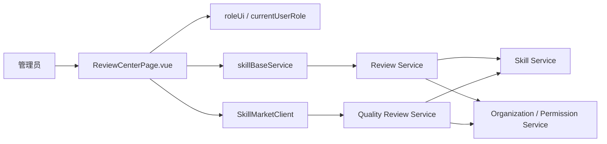
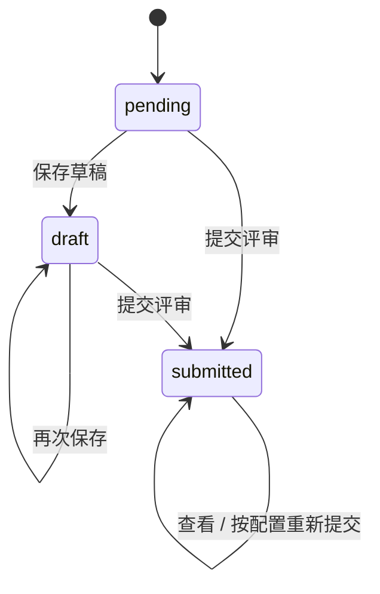
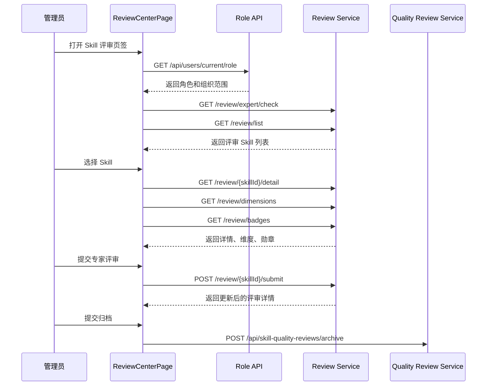

# Skill 评审页签软件设计文档

## 文档信息

| 项目         | 内容                              |
| ------------ | --------------------------------- |
| 文档名称     | Skill 评审页签软件设计文档        |
| 所属系统     | Agent Center Skill 市场前端       |
| 目标模块     | 管理员视角 Skill 评审页签         |
| 文档版本     | V1.0                              |
| 适用读者     | 产品、前端、后端、测试、运维      |
| 相关项目结构 | Vue 3 + TypeScript + Vite + Pinia |

## 1. 背景与目标

### 1.1 背景

当前 Skill 市场已规划市场总览、我的发布、审核中心、组织管理、运营管理等能力。随着 Skill 数量增长，仅依赖下载、点赞、点踩等反馈指标不足以沉淀高质量 Skill，也无法满足管理员按月、按部门集中治理的需要。

因此需要新增独立的 Skill 评审页签，面向超级管理员和组织管理员提供统一评审工作台。管理员可在该页签内查看待评审 Skill、参考 AI 评审结果、完成专家维度评分、授予质量勋章、填写评审意见，并将月度部门评审结果归档。

### 1.2 建设目标

1. 支持管理员按月份、部门、业务维度、评审状态筛选待评审 Skill。
2. 支持查看 Skill 基础信息、版本、发布人、部门、标签、下载量、AI 评审分和专家评审状态。
3. 支持展示 AI 评审明细，包括总分、维度得分、扣分说明、改进建议和历史版本记录。
4. 支持专家评审，包括维度评分、评分理由、勋章选择、勋章理由、整体评审意见和提交。
5. 支持月度质量评审批次的批量保存、只看未评分、导出清单和提交归档。
6. 支持按角色控制入口和数据范围，普通用户不可访问评审页签。
7. 支持 Mock / HTTP 双通道，保持当前项目服务层统一抽象。

### 1.3 非目标

1. 不在本页签内实现 Skill 上传、下载、同步审核、组织配置等能力。
2. 不在前端直接计算管理员组织权限，权限结果以服务端 `/api/users/current/role` 和服务端鉴权为准。
3. 不在前端直接写入市场统计数据，评分、勋章和归档结果必须通过后端接口落库。
4. 不在本期实现复杂评审流转审批，例如多专家会签、复核、申诉。

## 2. 术语定义

| 术语     | 说明                                                                    |
| -------- | ----------------------------------------------------------------------- |
| Skill    | 用户上传并沉淀到市场的能力包，包含 `SKILL.md`、版本、分类、标签等元信息 |
| AI 评审  | 系统基于规则或模型对 Skill 进行自动打分和建议生成                       |
| 专家评审 | 管理员或专家按维度对 Skill 进行人工评分和意见填写                       |
| 质量勋章 | 对 Skill 质量标签化表达，如优秀 Skill、推荐复用、待优化、高分 Skill     |
| 评审批次 | 按月份和部门形成的一组待评审 Skill 集合                                 |
| 归档     | 管理员确认某月某部门评审已完成，归档后默认只读                          |

## 3. 业务范围

### 3.1 角色范围

| 角色          | 页面入口              | 数据范围                         | 操作权限                                 |
| ------------- | --------------------- | -------------------------------- | ---------------------------------------- |
| `SUPER_ADMIN` | 显示 Skill 评审页签   | 全部组织、全部部门               | 查询、评分、打标、保存、提交、归档、导出 |
| `ORG_ADMIN`   | 显示 Skill 评审页签   | `managedOrgIds` 及其关联部门范围 | 查询、评分、打标、保存、提交、归档、导出 |
| `USER`        | 不显示 Skill 评审页签 | 无                               | 不允许访问和调用保存、提交、归档接口     |

前端通过当前项目的角色辅助函数规划入口展示：

| 方法                              | 用途                                                 |
| --------------------------------- | ---------------------------------------------------- |
| `marketRoleShowsAdminPerspective` | 判断是否进入管理员视角                               |
| `marketRoleShowsOpsAndReview`     | 判断审核中心、评审页签、运营导入等管理员能力是否展示 |
| `marketRoleIsSuperAdmin`          | 判断超级管理员专属操作                               |

### 3.2 核心场景

1. 管理员进入 Skill 评审页签，系统加载当前用户角色、评审筛选项和默认清单。
2. 管理员选择月份、部门、业务维度、评审状态或关键词，查询评审 Skill。
3. 管理员在左侧清单中选择一个 Skill，右侧展示评审详情。
4. 管理员切换 AI 评审页签，查看自动评分、维度扣分和改进建议。
5. 管理员切换专家评审页签，按维度填写分数和理由，选择勋章并填写总体意见。
6. 管理员提交专家评审，系统保存评审详情并更新列表状态。
7. 管理员可对月度部门清单批量保存质量评审字段，并在完成后提交归档。

## 4. 总体设计

### 4.1 前端架构

基于当前项目结构，评审页签采用如下前端分层：

```text
src/
  views/
    skill/
      ReviewCenterPage.vue        # Skill 评审页签页面
  components/
    skill/
      MarketDeptCascader.vue      # 复用部门级联筛选
      BusinessDimensionCascader.vue # 复用业务维度筛选
  services/
    skillMarket/
      skillBaseService.ts         # 评审接口调用入口
      reviewCenterDataSource.ts   # Mock / HTTP 数据源适配
      apiTypes.ts                 # DTO 和请求体类型定义
      endpoints.ts                # 统一 REST 路径定义
      roleUi.ts                   # 角色展示辅助判断
  stores/
    skillMarketStore.ts           # 全局角色、市场客户端、基础数据
```

页面不直接访问 Mock 文件或硬编码网络路径。所有请求通过 `skillBaseService` 或 `SkillMarketClient` 封装，路径集中维护在服务层。

### 4.2 后端架构

后端建议拆分为以下服务职责：

| 服务                   | 职责                                                          |
| ---------------------- | ------------------------------------------------------------- |
| Review Service         | 评审清单、AI 评审详情、专家评审维度、勋章、专家提交、历史记录 |
| Quality Review Service | 月度部门质量评审批次、批量保存、归档、导出                    |
| Skill Service          | Skill 基础信息、版本、评分、勋章字段同步更新                  |
| Organization Service   | 组织范围、部门范围、管理员可见范围                            |
| Permission Service     | 当前用户角色计算、接口鉴权、组织范围过滤                      |
| Operation Log Service  | 记录评审、保存、归档等操作日志                                |

### 4.3 模块关系



## 5. 页面设计

### 5.1 页面入口

评审页签挂载在管理员视角内，与审核中心、运营管理、组织管理并列。入口展示规则如下：

1. 初始化应用时调用 `GET /api/users/current/role`。
2. 若角色为 `SUPER_ADMIN` 或 `ORG_ADMIN`，展示管理员视角和 Skill 评审页签。
3. 若角色为 `USER`，不展示入口；若用户通过 URL 直接访问，前端展示无权限页，后端接口返回 403。

### 5.2 页面布局

页面采用工作台布局：

| 区域       | 内容                                                           |
| ---------- | -------------------------------------------------------------- |
| 顶部筛选区 | 月份、部门级联、业务维度、评审状态、排序、关键词搜索、查询按钮 |
| 左侧清单区 | 待评审 Skill 卡片列表，支持分页和下拉加载                      |
| 右侧详情区 | 当前 Skill 的 AI 评审和专家评审详情                            |
| 辅助面板   | 榜单、勋章排行榜、绿色通道、历史版本评审记录入口               |
| 操作区     | 保存草稿、提交评审、批量保存、导出清单、提交归档               |

### 5.3 筛选条件

| 筛选项   | 字段                                  | 控件         | 说明                                |
| -------- | ------------------------------------- | ------------ | ----------------------------------- |
| 月份     | `reviewMonth`                         | 月份选择器   | 默认当前月份                        |
| 部门     | `deptLevel`、`deptName` 或 L1-L6 字段 | 部门级联     | 复用 `MarketDeptCascader`           |
| 业务维度 | `categoryId` / `dimensionCode`        | 业务维度级联 | 复用 `BusinessDimensionCascader`    |
| 评审状态 | `reviewStatus`                        | 下拉框       | 全部、待评审、已评审、未评分        |
| 排序     | `sortBy`                              | 下拉框       | 默认综合排序，可按下载量、AI 分排序 |
| 关键词   | `keyword`                             | 输入框       | 支持 Skill 名称、发布人搜索         |

### 5.4 Skill 清单字段

| 字段                       | 来源                           | 说明                            |
| -------------------------- | ------------------------------ | ------------------------------- |
| `skillId`                  | Review Service                 | Skill 唯一标识                  |
| `name`                     | Review Service / Skill Service | Skill 名称                      |
| `version`                  | Review Service                 | 当前评审版本                    |
| `ownerUser`                | Skill Service                  | 发布人工号或账号                |
| `ownerName`                | Skill Service                  | 发布人展示名                    |
| `departmentL1-L6`          | Skill Service                  | Skill 所属部门                  |
| `tags`                     | Skill Service                  | 标签，支持多标签展示            |
| `downloads`                | Feedback Stat                  | 下载量                          |
| `aiScore` / `overallScore` | Review Service                 | AI 综合评分                     |
| `expertScore`              | Review Service                 | 当前专家或综合专家评分          |
| `hasReviewed`              | Review Service                 | 是否已完成专家评审              |
| `reviewStatus`             | Review Service                 | `pending`、`draft`、`submitted` |

### 5.5 AI 评审详情

AI 评审详情展示内容：

| 模块            | 内容                                                                       |
| --------------- | -------------------------------------------------------------------------- |
| 总览            | AI 总分、模型版本、评估时间                                                |
| 维度评分        | 技能边界完整性、接口规范完整性、异常与边界处理、规则一致性、安全与权限约束 |
| 雷达图 / 分布图 | 展示各维度得分比例                                                         |
| 扣分说明        | 每个维度展示扣分原因和证据                                                 |
| 改进建议        | 按 `SKILL.md`、`references`、`scripts` 等模块展示建议                      |
| 历史版本        | 查看不同版本的 AI 和专家评审记录                                           |

### 5.6 专家评审详情

专家评审支持动态维度配置。前端先调用维度接口，再按维度渲染评分表单：

| 字段     | 控件       | 校验规则                             |
| -------- | ---------- | ------------------------------------ |
| 维度评分 | 数字输入框 | 必填，0-100，最多两位小数            |
| 维度理由 | 多行文本   | 提交时必填，建议 5-500 字            |
| 质量勋章 | 多选卡片   | 可为空；若选择勋章，必须填写勋章理由 |
| 勋章理由 | 多行文本   | 选择勋章时必填                       |
| 整体意见 | 多行文本   | 提交时必填                           |
| 总分     | 只读       | 按维度分和权重自动计算               |

总分计算规则：

```text
totalScore = sum(dimension.score * dimension.weight)
```

权重由后端 `GET /review/dimensions` 返回，前端只用于展示和即时计算，最终以服务端计算结果为准。

### 5.7 批量质量评审

质量评审批量能力用于月度部门治理，与单个 Skill 专家评审互补：

| 操作       | 说明                                           |
| ---------- | ---------------------------------------------- |
| 查询       | 根据月份、部门、状态、关键词查询月度清单       |
| 批量保存   | 保存多条 Skill 的评分、质量标识、评审说明      |
| 只看未评分 | 快速定位未完成项                               |
| 导出清单   | 导出当前筛选结果，便于线下评审会使用           |
| 提交归档   | 当前月度部门评审批次完成后归档，归档后默认只读 |

## 6. 接口设计

### 6.1 响应格式

沿用当前项目统一响应壳：

```ts
type ApiEnvelope<T> = {
  code: number;
  message: string;
  meta?: {
    number?: number;
    message: string;
    success: boolean;
  };
  data: T;
};
```

前端判断成功时兼容 `meta.success`、`code === 0`、`code === 200`。

### 6.2 评审清单

```http
GET /review/list
```

请求参数：

| 参数           | 类型   | 必填 | 说明                                |
| -------------- | ------ | ---- | ----------------------------------- |
| `pageNum`      | number | 是   | 页码，从 1 开始                     |
| `pageSize`     | number | 是   | 每页数量                            |
| `reviewMonth`  | string | 否   | 评审月份，如 `2026-06`              |
| `categoryId`   | string | 否   | 业务维度 ID                         |
| `reviewStatus` | string | 否   | `PENDING` / `REVIEWED` / `UNSCORED` |
| `sortBy`       | string | 否   | `downloads` / `aiScore`             |
| `keyword`      | string | 否   | Skill 名称或发布人                  |
| `deptLevel`    | number | 否   | 部门层级                            |
| `deptName`     | string | 否   | 部门名称                            |

响应数据：

```ts
type ReviewListPayload = {
  total: number;
  list: ReviewTaskCard[];
};
```

### 6.3 专家身份判断

```http
GET /review/expert/check
```

响应数据：

```ts
type ExpertCheckDto = {
  isExpert: boolean;
};
```

用途：

1. 判断当前用户是否可提交专家评审。
2. 非专家但具备管理员角色时，可查看评审数据，但提交按钮置灰。
3. 最终提交权限仍由后端鉴权。

### 6.4 评审详情

```http
GET /review/{skillId}/detail
```

请求参数：

| 参数      | 类型   | 必填 | 说明                               |
| --------- | ------ | ---- | ---------------------------------- |
| `userId`  | string | 否   | 当前用户账号，后端也可从登录态获取 |
| `version` | string | 否   | Skill 版本                         |

响应数据：

```ts
type SkillReviewDetailPayload = {
  skillInfo: {
    skillId: string;
    name: string;
    version: string;
    ownerUser: string;
    departmentL6: string;
  };
  aiScore: {
    aiModel: string;
    evaluateTime: string;
    aiScore: number;
    dimensionScores: {
      dimensionId: string;
      score: number;
      deductionBreakdown: string;
    }[];
    advices: Record<string, string>;
  };
  currentUserReview: SkillExpertReviewDetailDto | null;
  versionDetails: ReviewVersionDetail[];
};
```

### 6.5 专家评审维度

```http
GET /review/dimensions
```

响应数据：

```ts
type ExpertReviewDimensionDto = {
  dimensionId: string;
  name: string;
  description: string;
  weight: number;
};
```

约束：

1. `weight` 取值范围为 0-1。
2. 同一有效维度集合的权重总和建议为 1。
3. 禁用维度不返回给前端。

### 6.6 勋章列表

```http
GET /review/badges
```

响应数据：

```ts
type ReviewBadgeDto = {
  badgeId: string;
  name: string;
  description: string;
};
```

### 6.7 提交专家评审

```http
POST /review/{skillId}/submit
Content-Type: application/json
```

请求体：

```ts
type ExpertReviewSubmitBody = {
  reviewId: string;
  totalScore: number;
  dimensionScores: {
    dimensionId: string;
    score: number;
    reason: string;
  }[];
  badgeIds: string[];
  badgeReason?: string;
  overallOpinion?: string;
};
```

处理规则：

1. 后端校验当前用户是否具备评审权限。
2. 后端重新计算 `totalScore`，不完全信任前端传值。
3. 提交成功后写入专家评审记录。
4. 若满足质量勋章规则，同步更新 Skill 的 `rating`、`qualityMark`、`qualityBadges`、`scored` 等字段。
5. 写入操作日志，操作类型为 `质量评审`。

### 6.8 评审历史

```http
GET /review/{skillId}/history
```

响应数据：

```ts
type ReviewHistoryPayload = {
  versionDetails: {
    version: string;
    aiScore: unknown;
    expertReviews: unknown[];
  }[];
};
```

### 6.9 月度质量评审清单

```http
GET /api/skill-quality-reviews
```

请求参数：

| 参数           | 类型   | 必填 | 说明                              |
| -------------- | ------ | ---- | --------------------------------- |
| `reviewMonth`  | string | 是   | 评审月份                          |
| `deptLevel`    | number | 否   | 部门层级                          |
| `deptName`     | string | 否   | 部门名称                          |
| `reviewStatus` | string | 否   | 待评审 / 已评审 / 未评分 / 已归档 |
| `keyword`      | string | 否   | Skill 名称或发布人                |
| `pageNo`       | number | 是   | 页码                              |
| `pageSize`     | number | 是   | 每页数量                          |

### 6.10 批量保存质量评审

```http
POST /api/skill-quality-reviews/save
Content-Type: application/json
```

请求体：

```ts
type QualityReviewSaveBody = {
  reviewMonth: string;
  deptLevel: number;
  deptName: string;
  items: {
    skillId: number;
    score: number;
    qualityMark: string;
    reviewComment: string;
  }[];
};
```

### 6.11 提交归档

```http
POST /api/skill-quality-reviews/archive
Content-Type: application/json
```

请求体：

```ts
type QualityReviewArchiveBody = {
  reviewMonth: string;
  deptLevel?: number;
  deptName?: string;
};
```

## 7. 数据模型设计

### 7.1 专家评审主表

建议表名：`t_skill_expert_review`

| 字段              | 类型         | 说明                          |
| ----------------- | ------------ | ----------------------------- |
| `id`              | bigint       | 主键                          |
| `review_id`       | varchar(64)  | 评审记录唯一标识              |
| `skill_id`        | bigint       | Skill ID                      |
| `version`         | varchar(64)  | Skill 版本                    |
| `expert_user_id`  | varchar(128) | 专家账号                      |
| `total_score`     | decimal(6,2) | 专家总分                      |
| `badge_ids`       | varchar(512) | 勋章 ID 集合，JSON 或逗号分隔 |
| `badge_reason`    | text         | 勋章理由                      |
| `overall_opinion` | text         | 整体评审意见                  |
| `review_status`   | varchar(32)  | `draft` / `submitted`         |
| `created_at`      | datetime     | 创建时间                      |
| `updated_at`      | datetime     | 更新时间                      |
| `submitted_at`    | datetime     | 提交时间                      |

索引：

| 索引                             | 字段                                | 说明                               |
| -------------------------------- | ----------------------------------- | ---------------------------------- |
| `uk_review_skill_version_expert` | `skill_id, version, expert_user_id` | 同一专家对同一版本保留一条当前评审 |
| `idx_review_skill`               | `skill_id`                          | 按 Skill 查询                      |
| `idx_review_status`              | `review_status`                     | 按状态筛选                         |

### 7.2 专家评审维度明细表

建议表名：`t_skill_expert_review_dimension`

| 字段             | 类型         | 说明         |
| ---------------- | ------------ | ------------ |
| `id`             | bigint       | 主键         |
| `review_id`      | varchar(64)  | 关联专家评审 |
| `dimension_id`   | varchar(64)  | 维度 ID      |
| `dimension_name` | varchar(128) | 维度名称快照 |
| `weight`         | decimal(6,4) | 权重快照     |
| `score`          | decimal(6,2) | 维度得分     |
| `reason`         | text         | 评分理由     |

### 7.3 AI 评审结果表

建议表名：`t_skill_ai_review`

| 字段               | 类型         | 说明                  |
| ------------------ | ------------ | --------------------- |
| `id`               | bigint       | 主键                  |
| `skill_id`         | bigint       | Skill ID              |
| `version`          | varchar(64)  | Skill 版本            |
| `ai_model`         | varchar(128) | 模型或规则版本        |
| `ai_score`         | decimal(6,2) | AI 总分               |
| `dimension_scores` | text         | 维度分和扣分说明 JSON |
| `advices`          | text         | 改进建议 JSON         |
| `evaluate_time`    | datetime     | 评估时间              |
| `created_at`       | datetime     | 创建时间              |

### 7.4 月度质量评审表

沿用既有设计表：`t_skill_quality_review`

| 字段                | 类型         | 说明                                |
| ------------------- | ------------ | ----------------------------------- |
| `id`                | bigint       | 主键                                |
| `review_month`      | varchar(7)   | 评审月份，例如 `2026-06`            |
| `review_dept_level` | int          | 评审部门层级                        |
| `review_dept_name`  | varchar(128) | 评审部门名称                        |
| `skill_id`          | bigint       | Skill ID                            |
| `score`             | decimal(6,2) | 质量评分                            |
| `quality_mark`      | varchar(32)  | 优秀 Skill / 推荐复用 / 待优化 / 无 |
| `review_comment`    | text         | 评审说明                            |
| `review_status`     | varchar(32)  | 待评审 / 已评审 / 已归档            |
| `reviewer`          | varchar(128) | 评审管理员                          |
| `reviewed_at`       | datetime     | 评审时间                            |

唯一约束：

```text
uk_quality_review_scope(review_month, review_dept_level, review_dept_name, skill_id)
```

## 8. 状态设计

### 8.1 专家评审状态

| 状态        | 说明               | 可编辑                             |
| ----------- | ------------------ | ---------------------------------- |
| `pending`   | 当前用户尚未评审   | 是                                 |
| `draft`     | 已保存草稿，未提交 | 是                                 |
| `submitted` | 已提交专家评审     | 默认只读，可按业务配置允许重新提交 |

状态流转：



### 8.2 月度质量评审批次状态

| 状态   | 说明                           | 可编辑 |
| ------ | ------------------------------ | ------ |
| 待评审 | 评审批次已生成，但存在未填写项 | 是     |
| 已评审 | 当前清单已保存评分或评审说明   | 是     |
| 已归档 | 当前月度部门评审完成           | 否     |

## 9. 权限与安全设计

### 9.1 前端权限

1. 页面入口通过 `currentUserRole` 和 `roleUi.ts` 辅助函数控制。
2. 普通用户不展示入口。
3. 非专家用户不展示或禁用提交专家评审按钮。
4. 已归档批次禁用评分、勋章、评审说明编辑。
5. 接口异常为 401 / 403 时统一提示无权限或登录失效。

### 9.2 后端权限

1. 所有评审接口必须从登录态获取当前用户，不信任前端传入的 `userId`。
2. `SUPER_ADMIN` 可访问全部组织评审数据。
3. `ORG_ADMIN` 仅可访问 `managedOrgIds` 对应组织及部门范围内的评审数据。
4. `USER` 不可访问评审清单、提交评审、保存质量评审、归档接口。
5. 保存、提交、归档操作必须写入操作日志。

### 9.3 数据安全

| 风险       | 控制措施                                                     |
| ---------- | ------------------------------------------------------------ |
| 越权查看   | 服务端按组织范围拼接查询条件                                 |
| 越权提交   | 提交接口二次校验角色和专家身份                               |
| XSS        | 前端所有描述、理由、意见按文本渲染，不使用未净化 HTML        |
| 重复提交   | `reviewId` + `skillId` + `version` + `expertUserId` 幂等处理 |
| 分数篡改   | 后端重新校验维度分范围并重新计算总分                         |
| 已归档修改 | 保存接口拒绝修改已归档批次                                   |

## 10. 前端实现设计

### 10.1 状态管理

页面局部状态：

| 状态                     | 说明                        |
| ------------------------ | --------------------------- |
| `filters`                | 筛选条件                    |
| `taskCards`              | 当前已加载的评审 Skill 列表 |
| `selectedTaskId`         | 当前选中 Skill              |
| `selectedSkillDetail`    | 当前评审详情                |
| `activeReviewDetailTab`  | AI 评审 / 专家评审          |
| `expertReviewDimensions` | 专家评审维度                |
| `badgeOptions`           | 勋章选项                    |
| `expertDimensionForms`   | 专家评分表单                |
| `reviewHistoryRecords`   | 历史评审记录                |
| `loading` / `submitting` | 加载和提交状态              |

全局状态：

| 状态              | 来源               | 说明               |
| ----------------- | ------------------ | ------------------ |
| `currentUserRole` | `skillMarketStore` | 当前用户市场角色   |
| `marketClient`    | `skillMarketStore` | Mock / HTTP 客户端 |

### 10.2 加载流程



### 10.3 分页与性能

1. 默认 `pageSize = 10`。
2. 左侧清单支持滚动预加载，距离底部不足 180px 或列表高度 60% 时触发下一页。
3. 请求使用递增 token 或 AbortController 避免旧请求覆盖新筛选结果。
4. 筛选条件变化后重置页码、清空清单、回到顶部。
5. 详情接口仅在选中 Skill 时加载，不随清单一次性批量请求。

### 10.4 表单校验

| 场景             | 校验                       |
| ---------------- | -------------------------- |
| 维度分为空       | 提示“请填写维度评分”       |
| 维度分越界       | 提示“评分需在 0-100 之间”  |
| 维度理由为空     | 提示“请填写评分理由”       |
| 选择勋章但无理由 | 提示“请填写勋章理由”       |
| 整体意见为空     | 提示“请填写整体评审意见”   |
| 正在提交         | 禁用提交按钮，防止重复提交 |

## 11. 后端实现设计

### 11.1 查询评审清单

处理步骤：

1. 获取当前登录用户。
2. 调用 `PermissionService` 计算角色和组织范围。
3. 根据角色组装组织和部门过滤条件。
4. 按筛选条件查询 Skill、AI 评审、专家评审、反馈统计。
5. 返回分页结果。

### 11.2 查询评审详情

处理步骤：

1. 校验当前用户是否可查看该 Skill。
2. 查询 Skill 基础信息和当前版本。
3. 查询或生成 AI 评审结果。
4. 查询当前用户专家评审记录。
5. 查询历史版本评审记录。
6. 返回详情聚合数据。

### 11.3 提交专家评审

处理步骤：

1. 校验当前用户身份和组织范围。
2. 校验 Skill 和版本存在。
3. 校验维度集合有效、评分范围有效。
4. 重新按后端维度权重计算总分。
5. 保存专家评审主表和维度明细表。
6. 根据业务规则更新 Skill 评分和质量勋章。
7. 写入操作日志。
8. 返回最新评审详情。

### 11.4 归档质量评审

处理步骤：

1. 校验当前用户是否可归档该部门批次。
2. 校验批次存在且未归档。
3. 可配置是否允许存在未评分项；默认允许归档但返回未评分数量。
4. 更新批次状态为已归档。
5. 写入操作日志。

## 12. 异常处理

| 场景         | 前端表现                     | 后端处理         |
| ------------ | ---------------------------- | ---------------- |
| 角色加载失败 | 隐藏管理员入口或显示重试     | 返回标准错误码   |
| 无权限访问   | 展示无权限提示               | 401 / 403        |
| 评审列表为空 | 展示空状态                   | 返回 `total = 0` |
| 详情加载失败 | 保留列表，详情区显示失败提示 | 返回错误信息     |
| 维度配置为空 | 专家评审区显示暂无维度       | 记录配置告警     |
| 提交失败     | 保留表单内容并提示           | 事务回滚         |
| 已归档后保存 | 禁用编辑并提示已归档         | 返回 409         |
| 网络超时     | Toast 提示，可重试           | 接入网关超时监控 |

## 13. DFX 设计

### 13.1 可用性

1. 默认展示当前月份和当前管理员可见范围内的待评审 Skill。
2. 左侧清单展示关键指标，减少反复进入详情的成本。
3. AI 评审和专家评审分为页签，降低信息密度。
4. 专家总分自动计算，避免人工计算错误。
5. 提交后即时刷新当前卡片状态和历史记录。

### 13.2 性能

| 场景                | 目标           |
| ------------------- | -------------- |
| 评审列表查询        | P95 小于 1 秒  |
| 评审详情查询        | P95 小于 1 秒  |
| 维度和勋章配置查询  | P95 小于 500ms |
| 专家评审提交        | P95 小于 2 秒  |
| 左侧 500 条滚动浏览 | 无明显卡顿     |

### 13.3 可维护性

1. REST 路径集中维护，不在页面中散落硬编码。
2. DTO 类型集中维护在 `apiTypes.ts`。
3. Mock 与 HTTP 返回结构保持一致。
4. 页面只负责展示和交互，权限、计算、落库以服务端为准。

### 13.4 可观测性

需要记录以下日志：

| 日志     | 字段                                                 |
| -------- | ---------------------------------------------------- |
| 评审查询 | userId、role、filters、pageNum、耗时                 |
| 详情查询 | userId、skillId、version、耗时                       |
| 专家提交 | userId、skillId、version、totalScore、badgeIds、结果 |
| 批量保存 | userId、reviewMonth、deptName、itemCount、结果       |
| 归档     | userId、reviewMonth、deptName、未评分数量、结果      |

## 14. 测试设计

### 14.1 功能测试

| 编号  | 用例                      | 预期                             |
| ----- | ------------------------- | -------------------------------- |
| FT-01 | 管理员进入 Skill 评审页签 | 页面正常加载默认清单             |
| FT-02 | 普通用户访问评审页签      | 前端无入口，直访提示无权限       |
| FT-03 | 按月份筛选                | 返回指定月份评审清单             |
| FT-04 | 按部门筛选                | 仅返回该部门范围 Skill           |
| FT-05 | 按业务维度筛选            | 仅返回对应维度 Skill             |
| FT-06 | 只看待评审                | 仅返回未提交专家评审 Skill       |
| FT-07 | 选择 Skill                | 详情区加载 AI 评审和专家表单     |
| FT-08 | 提交完整专家评审          | 提交成功，列表状态变为已评审     |
| FT-09 | 维度评分为空提交          | 阻止提交并提示                   |
| FT-10 | 选择勋章但未填理由        | 阻止提交并提示                   |
| FT-11 | 批量保存质量评审          | 多条记录保存成功                 |
| FT-12 | 提交归档                  | 当前批次变为已归档并只读         |
| FT-13 | 查看历史版本              | 展示版本维度的 AI 和专家评审记录 |

### 14.2 权限测试

| 编号  | 场景                                  | 预期                   |
| ----- | ------------------------------------- | ---------------------- |
| PT-01 | `SUPER_ADMIN` 查询评审列表            | 返回全量可见数据       |
| PT-02 | `ORG_ADMIN` 查询评审列表              | 仅返回管理组织范围数据 |
| PT-03 | `USER` 调用评审列表                   | 返回 403               |
| PT-04 | `ORG_ADMIN` 提交非管理组织 Skill 评审 | 返回 403               |
| PT-05 | 已归档批次再次保存                    | 返回 409 或业务错误    |
| PT-06 | 前端篡改 `userId`                     | 后端以登录态用户为准   |

### 14.3 异常测试

| 编号  | 场景                     | 预期                               |
| ----- | ------------------------ | ---------------------------------- |
| ET-01 | 评审维度接口返回空数组   | 专家表单显示暂无维度               |
| ET-02 | 勋章接口失败             | 不影响维度评分，勋章区提示加载失败 |
| ET-03 | 详情接口超时             | 详情区可重试，列表不丢失           |
| ET-04 | 提交时网络失败           | 保留用户输入                       |
| ET-05 | 旧分页请求晚于新请求返回 | 不覆盖新筛选结果                   |

### 14.4 验收标准

1. `SUPER_ADMIN` 和 `ORG_ADMIN` 可看到 Skill 评审页签，`USER` 不可见。
2. 页面支持月份、部门、业务维度、状态、排序、关键词组合查询。
3. 左侧清单支持分页加载，并正确展示 Skill 基础信息和评审状态。
4. 右侧可查看 AI 评审总分、维度得分、扣分说明和建议。
5. 专家可按动态维度评分，系统自动计算总分。
6. 专家提交时完成必填校验，成功后更新列表状态和历史记录。
7. 质量评审支持批量保存、导出清单和提交归档。
8. 已归档批次默认只读。
9. 所有保存、提交、归档操作均由后端鉴权并写操作日志。
10. Mock 模式和 HTTP 模式页面行为一致。

## 15. 实施计划

| 阶段 | 内容                         | 产出                                            |
| ---- | ---------------------------- | ----------------------------------------------- |
| P1   | DTO、接口路径、Mock 数据补齐 | `apiTypes.ts`、`skillBaseService.ts`、Mock 服务 |
| P2   | 页面框架和筛选清单           | `ReviewCenterPage.vue` 基础布局、列表分页       |
| P3   | AI 评审详情                  | AI 总览、维度、建议、历史版本                   |
| P4   | 专家评审表单                 | 动态维度、勋章、校验、提交                      |
| P5   | 月度质量评审批量能力         | 批量保存、导出、归档                            |
| P6   | 权限、异常、测试和联调       | 权限闭环、测试用例、HTTP 联调                   |

## 16. 风险与应对

| 风险                       | 影响             | 应对                                         |
| -------------------------- | ---------------- | -------------------------------------------- |
| AI 评审结果结构未最终确定  | 页面字段频繁调整 | 前端通过 mapper 层适配，页面使用稳定 UI 模型 |
| 专家维度动态变更           | 历史评分解释困难 | 保存维度名称和权重快照                       |
| 组织和部门范围映射复杂     | 可能越权或漏数据 | 后端统一使用 Permission Service 过滤         |
| 归档后是否允许修改存在争议 | 影响运营流程     | 默认只读，预留超级管理员解锁能力             |
| Mock / HTTP 契约不一致     | 联调成本增加     | 以 `apiTypes.ts` 为准，Mock 按 HTTP DTO 构造 |

## 17. 附录：建议前端类型

```ts
type ReviewTaskCard = {
  id: string;
  skillId: string;
  name: string;
  owner: string;
  ownerName: string;
  ownerUser: string;
  version?: string;
  team: string;
  departmentL6: string;
  tags: string;
  usage: string;
  downloads: string;
  expertScore: string;
  hasReviewed: boolean;
  overallScore: number | null;
  dimensionId: string;
  dimensionName: string;
  categoryId: string;
  categoryName: string;
};

type ExpertReviewDimensionDto = {
  dimensionId: string;
  name: string;
  description: string;
  weight: number;
};

type ReviewBadgeDto = {
  badgeId: string;
  name: string;
  description: string;
};

type SkillExpertReviewDetailDto = {
  reviewId: string;
  skillId: string;
  aiScore: number;
  reviewStatus: 'pending' | 'draft' | 'submitted';
  totalScore: number | null;
  dimensionScores: {
    dimensionId: string;
    score?: number;
    reason?: string;
  }[];
  badgeIds: string[];
  badgeReason?: string;
  overallOpinion?: string;
  updatedAt?: string;
};
```
